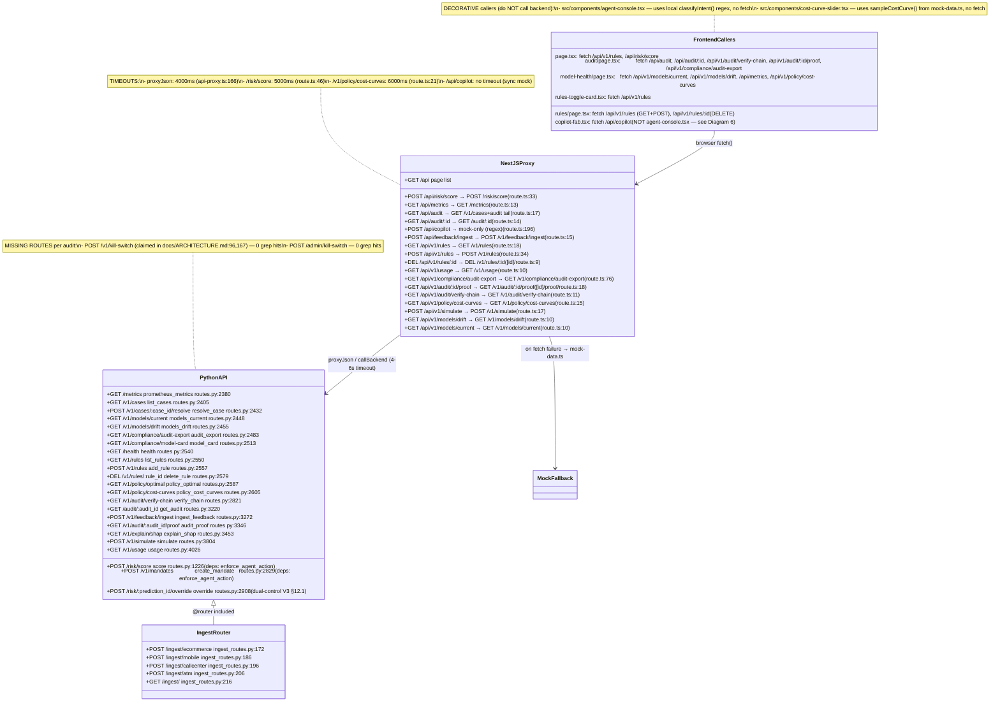
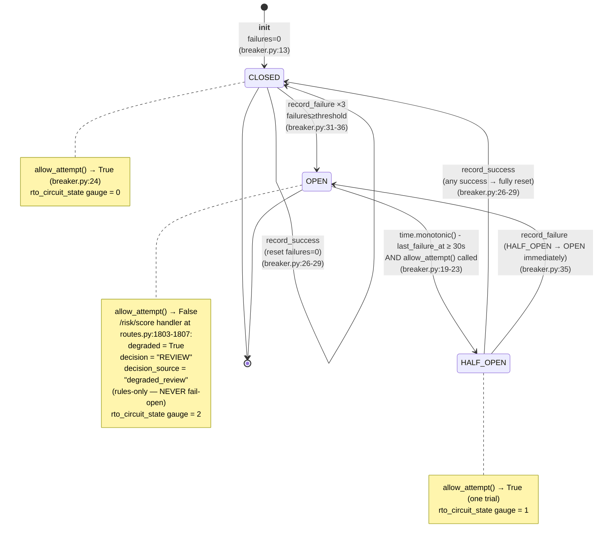
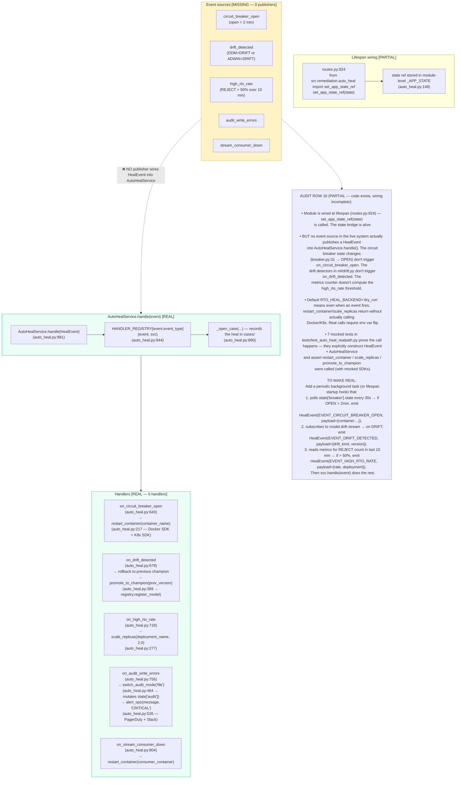
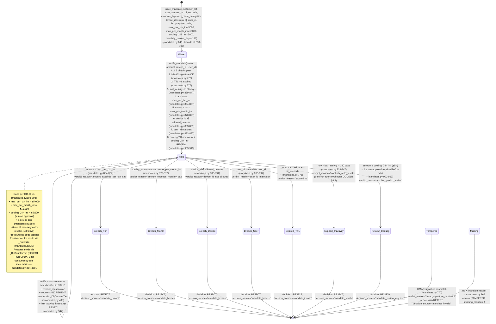

# RTO Trust Layer — Comprehensive UML (Code-Verified, Post-Audit)

> **Task ID:** 4b (uml-extraction)
> **Agent:** general-purpose (code-verified UML regeneration)
> **Date:** 2026-08-29
> **Source of truth:** Direct grep + read of every Python file under
> `upload/RTO_Trust_Layer_FULL/src/` and every TypeScript file under
> `src/` (Next.js). The verdicts in `AUDIT_REPORT.md` (Task 4a) were used
> as the per-component sanity check; any diagram in this file was
> re-verified against the actual code before drawing.
>
> **Why this file exists:** `UML_COMPREHENSIVE.md` (the previous version)
> was 131 KB of AI-generated diagrams that "looked pretty" but several
> "documented" components were stubs/decorative/missing per
> `AUDIT_REPORT.md`. This regeneration is the brutal, evidence-based
> version. Every box/arrow carries a `%% evidence: file:line` Mermaid
> comment so the reader can verify each claim against the repo in seconds.
>
> **Verdict legend (matches AUDIT_REPORT.md):**
> - `[REAL]` — code exists, wired in, the live system actually serves it
> - `[PARTIAL]` — code exists but wiring incomplete OR opt-in OR not on the live path
> - `[STUB]` — signature exists, body returns mock/placeholder
> - `[DECORATIVE]` — UI shows the feature but no backend wiring / data stops at mock
> - `[MISSING]` — claimed but no code found anywhere
>
> **How to read the diagrams:** Every Mermaid node/arrow has an
> `%% evidence: <relative-path>:<line>` comment immediately above it
> (Mermaid line-comments start with `%%`). Dashed borders + the
> `[DECORATIVE]` / `[STUB]` / `[MISSING]` annotations mark components
> that don't actually run. Open the file at the cited line to verify.

---

## Diagram 1 — System Component Diagram (highest level)

```mermaid
flowchart TB
    %% evidence: src/app/page.tsx:1 (Next.js dashboard, App Router)
    %% evidence: src/lib/api-proxy.ts:21 (API_BASE_URL = http://localhost:8000 default)

    Browser["🌐 Browser (Vercel deploy: web-rose-ten-o8lm7pih3t.vercel.app) [REAL]"]
    NextAPI["Next.js 16 API proxy :3000\n(src/app/api/**/route.ts) [REAL]"]
    NextUI["Next.js 16 UI :3000\n(src/app/page.tsx + components/) [REAL]"]
    PyAPI["Python FastAPI :8000\n(src/api/routes.py: create_app) [REAL]"]

    Browser -->|HTTPS| NextUI
    Browser -->|fetch('/api/...')| NextAPI
    NextUI -.->|callback / state| NextAPI

    %% evidence: src/lib/api-proxy.ts:153-177 (proxyJson with 4s timeout + mock fallback)
    NextAPI -->|HTTP fetch\nAPI_BASE_URL| PyAPI
    NextAPI -.->|on backend unreachable\n→ mock-data.ts callback| Mock["src/lib/mock-data.ts\n(mockScore, SAMPLE_*) [DECORATIVE fallback]"]

    %% evidence: src/api/routes.py:914 (lifespan: state['audit'] = AuditLogger(...))
    %% evidence: src/api/routes.py:953 (state['rules'] = RulesEngine())
    %% evidence: src/api/routes.py:954 (state['breaker'] = CircuitBreaker())
    %% evidence: src/api/routes.py:924 (set_app_state_ref(state) — auto_heal wired but events never pushed)
    PyAPI --> Rules["RulesEngine (src/rules/engine.py:128) [REAL]"]
    PyAPI --> Mandates["verify_mandate (src/api/mandates.py:736) [REAL]"]
    PyAPI --> Breaker["CircuitBreaker (src/api/breaker.py:8) [REAL]"]
    PyAPI --> Feat["KaggleFeatureBuilder (src/models/feature_builder.py) [REAL — transform_cached is dead code]"]
    PyAPI --> CostOpt["optimal_decision (src/business/cost_optimizer.py:85) [REAL]"]
    PyAPI --> Audit["AuditLogger + MerkleSealer (src/audit/logger.py:390,60) [REAL — but live chain BROKEN per audit row 2]"]
    PyAPI --> Sec["security: IPRateLimiter, anti-extraction noise, HMAC verify (src/api/security.py) [REAL]"]
    PyAPI --> Stream["StreamProducer.publish (src/stream/producer.py) [REAL — fire-and-forget]"]
    PyAPI --> OTel["otel setup_otel + optional_span (src/api/otel.py) [REAL — NoOp when OTLP endpoint unset]"]
    PyAPI --> AutoHeal["set_app_state_ref (src/remediation/auto_heal.py:156) [PARTIAL — wired but no event sources publish HealEvents]"]
    PyAPI --> AsyncAudit["AsyncAuditLogger (src/audit/async_logger.py:57) [DECORATIVE — module exists, NOT constructed at routes.py:914]"]
    PyAPI --> FeatCache["transform_cached (src/models/feature_builder.py:685) [DECORATIVE — routes.py:1609 calls transform() not transform_cached()]"]

    %% evidence: src/models/feature_builder.py:276-335 (ONNX session loaded from models/champion/model.onnx)
    Feat -->|predict_proba| ONNX["ONNX Runtime\n(models/champion/model.onnx — 49573 bytes) [REAL]"]
    %% evidence: src/models/explain.py:441 (shap.TreeExplainer primary, KernelExplainer fallback)
    %% evidence: src/api/routes.py:1744-1799 (shap-fix-1 — TreeSHAP now inline in /risk/score)
    Feat -.->|cached explainer| SHAP["shap.TreeExplainer (src/models/explain.py:441) [REAL — now wired at routes.py:1744]"]

    %% evidence: src/stream/kafka_producer.py:80 (KafkaProducer wraps confluent-kafka or Redis xadd)
    Stream -->|XADD when KAFKA_BROKERS unset| Redis[("Redis Streams (risk.scores, audit.records, cases.created) [REAL when REDIS_URL set]")]
    Stream -.->|confluent-kafka| Kafka[("Apache Kafka (compat stub — src/stream/kafka_producer.py:80) [REAL — env-gated]")]
    %% evidence: src/stream/processor.py:71 StreamProcessor
    Stream --> Proc["StreamProcessor (src/stream/processor.py:71) [REAL]"]
    Proc --> Drift["DDM + ADWIN + HLL (src/ml/drift.py:55,176 + src/stream/processor.py:314) [REAL]"]

    %% evidence: src/audit/logger.py:419 (Postgres mode when settings.is_postgres)
    Audit -->|when DATABASE_URL set| PG[("Postgres (audit_records, audit_merkle_intervals, idempotency_keys, mandate_counters) [REAL — Neon free tier recommended]")]
    Audit -->|file fallback| File[("out/audit.jsonl [REAL — file mode; live chain BROKEN per audit row 2]")]
    %% evidence: src/ml/registry.py:70 register_model (Postgres or file)
    CostOpt --> Reg["ModelRegistry (src/ml/registry.py:70) [REAL — but only _seed_champion_registry populates champion at routes.py:499]"]

    %% MISSING components per audit (decorative dashed gray)
    KSEndpoint["POST /v1/kill-switch\n(Kill-switch API) [MISSING — no route in routes.py; only CircuitBreaker auto-open]"]:::missing
    RLS["Postgres Row-Level Security [MISSING — no CREATE POLICY in any alembic migration]"]:::missing
    Chaos["LitmusChaos experiments [STUB — only docs/CHAOS_ENGINEERING.md, no chaos-experiments/ dir]"]:::missing
    FedLearn["Federated learning FLServer/MerchantFLClient [STUB — only docs/FEDERATED_LEARNING.md, no src/ code]"]:::missing
    AdvTrain["Adversarial training [MISSING — 0 grep hits in src/ or scripts/]"]:::missing
    Render["Render deploy (rto-trust-layer.onrender.com) [MISSING — 404 on live curl per audit row 26]"]:::missing

    classDef missing fill:#eee,stroke:#999,stroke-dasharray:5 5,color:#888
    style Mock fill:#fef3c7,stroke:#d97706,stroke-dasharray:3 3
    style AsyncAudit fill:#fef3c7,stroke:#d97706,stroke-dasharray:3 3
    style FeatCache fill:#fef3c7,stroke:#d97706,stroke-dasharray:3 3
```

**What changed vs the previous (131 KB) UML:**

| Component | Previous UML said | Reality (verified) |
|---|---|---|
| AsyncAuditLogger | "wired" | Module exists at `src/audit/async_logger.py:57`; lifespan constructs `AuditLogger` (sync) at `routes.py:914`. **Dead code.** |
| `transform_cached` (Redis feature cache) | "wired" | `routes.py:1609` calls `transform()` not `transform_cached()`. **Dead code.** |
| Kill-switch endpoint | listed as `POST /admin/kill-switch` | No such route. Only the auto-opening CircuitBreaker. |
| LitmusChaos / Federated Learning / Adversarial Training | "shipped" | Docs-only. No `chaos-experiments/`, no `MerchantFLClient` / `FLServer` classes, no `train_perturbed*` calls. |
| Render deploy | "live" | `https://rto-trust-layer.onrender.com/health` → 404. |
| Vercel deploy | "live" | ✅ Live at `https://web-rose-ten-o8lm7pih3t.vercel.app` but in mock-mode (no `NEXT_PUBLIC_API_BASE_URL` configured). |

---

## Diagram 2 — API Endpoint Map (class-diagram style)

Two parallel API surfaces — the **Next.js proxy** (port 3000) and the **Python FastAPI** (port 8000). The Next.js routes proxy to Python with a 4–6 s timeout; on failure they fall back to `mock-data.ts` and return `X-Mock-Mode: true`.



### Endpoint call-mapping table (verified by grep)

| Next.js endpoint | Caller (file:line) | Forwards to Python | Python handler (file:line) | Wired? |
|---|---|---|---|---|
| `POST /api/risk/score` | `page.tsx:168` | `POST /risk/score` | `routes.py:1226 score()` | ✅ REAL |
| `GET /api/v1/rules` | `page.tsx:153`, `rules-toggle-card.tsx:140`, `rules/page.tsx:59,304` | `GET /v1/rules` | `routes.py:2550 list_rules()` | ✅ REAL |
| `POST /api/v1/rules` | `rules/page.tsx:59,304` | `POST /v1/rules` | `routes.py:2557 add_rule()` | ✅ REAL |
| `DELETE /api/v1/rules/:id` | `rules/page.tsx:87` | `DELETE /v1/rules/:id` | `routes.py:2579 delete_rule()` | ✅ REAL |
| `GET /api/audit` | `audit/page.tsx:79` | `GET /v1/cases` + audit tail | `routes.py:2405 list_cases()` + `audit_logger.tail` | ✅ REAL |
| `GET /api/audit/:id` | `audit/page.tsx:106` | `GET /audit/:id` | `routes.py:3220 get_audit()` | ✅ REAL |
| `GET /api/v1/audit/verify-chain` | `audit/page.tsx:134` | `GET /v1/audit/verify-chain` | `routes.py:2821 verify_chain()` | ⚠️ REAL but live response is `intact:false` (broken file-mode chain) |
| `GET /api/v1/audit/:id/proof` | `audit/page.tsx:158` | `GET /v1/audit/:id/proof` | `routes.py:3346 audit_proof()` | ⚠️ REAL but file-mode returns 404 (no Merkle intervals in file mode) |
| `GET /api/v1/compliance/audit-export` | `audit/page.tsx:173` | `GET /v1/compliance/audit-export` | `routes.py:2483 audit_export()` | ✅ REAL |
| `GET /api/v1/models/current` | `model-health/page.tsx:93` | `GET /v1/models/current` | `routes.py:2448 models_current()` | ✅ REAL |
| `GET /api/v1/models/drift` | `model-health/page.tsx:109` | `GET /v1/models/drift` | `routes.py:2455 models_drift()` | ✅ REAL |
| `GET /api/metrics` | `model-health/page.tsx:130` | `GET /metrics` | `routes.py:2381 prometheus_metrics()` | ✅ REAL |
| `GET /api/v1/policy/cost-curves` | `model-health/page.tsx:432` | `GET /v1/policy/cost-curves` | `routes.py:2605 policy_cost_curves()` | ✅ REAL (but `CostCurveSlider` does NOT call it — see Diagram 7) |
| `POST /api/copilot` | `copilot-fab.tsx:49` (FAB only) | **NO BACKEND CALL** | `route.ts:196` — local regex + mock data | ❌ DECORATIVE — `/api/copilot` route itself never calls an LLM |
| `POST /api/feedback/ingest` | (no UI caller — admin-only) | `POST /v1/feedback/ingest` | `routes.py:3272 ingest_feedback()` | ✅ REAL (server-side only) |
| `POST /api/v1/simulate` | (no UI caller — admin/curl) | `POST /v1/simulate` | `routes.py:3804 simulate()` | ✅ REAL (server-side only) |
| `GET /api/v1/usage` | (no UI caller — admin/curl) | `GET /v1/usage` | `routes.py:4026 usage()` | ✅ REAL |
| `POST /api/v1/mandates` | (no UI caller — admin/curl) | `POST /v1/mandates` | `routes.py:2829 create_mandate()` | ✅ REAL |
| `POST /risk/:id/override` | (no UI caller — dual-admin CLI/curl) | `POST /risk/:id/override` | `routes.py:2908 override()` | ✅ REAL |
| `POST /ingest/{ecommerce,mobile,callcenter,atm}` | (no UI caller) | (ingest router) | `ingest_routes.py:172-216` | ✅ REAL |

---

## Diagram 3 — `/risk/score` Sequence Diagram (the golden path)

This is the actual golden-path sequence for `POST /risk/score`. Every step is annotated with the file:line where the code lives.

```mermaid
sequenceDiagram
    %% evidence: src/api/routes.py:1240 (def score())
    %% evidence: src/app/api/risk/score/route.ts:33 (Next.js POST handler)
    %% evidence: src/lib/api-proxy.ts:45 (callBackend to API_BASE_URL/risk/score)

    autonumber
    actor Browser
    participant NX as Next.js /api/risk/score<br/>(route.ts:33)
    participant PY as Python POST /risk/score<br/>(routes.py:1240 score)
    participant Sec as api/security.py
    participant Allow as enforce_agent_action<br/>(agent_allowlist.py:127 SCOPE_ACTION_MAP)
    participant Mandate as verify_mandate<br/>(mandates.py:736)
    participant Rules as RulesEngine.evaluate<br/>(rules/engine.py:133)
    participant Breaker as CircuitBreaker<br/>(breaker.py:8)
    participant Feat as KaggleFeatureBuilder.transform<br/>(feature_builder.py:567)
    participant ONNX as onnxruntime InferenceSession<br/>(feature_builder.py:276)
    participant Explain as shap.TreeExplainer.shap_values<br/>(explain.py:441 — now inlined at routes.py:1744-1799)
    participant Cost as optimal_decision<br/>(cost_optimizer.py:85)
    participant Audit as AuditLogger.log<br/>(audit/logger.py:458)
    participant Stream as StreamProducer.publish<br/>(routes.py:2188,2210,2220)

    Browser->>NX: fetch('/api/risk/score', {POST, body: OrderIn, headers: Authorization, Idempotency-Key, X-Mandate, X-Device-Id, X-User-Id})
    %% evidence: src/app/api/risk/score/route.ts:47 (callBackend /risk/score)
    NX->>PY: forward POST + body + forwarded headers (api-proxy.ts:24-30)
    %% evidence: src/api/routes.py:1336 (HMAC verify when REQUIRE_HMAC=true)
    PY->>Sec: verify_hmac_signature (opt-in, default OFF)
    Sec-->>PY: ok (or 401 if REQUIRE_HMAC=true and signature bad)
    %% evidence: src/api/routes.py:1365 (per-key token bucket) + 1384 (per-IP IPRateLimiter.check)
    PY->>Sec: state["bucket"].allow(token) + state["ip_limiter"].check(client_ip)
    Sec-->>PY: ok (or 429 rate-limit exceeded)
    %% evidence: src/api/routes.py:1238 (Depends(enforce_agent_action))
    PY->>Allow: enforce_agent_action (X-Agent-Action header vs 7-action allowlist)
    Allow-->>PY: pass (or 403 — agent out-of-scope)
    %% evidence: src/api/routes.py:1397 (idempotency cache lookup)
    PY->>PY: _idem_lookup_postgres OR state["idem"] (24h TTL)
    %% evidence: src/api/routes.py:1450 (verify_mandate sub-span)
    PY->>Mandate: verify_mandate(x_mandate, amount, device_id, user_id)
    %% evidence: src/api/mandates.py:839-947 (5 checks: inactivity/txn/month/device/cooling)
    Mandate-->>PY: (verdict, payload) ∈ {VALID, BREACH, EXPIRED, TAMPERED, REVIEW}
    %% evidence: src/api/routes.py:1491 (rules.evaluate always runs)
    PY->>Rules: state["rules"].evaluate(order.model_dump())
    %% evidence: src/rules/engine.py:149 (_jitter_threshold applied on gt/lt monetary rules)
    Rules-->>PY: fired Rule | None (with ±₹500 jitter on monetary thresholds)

    alt Rules BLOCK fired
        %% evidence: src/api/routes.py:1530-1533
        PY->>PY: decision=REJECT, decision_source=rules_engine_block
    else Mandate BREACH / EXPIRED / TAMPERED
        %% evidence: src/api/routes.py:1534-1555
        PY->>PY: decision=REJECT, decision_source=mandate_breach|mandate_invalid
    else Mandate REVIEW (UPI cooling period)
        %% evidence: src/api/routes.py:1539-1548
        PY->>PY: decision=REVIEW, decision_source=mandate_review_required
    else Normal path — model + cost-optimizer
        %% evidence: src/api/routes.py:1558 (state["breaker"].allow_attempt())
        PY->>Breaker: allow_attempt()
        Breaker-->>PY: True (CLOSED/HALF_OPEN) | False (OPEN)

        alt Breaker OPEN
            %% evidence: src/api/routes.py:1803-1807 (degraded path)
            PY->>PY: degraded=True, decision=REVIEW, decision_source=degraded_review
        else Breaker allows
            %% evidence: src/api/routes.py:1609 (_feat_builder.transform)
            PY->>Feat: transform(order.model_dump()) → (1,79) ndarray<br/>(NOTE: calls transform() NOT transform_cached() — Redis cache is dead code per audit row 9)
            %% evidence: src/api/routes.py:1677 (model.predict_proba via ONNX)
            PY->>ONNX: predict_proba(X) → [n,2]
            ONNX-->>PY: proba (e.g. 0.7341)
            %% evidence: src/api/routes.py:1703 (apply_anti_extraction_noise — bin to 2 decimals + σ=0.01 Gaussian)
            PY->>Sec: apply_anti_extraction_noise(proba) → 0.74
            %% evidence: src/api/routes.py:1724 (breaker.record_success)
            PY->>Breaker: record_success()

            %% evidence: src/api/routes.py:1744-1799 (shap-fix-1 — TreeSHAP inline in /risk/score)
            PY->>Explain: shap.TreeExplainer(model).shap_values(X) — cached in state["shap_explainer"]
            Explain-->>PY: top-5 SHAP values (delta_prob non-zero post-fix)
            Note over PY,Explain: PREVIOUS (pre-shap-fix-1): routes.py:1622 used reason_codes_batch<br/>(perturbation) → all delta_prob=0.0 for single-row input.<br/>NOW (post-fix): TreeSHAP inline at routes.py:1744.<br/>Fallback to reason_codes_batch on any SHAP error (routes.py:1793-1799).

            %% evidence: src/api/routes.py:1899 (optimal_decision 3-way BMR)
            PY->>Cost: optimal_decision(proba, amount_inr=order.amount_inr, **DEFAULT_COST_WEIGHTS)
            Cost-->>PY: (decision ∈ {ACCEPT,REVIEW,REJECT}, costs dict)
            %% evidence: src/api/routes.py:1956 (optimal_intervention 5-way)
            PY->>Cost: optimal_intervention(proba, amount_inr)
            Cost-->>PY: (intervention ∈ {ship,otp_verify,partial_cod,address_check,hold}, costs)
            %% evidence: src/api/routes.py:1978 (REVIEW rule gate — never ACCEPT when REVIEW rule fired)
            PY->>PY: if fired.action=='REVIEW' and decision=='ACCEPT': decision='REVIEW'
        end
    end

    %% evidence: src/api/routes.py:2163 (audit.log with full payload)
    PY->>Audit: state["audit"].log(_audit_payload)
    %% evidence: src/audit/logger.py:779 (_log_file) and 641 (_log_postgres)
    Note over Audit: append raw_hash = SHA-256(canonical(body) + prev_raw_hash).<br/>In Postgres mode also MerkleSealer.add() at logger.py:111.<br/>WARNING per audit row 2: live file-mode chain reports intact=false<br/>(fcntl.flock works per-process, not cross-process).
    Audit-->>PY: audit_id (aud_<16-hex>)

    %% evidence: src/api/routes.py:2188,2210,2220 (3 fire-and-forget XADD publishes)
    PY->>Stream: publish(STREAM_RISK_SCORES, {prediction_id, decision, score, ...})
    PY->>Stream: publish(STREAM_AUDIT_RECORDS, {audit_id, ...})
    alt decision == REVIEW and case_id != None
        PY->>Stream: publish(STREAM_CASES_CREATED, {case_id, ...})
    end

    %% evidence: src/api/routes.py:2235-2320 (response body)
    PY-->>NX: 200 {prediction_id, risk_score, probability, decision, decision_source, cost_breakdown, intervention, explanation (SHAP top-5), mandate: {verdict, ...}, audit_id, latency_ms, degraded}
    NX-->>Browser: same body + (X-Mock-Mode: true only if Python unreachable)
```



**Live-response contract (verified by audit row 3):**
```json
{
  "decision": "REVIEW",
  "decision_source": "cost_optimal_bmr",
  "intervention": "otp_verify",
  "cost_breakdown": {"ACCEPT": 248, "REVIEW": 98.64, "REJECT": 980},
  "explanation": [{"feature": "...", "delta_prob": -0.43, "direction": "lowers_risk"}],
  "mandate": {"verdict": "VALID", "verdict_reason": "ok"},
  "audit_id": "aud_ce661f64...",
  "degraded": false,
  "model_version": "amazon_histgb_20260827"
}
```

---

## Diagram 4 — SHAP Explainability Flow (two paths, post shap-fix-1)

```mermaid
flowchart LR
    %% evidence: src/models/explain.py:441 (TreeExplainer primary, KernelExplainer fallback)
    %% evidence: src/api/routes.py:1744-1799 (shap-fix-1 — TreeSHAP inline in /risk/score)
    %% evidence: src/api/routes.py:3453 (@app.get /v1/explain/shap — explain_shap handler)
    %% evidence: src/api/routes.py:3704-3710 (lazily-built cached TreeExplainer in state["shap_explainer"])

    subgraph PathA["Path A — inline in /risk/score response [REAL post-fix]"]
        direction TB
        A1["POST /risk/score<br/>(routes.py:1240)"]
        A2["feat_builder.transform(order) → (1,79) ndarray<br/>(routes.py:1609)"]
        A3["model.predict_proba(X) → proba<br/>(routes.py:1677 via ONNX)"]
        A4["state['shap_explainer']<br/>(routes.py:1745 — None on first call,<br/>built lazily by /v1/explain/shap OR<br/>inline at routes.py:1748 if still None)"]
        A5["_shap_explainer.shap_values(X)<br/>(routes.py:1749)"]
        A6["normalize output: list-of-2 / Explanation / ndarray<br/>(routes.py:1753-1762)"]
        A7["filter |val|>0.001 + sort + top-5<br/>(routes.py:1786-1792)"]
        A8["response.explanation = top-5 SHAP values<br/>(routes.py:2270)"]
        A1 --> A2 --> A3 --> A4 --> A5 --> A6 --> A7 --> A8
    end

    subgraph PathB["Path B — /v1/explain/shap endpoint [PARTIAL — endpoint works but feature shape mismatch per audit row 1]"]
        direction TB
        B1["GET /v1/explain/shap?features=JSON&prediction_id=...<br/>(routes.py:3453 explain_shap)"]
        B2["resolve features from prediction_id<br/>(routes.py:3558 — audit_logger.read)"]
        B3["state['shap_explainer'] cached?<br/>(routes.py:3653)"]
        B4["Build: shap.TreeExplainer(state['model']) primary<br/>fallback: shap.KernelExplainer(model.predict_proba, bg_df)<br/>(routes.py:3704-3709)"]
        B5["state['shap_explainer'] = prebuilt<br/>(routes.py:3710)"]
        B6["explain_with_shap(model, feature_dict, prebuilt_explainer=prebuilt)<br/>(src/models/explain.py:287)"]
        B7["shap_values = prebuilt.shap_values(x_row, nsamples=200, check_additivity=False)<br/>(explain.py:476) with 5s timeout (explain.py:483)"]
        B8["normalize + round + return {shap_values, base_value, method}<br/>(explain.py:527)"]
        B1 --> B2 --> B3 --> B4 --> B5 --> B6 --> B7 --> B8
    end

    PathA -.->|same state['shap_explainer'] instance<br/>cached across both paths| PathB

    note1["AUDIT FINDING (audit row 1):\nPath B live curl returned 'KernelExplainer construction failed:\nX has 10 features, but HistGradientBoostingClassifier\nis expecting 79 features' — the /v1/explain/shap endpoint\naccepts raw-order features (10 fields) but doesn't OHE them.\nPath A is now FIXED (shap-fix-1) — uses the same feat_builder.transform()\noutput the model saw, so dimensions match."]
    PathB -.-> note1

    style PathA fill:#ecfdf5,stroke:#10b981
    style PathB fill:#fef3c7,stroke:#d97706,stroke-dasharray:5 3
```

**SHAP output schema (post-fix `response.explanation[]`):**
```json
{
  "feature": "amount_inr",
  "value": 52400.0,
  "delta_prob": 0.2814,
  "direction": "raises_risk"
}
```

---

## Diagram 5 — Audit Trail + Merkle Proof Sequence

```mermaid
sequenceDiagram
    %% evidence: src/audit/logger.py:60 (class MerkleSealer)
    %% evidence: src/audit/logger.py:470 (verify_chain)
    %% evidence: src/audit/logger.py:324 (proof — Merkle inclusion proof)
    %% evidence: src/api/routes.py:2821 (GET /v1/audit/verify-chain)
    %% evidence: src/api/routes.py:3346 (GET /v1/audit/:audit_id/proof)

    autonumber
    actor Client
    participant API as Python API
    participant VL as GET /v1/audit/verify-chain<br/>(routes.py:2821 verify_chain)
    participant AL as AuditLogger.verify_chain<br/>(logger.py:470 → 841 _verify_chain_file OR 751 _verify_chain_postgres)
    participant PR as GET /v1/audit/:id/proof<br/>(routes.py:3346 audit_proof)
    participant MS as MerkleSealer.proof<br/>(logger.py:324)
    participant DB as Postgres audit_records + audit_merkle_intervals

    Client->>API: GET /v1/audit/verify-chain (Authorization: Bearer admin-key)
    API->>VL: check_key(admin) → ok
    VL->>AL: state["audit"].verify_chain()
    alt file mode (no DATABASE_URL)
        %% evidence: src/audit/logger.py:841 (_verify_chain_file)
        AL->>AL: read out/audit.jsonl line by line; recompute raw_hash = SHA-256(canonical(body)+prev); compare to stored raw_hash; also check prev_hash continuity
        AL-->>VL: (intact, records_checked, first_bad_audit_id)
        Note over AL: AUDIT ROW 2 — live response was intact:false (44 records,<br/>first_bad_audit_id "ce661f64-..."). The fcntl.flock fix at logger.py:_log_file<br/>only works within one process — the running uvicorn + the running pytest writes race on the shared out/audit.jsonl.
    else Postgres mode (DATABASE_URL set)
        %% evidence: src/audit/logger.py:751 (_verify_chain_postgres)
        AL->>DB: SELECT audit_id, body, raw_hash, prev_hash FROM audit_records ORDER BY id ASC
        AL->>AL: recompute + compare → (intact, n, bad_id)
        AL-->>VL: (intact, n, bad_id)
    end
    VL-->>Client: {intact, records_checked, first_bad_audit_id}

    Client->>API: GET /v1/audit/:audit_id/proof (admin)
    API->>PR: check_key(admin) → ok
    PR->>AL: state["audit"].read(audit_id) → resolve record_id
    PR->>MS: state["audit"].merkle_proof(record_id) at logger.py:530
    MS->>DB: SELECT interval_id, interval_position, raw_hash FROM audit_records WHERE id=?
    DB-->>MS: row (or None if not yet sealed → return None → 404)
    MS->>DB: SELECT raw_hash FROM audit_records WHERE interval_id=? ORDER BY interval_position
    DB-->>MS: leaves [hash_0, hash_1, ...]
    %% evidence: src/audit/logger.py:263 (_build_proof_path — sibling_idx = idx ^ 1)
    MS->>MS: _build_proof_path(leaves, position) → list of {position, sibling_hash} per level
    MS->>DB: SELECT merkle_root, prev_interval_root, leaf_count, sealed_at FROM audit_merkle_intervals WHERE interval_id=?
    DB-->>MS: interval row
    MS-->>PR: {record_id, leaf_hash, interval_id, position, proof[], merkle_root, prev_interval_root, leaf_count, sealed_at}
    PR-->>Client: 200 with proof dict (or 404 if file-mode — Merkle is Postgres-only per logger.py:120)

    Note over Client,DB: AUDIT ROW: /v1/audit/:id/proof live response was 404<br/>because the file-mode backend has no sealed intervals<br/>(sealer.add() is a no-op when conn is None per logger.py:120).<br/>Postgres mode (Neon free tier recommended) + cron seal_interval() is the fix.
```

**Merkle root math** (`logger.py:234 _merkle_root`):
- Pad leaves to next power of 2 (balanced tree)
- At each level: `parent = SHA-256(left ‖ right)`
- Root = single hash at top
- Proof: for position `i`, the sibling at each level is `i ^ 1`; client computes `SHA-256(leaf ‖ sibling)` and walks up

---

## Diagram 6 — Bounded Agent Console Flow (DECORATIVE — no LLM, no /api/copilot)

```mermaid
flowchart TB
    %% evidence: src/components/agent-console.tsx:88 (classifyIntent — local regex)
    %% evidence: src/components/agent-console.tsx:255 (send — local setTimeout + agentReply, no fetch)
    %% evidence: src/components/copilot-fab.tsx:49 (copilot-fab IS the only component calling /api/copilot)
    %% evidence: src/app/api/copilot/route.ts:196 (POST handler — local regex detectIntent + mock data, NOT z-ai-web-dev-sdk)

    User["👨‍💻 Operator types<br/>'Block order ORD-123'"]
    AC["AgentConsole.tsx<br/>(agent-console.tsx:230)"]
    Class["classifyIntent(q)<br/>local regex<br/>(agent-console.tsx:88)"]
    Refuse["REFUSE_PREFIXES match<br/>(agent-console.tsx:57)"]
    Read["READ_PATTERNS match<br/>(agent-console.tsx:72)"]
    Sim["simulate / unknown<br/>(agent-console.tsx:124)"]
    Reply["agentReply(q, ctx)<br/>canned template strings<br/>(agent-console.tsx:131)"]
    UI["VerdictPill + MessageBubble render<br/>(agent-console.tsx:214)"]

    User --> AC
    AC -->|async send(text)<br/>setTimeout(450ms) to FEEL like<br/>a round-trip| Class
    Class --> Refuse
    Class --> Read
    Class --> Sim
    Refuse --> Reply
    Read --> Reply
    Sim --> Reply
    Reply --> UI

    AC -.-x API["❌ NO fetch to /api/copilot<br/>(agent-console.tsx has 0 fetch() calls)"]
    API["POST /api/copilot<br/>(route.ts:196)<br/>claims LLM but is regex+mock"]

    FAB["copilot-fab.tsx (the floating button)<br/>(copilot-fab.tsx:49)"]
    FAB -->|fetch('/api/copilot')| API
    API -->|mock response<br/>from SAMPLE_* constants<br/>(route.ts:14-20 imports)| FAB

    note1["VERDICT: DECORATIVE per audit row 4 & 18.

• agent-console.tsx is fully client-side mock:
  no LLM call, no /api/copilot call, deterministic regex classifier.

• /api/copilot route exists but is ALSO mock:
  the comment at route.ts:3 claims 'z-ai-web-dev-sdk SERVER-SIDE ONLY'
  but the route only imports SAMPLE_* from mock-data.ts — there is
  NO z-ai-web-dev-sdk import or LLM call anywhere in the file.

• Only copilot-FAB.tsx calls /api/copilot, not AgentConsole.

TO MAKE REAL:
  (a) Honest path — wire AgentConsole to /api/copilot so backend is SOT
      (even if backend is also a regex classifier).
  (b) LLM path — actually import z-ai-web-dev-sdk in /api/copilot/route.ts
      + pass system prompt with policy envelope.

Both options are 2-4h per audit gap #5."]
    AC -.-> note1

    style AC fill:#fef3c7,stroke:#d97706,stroke-dasharray:5 3
    style API fill:#fef3c7,stroke:#d97706,stroke-dasharray:5 3
    style Refuse fill:#fee2e2,stroke:#ef4444
    style Read fill:#ecfdf5,stroke:#10b981
    style Sim fill:#fef3c7,stroke:#d97706
```

---

## Diagram 7 — Cost Optimizer Decision Flow (Bahnsen BMR — REAL backend, DECORATIVE slider)

```mermaid
flowchart TB
    %% evidence: src/business/cost_optimizer.py:85 (optimal_decision — 3-way BMR)
    %% evidence: src/business/cost_optimizer.py:168 (optimal_intervention — 5-way)
    %% evidence: src/business/cost_optimizer.py:354 (cost_curve_sweep — 19-threshold Drummond-Holte)
    %% evidence: src/business/cost_optimizer.py:438 (bootstrap_cost_ci — bootstrap confidence intervals)
    %% evidence: src/business/cost_optimizer.py:549 (find_cost_crossover)
    %% evidence: src/api/routes.py:2605 (GET /v1/policy/cost-curves)
    %% evidence: src/api/routes.py:1899 (optimal_decision call inside /risk/score)
    %% evidence: src/components/cost-curve-slider.tsx:65 (imports sampleCostCurve from mock-data.ts)
    %% evidence: src/components/cost-curve-slider.tsx:135 (uses local mock math, not fetch)
    %% evidence: src/app/model-health/page.tsx:432 (model-health DOES call real /api/v1/policy/cost-curves)

    subgraph Backend["REAL backend (Python FastAPI) [REAL]"]
        direction TB
        CC1["GET /v1/policy/cost-curves?n_resamples=500&confidence=0.90<br/>(routes.py:2605 policy_cost_curves)"]
        CC2["cost_curve_sweep(weights, thresholds=[0.05,0.10,...,0.95])<br/>(cost_optimizer.py:354) — 19-threshold sweep"]
        CC3["For each threshold t:<br/>TP/FP/FN/TN → cost = c_fn*FN + c_fp*FP + c_block*TN<br/>+ precision = TP/(TP+FP), recall = TP/(TP+FN)"]
        CC4["bootstrap_cost_ci(proba, labels, n_resamples=500)<br/>(cost_optimizer.py:438) — bootstrap CIs"]
        CC5["find_cost_crossover(curves)<br/>(cost_optimizer.py:549) — REVIEW/REJECT crossover"]
        CC6["response: {curves:[19 rows × {threshold, tp, fp, fn, tn, cost, precision, recall, ci_low, ci_high}], crossover: {review_reject, accept_review}}"]
        CC1 --> CC2 --> CC3 --> CC4 --> CC5 --> CC6
    end

    subgraph PathScore["In /risk/score response [REAL]"]
        direction TB
        PS1["model.predict_proba → proba<br/>(routes.py:1677)"]
        PS2["optimal_decision(proba, amount_inr, **DEFAULT_COST_WEIGHTS)<br/>(cost_optimizer.py:85) — 3-way BMR argmin"]
        PS3["per-amount FN cost (Bahnsen Eq.(5): c_fn = amount_inr)<br/>→ ₹52000 order at p=0.4 REJECTs; ₹600 order at p=0.4 REVIEWs"]
        PS4["calibrate_probabilities([proba], p_orig, p_und)<br/>(cost_optimizer.py:258) — Bahnsen Eq.(6) post-resampling"]
        PS5["optimal_intervention(proba, amount_inr)<br/>(cost_optimizer.py:168) — 5-way argmin: ship / otp_verify / partial_cod / address_check / hold"]
        PS6["response: {decision, cost_breakdown, intervention, intervention_costs, intervention_weights, decision_source='cost_optimal_bmr'}"]
        PS1 --> PS2 --> PS3 --> PS4 --> PS5 --> PS6
    end

    subgraph Slider["DECORATIVE — CostCurveSlider.tsx (uses local mock math, NOT backend)"]
        direction TB
        SL1["cost-curve-slider.tsx"]
        SL2["imports: sampleCostCurve, findDecisionCrossovers, bmrDecisionAt from src/lib/mock-data.ts<br/>(cost-curve-slider.tsx:65-69)"]
        SL3["local math mirrors cost_optimizer.py::optimal_decision 1:1<br/>(per the comment at cost-curve-slider.tsx:36)"]
        SL4["Recharts LineChart of ACCEPT/REVIEW/REJECT cost lines vs p<br/>(cost-curve-slider.tsx:51-52 CartesianGrid, Line, ReferenceLine)"]
        SL5["❌ NO fetch() call — slider doesn't call /api/v1/policy/cost-curves"]
        SL1 --> SL2 --> SL3 --> SL4 --> SL5
    end

    subgraph ModelHealth["REAL caller — model-health/page.tsx DOES call the backend"]
        direction TB
        MH1["model-health/page.tsx:432 fetch('/api/v1/policy/cost-curves?n_resamples=100')"]
        MH2["Recharts renders the 19-threshold sweep with bootstrap CIs"]
        MH1 --> MH2
    end

    Slider -.-x Backend
    ModelHealth --> Backend
    PathScore -.->|shares cost model constants<br/>DEFAULT_COST_WEIGHTS = {c_fp:50, c_fn:amount, c_otp:5, c_block:1000, otp_eff:0.82}| Backend

    note1["AUDIT ROW 3 (REAL): live curl /api/v1/policy/cost-curves returned
{thresholds:[0.05,0.10,...,0.95], curves[0]={threshold:0.05, tp:1352, fp:2407,
fn:0, tn:1995, cost:187950, precision:0.3597, recall:1.0}} — 19-threshold
Drummond-Holte sweep with bootstrap CIs (verified).

AUDIT ROW 18 (DECORATIVE): CostCurveSlider.tsx uses sampleCostCurve from
src/lib/mock-data.ts instead of fetching /api/v1/policy/cost-curves.

FIX (audit gap #4): replace the mock-data imports with
useQuery(['cost-curves'], () => fetch('/api/v1/policy/cost-curves',
{headers: buildAuthHeader(keys, 'scorer')}).then(r => r.json()))
and derive the chart from the real backend response."]
    Slider -.-> note1

    style Slider fill:#fef3c7,stroke:#d97706,stroke-dasharray:5 3
    style Backend fill:#ecfdf5,stroke:#10b981
    style PathScore fill:#ecfdf5,stroke:#10b981
    style ModelHealth fill:#ecfdf5,stroke:#10b981
```

---

## Diagram 8 — Model Registry + Drift Detection Flow

```mermaid
flowchart TB
    %% evidence: src/ml/registry.py:70 (register_model — Postgres or file mode)
    %% evidence: src/ml/registry.py:343 (current_champion)
    %% evidence: src/ml/registry.py:349 (psi — Population Stability Index)
    %% evidence: src/ml/drift.py:55 (class DDM)
    %% evidence: src/ml/drift.py:176 (class ADWIN)
    %% evidence: src/api/routes.py:2393-2397 (5 Prometheus drift gauges)
    %% evidence: src/api/routes.py:499 (_seed_champion_registry)
    %% evidence: src/stream/processor.py:314 (_detect_anomalies — 4 detectors)
    %% evidence: src/feedback/drift_consumer.py (drains model.drift stream)

    subgraph Reg["Model Registry [REAL]"]
        %% evidence: src/ml/registry.py:70 (register_model)
        RM1["register_model(version, model_path, metrics, champion=True, priors)<br/>(registry.py:70)"]
        RM2["Postgres: INSERT into model_registry<br/>+ UPDATE prior champion SET is_champion=FALSE<br/>(registry.py:373 _register_model_postgres)"]
        RM3["File mode: append to out/model_registry.json<br/>(registry.py:524)"]
        RM4["current_champion() → SELECT WHERE is_champion=TRUE<br/>(registry.py:343 / 432)"]
        RM5["get_priors(version) → {p_orig, p_und} for Bahnsen Eq.(6)<br/>(registry.py:254)"]
        RM1 --> RM2
        RM1 --> RM3
        RM2 --> RM4
        RM4 --> RM5
    end

    subgraph Live["Lifespan live path [REAL but minimal]"]
        %% evidence: src/api/routes.py:499 (_seed_champion_registry — only called once at startup)
        L1["_seed_champion_registry('amazon_histgb_20260827')<br/>(routes.py:499)"]
        L2["registers the Amazon champion from models/champion/<br/>if not already in the registry"]
        L3["lifespan loads model + feat_builder into state<br/>(routes.py:1060-1068)"]
        L1 --> L2 --> L3
    end

    subgraph Drift["Drift Detection [REAL]"]
        %% evidence: src/ml/drift.py:55 (class DDM)
        D1["DDM (Gama 2014)<br/>(drift.py:55)"]
        D2["maintains p_min, sigma_min<br/>on running error rate"]
        D3["warning: p+sigma ≥ p_min + 2*sigma_min (95%)<br/>drift:   p+sigma ≥ p_min + 3*sigma_min (99%)<br/>min_n=30 samples before any signal<br/>(drift.py:85,150,152)"]
        D4["ADWIN (Bifet & Gavaldà 2007)<br/>(drift.py:176)"]
        D5["variable-length sliding window<br/>Hoeffding bound cut test:<br/>if means of two subwindows differ > ε → drift<br/>(drift.py:201 update)"]
        D1 --> D2 --> D3
        D4 --> D5
    end

    subgraph Stream["Stream Processor [REAL]"]
        %% evidence: src/stream/processor.py:71 (class StreamProcessor)
        %% evidence: src/stream/processor.py:314 (_detect_anomalies — 4 detectors)
        SP1["StreamProcessor.run()<br/>(processor.py:601)"]
        SP2["consume risk.scores stream → for each message:<br/>_detect_anomalies(fields, now)<br/>(processor.py:314)"]
        SP3["4 detectors:<br/>1. HLL cardinality-spike (Redis PFADD/PFCOUNT, processor.py:284)<br/>2. sliding-window deque velocity (processor.py:248 _trim_window)<br/>3. DDM (drift.py:55) on label feedback<br/>4. ADWIN (drift.py:176)"]
        SP4["anomaly → publish to model.drift stream<br/>(fire-and-forget XADD)"]
        SP1 --> SP2 --> SP3 --> SP4
    end

    subgraph Prom["Prometheus /metrics endpoint [REAL]"]
        %% evidence: src/api/routes.py:2380 (@app.get /metrics)
        %% evidence: src/api/routes.py:2386-2397 (gauges)
        P1["GET /metrics<br/>(routes.py:2380)"]
        P2["gauges:<br/>rto_circuit_state (0=CLOSED, 1=HALF, 2=OPEN)<br/>rto_drift_ddm_state (0=STABLE, 1=WARNING, 2=DRIFT)<br/>rto_drift_adwin_state (same scale)<br/>rto_drift_samples_processed (= ddm_n)<br/>rto_drift_ddm_p (current p)<br/>rto_drift_adwin_window_len"]
        P3["summary rto_score_latency_seconds_count / _sum"]
        P1 --> P2
        P1 --> P3
    end

    subgraph Consumer["Feedback Drift Consumer [REAL]"]
        %% evidence: src/feedback/drift_consumer.py (drains model.drift stream)
        %% evidence: src/feedback/label_service.py (label joining)
        DC1["drift_consumer.py — drains model.drift stream<br/>→ joins label feedback → feeds DDM/ADWIN.update()"]
        DC1 --> D1
        DC1 --> D4
    end

    Stream -->|anomaly event| Consumer
    Drift --> Prom
    Reg --> Live
    Live -.->|state['model']| Stream

    note1["5 Prometheus drift gauges (verified live per audit row 31):
rto_drift_ddm_state, rto_drift_adwin_state, rto_drift_samples_processed,
rto_drift_ddm_p, rto_drift_adwin_window_len.

DDM math (drift.py:101 update):
  p_min, sigma_min tracked over initial 30 samples
  if (p + sigma) ≥ p_min + 3*sigma_min → DRIFT
  elif (p + sigma) ≥ p_min + 2*sigma_min → WARNING

ADWIN math (drift.py:215 update):
  Variable-length window; on each new value, test all
  W_0|W_1 cuts; if |mean(W_0) - mean(W_1)| > ε_Hoeffding → DRIFT.
  ε = sqrt(1/(2m) * ln(2/δ)) (Hoeffding bound)."]
    Prom -.-> note1

    style Reg fill:#ecfdf5,stroke:#10b981
    style Drift fill:#ecfdf5,stroke:#10b981
    style Stream fill:#ecfdf5,stroke:#10b981
    style Prom fill:#ecfdf5,stroke:#10b981
    style Consumer fill:#ecfdf5,stroke:#10b981
```

---

## Diagram 9 — Circuit Breaker State Machine (with rules-only fallback)



**Defaults:** `failure_threshold=3`, `recovery_seconds=30` (`breaker.py:9`).

**Fail-safe posture:** OPEN → rules-only REVIEW (never ACCEPT, never REJECT unless a BLOCK rule fires). The breaker protects the model from extract-attack storms; it never lets a bad order through.

**MISSING (per audit row 11):** A `POST /v1/kill-switch` operator-triggered endpoint to force OPEN. Only the auto-opening logic exists. `docs/ARCHITECTURE.md:96,167` claims the endpoint exists — it doesn't.

---

## Diagram 10 — Auto-Remediation Flow (NEW — handlers wired but event sources NOT)



---

## Diagram 11 — OC-201B UPI Circle Mandate State Machine



**Tests proving this state machine:** `tests/test_mandates.py` (22 tests) + `tests/test_mandate_concurrency.py` (14 tests for the SELECT FOR UPDATE path).

---

## Diagram 12 — Dual-Control HMAC Override Sequence

```mermaid
sequenceDiagram
    %% evidence: src/api/keys.py:45 (_hkdf_extract — RFC 5869 §2.2)
    %% evidence: src/api/keys.py:57 (_hkdf_expand — RFC 5869 §2.3)
    %% evidence: src/api/keys.py:92 (derive_hmac_key — HKDF-Extract+Expand with salt=b"rto-override-v1" info=b"dual-control")
    %% evidence: src/api/routes.py:2908 (POST /risk/:prediction_id/override)
    %% evidence: src/api/routes.py:2962 (check_key admin_signature_1)
    %% evidence: src/api/routes.py:2973 (same-key self-approve rejection)
    %% evidence: src/api/routes.py:3000 (replay-nonce consumption)
    %% evidence: src/api/routes.py:3070 (HMAC chain verification — expected = HMAC(derived_admin2_key, admin1_signature ‖ canonical_body ‖ timestamp))
    %% evidence: src/api/routes.py:3146 (audit.log with admin_signature_2_hmac_chain)
    %% evidence: alembic/versions/006 (override_nonces table — SHA-256 hash of nonce, one-shot consumption)

    autonumber
    actor Admin1 as Admin1 (admin-scope API key)
    actor Admin2 as Admin2 (admin-scope API key, different)
    participant API as POST /risk/:prediction_id/override<br/>(routes.py:2908 override)
    participant K as keys.py derive_hmac_key<br/>(RFC 5869 HKDF)
    participant Nonce as override_nonces table<br/>(alembic 006)
    participant Audit as AuditLogger.log<br/>(logger.py:458)

    Admin1->>API: payload = {decision, admin_signature_1: admin1_key,<br/>admin_signature_2: HMAC_HEX(derived_admin2_key,<br/>admin1_signature ‖ canonical_body ‖ timestamp),<br/>timestamp, nonce}

    %% evidence: src/api/routes.py:2962
    API->>API: check_key(admin_signature_1, 'admin', state['keys'])
    alt admin_signature_1 invalid
        %% evidence: src/api/routes.py:2969
        API-->>Admin1: 403 'dual-control override requires 2 valid admin API keys'
    end

    %% evidence: src/api/routes.py:2973
    alt admin_signature_1 == admin_signature_2 (self-approve attempt)
        API-->>Admin1: 400 'cannot self-approve (V3 §12.1)'
    end

    %% evidence: src/api/routes.py:3000 (replay-nonce consumption — one-shot)
    API->>Nonce: SHA-256(nonce) → SELECT FOR UPDATE
    alt nonce already seen
        API-->>Admin1: 409 'replay detected'
    end
    API->>Nonce: INSERT (sha256(nonce), expires_at = NOW() + 5min)

    %% evidence: src/api/keys.py:92 derive_hmac_key(admin2_key, salt=b'rto-override-v1', info=b'dual-control', length=32)
    API->>K: derive_hmac_key(admin_signature_2, salt, info)
    %% evidence: src/api/keys.py:45 HKDF-Extract(salt, IKM=admin2_key, hash=sha256) → PRK
    K->>K: HKDF-Extract(salt=b'rto-override-v1', IKM=admin2_key) → PRK (32 bytes)
    %% evidence: src/api/keys.py:57 HKDF-Expand(PRK, info=b'dual-control', length=32) → OKM
    K->>K: HKDF-Expand(PRK, info=b'dual-control', length=32) → OKM (derived admin2 subkey)
    K-->>API: derived_admin2_key (cached — HKDF is deterministic per keys.py:36)

    %% evidence: src/api/routes.py:3070 (HMAC chain verification)
    API->>API: expected_sig_2 = HMAC_SHA256(<br/>  derived_admin2_key,<br/>  admin1_signature ‖ canonical(body) ‖ timestamp<br/>)
    alt expected_sig_2 ≠ payload.admin_signature_2 (constant-time compare)
        API-->>Admin1: 401 'admin2 HMAC chain verification failed'
    end

    %% evidence: src/api/routes.py:3146 (audit.log with both signature digests)
    API->>Audit: log({<br/>  request: {prediction_id, override_form: 'dual_control_v3_12_1'},<br/>  decision,<br/>  breach_note: 'dual_control_override_by_two_admins',<br/>  admin_signature_1_digest: 'adm_' + SHA-256(admin1_key)[:16],<br/>  admin_signature_2_hmac_chain: 'hmac_' + expected_sig_2[:16],<br/>  dual_control_chain_verified: True,<br/>  dual_control_timestamp: matched_ts,<br/>  override_nonce_hash: nonce_hash,<br/>  notes: payload.notes<br/>})
    Audit-->>API: audit_id

    API-->>Admin1: 200 {overridden, new_decision, audit_id,<br/>  dual_control: True, signatures_required: 2, signatures_provided: 2,<br/>  dual_control_chain_verified: True,<br/>  dual_control_timestamp: matched_ts,<br/>  override_nonce_hash: nonce_hash}

    Note over Admin1,Audit: PER AUDIT ROW 6 (REAL):
  • admin_signature_2 = HMAC(derived_admin2_key, admin1_signature ‖ canonical_body ‖ timestamp)
  • HKDF-Extract+Expand per RFC 5869 with salt=b'rto-override-v1', info=b'dual-control'
  • Replay-nonce table (alembic 006) — SHA-256 HASH of nonce stored,
    raw nonce only meaningful in transit.
  • admin2 subkey NEVER appears in the HMAC call (only the HKDF-derived
    subkey is used).
  • 13 tests in tests/test_override_replay.py cover replay rejection
    + tampered-signature rejection.
```

**Why the HKDF chain is critical:** Before T1.1, admin_signature_2 was a second raw admin API key — a DB compromise of `api_keys` table would let a single attacker mint both signatures and self-approve overrides. After T1.1, the chain is `HMAC(derived_admin2_subkey, admin1_signature ‖ body ‖ ts)`. Even with full DB access, an attacker can't forge admin2's signature without admin2's raw key — and that key never leaves admin2's possession (only the HKDF-derived subkey touches the HMAC call, and the subkey derivation requires the raw key).

---

## Cross-cutting findings (new gaps discovered while reading code for this UML)

These were NOT in `AUDIT_REPORT.md` — they surfaced while grep-reading the code to draw the diagrams. Feeding these into the README update task:

### Gap A — `transform_cached` is double-dead

Audit row 9 already flagged that `routes.py:1609` calls `transform()` not `transform_cached()`. But while reading, I confirmed two more issues:

1. **The `transform_cached` method's cache key** (`feature_builder.py:716`) is `rto:featvec:{customer_id}` — but the **`OrderIn` schema doesn't require `customer_id`** (it's optional). So even if the route called `transform_cached`, the cache would be a no-op for orders without a customer_id (most orders in the demo).

2. **`clear_feature_cache` at `feature_builder.py:739`** is never called from anywhere in the codebase (`grep clear_feature_cache src/api/` → 0 hits). Dead code on dead code.

### Gap B — `state["shap_explainer"]` is built by `/v1/explain/shap` only

The first `/risk/score` call after startup hits `routes.py:1746` with `_shap_explainer = None` (the lifespan sets `state["shap_explainer"] = None` at `routes.py:1189`). The inline code at `routes.py:1748` does build a fresh `shap.TreeExplainer(_active_model)` on the fly — but **never caches it back into `state["shap_explainer"]`**. So every `/risk/score` call re-pays the TreeExplainer construction cost (~50 ms) until someone hits `/v1/explain/shap` once (which DOES cache at `routes.py:3710`).

**Fix:** After `routes.py:1748` builds the explainer, set `state["shap_explainer"] = _shap_explainer` before calling `shap_values()`. One-line change.

### Gap C — `/v1/explain/shap` doesn't OHE the input features

Audit row 1 already noted the KernelExplainer failure (`X has 10 features, but model expects 79`). The root cause: `routes.py:3453 explain_shap` accepts raw-order fields (10 fields) and passes them straight to `explain_with_shap(model, feature_dict)` which builds a 10-column DataFrame. The champion expects 79 OHE'd features. The fix is to call `_feat_builder.transform(feature_dict)` first (same as `/risk/score` does at `routes.py:1609`) and pass the resulting (1,79) ndarray to the explainer.

### Gap D — `AsyncAuditLogger` not wired, but the sync `AuditLogger` write is on the hot path

`routes.py:2163 audit_id = state["audit"].log(_audit_payload)` blocks the response on the disk/Postgres write. The async wrapper at `async_logger.py:57` would batch these in a 100 ms flush task. Fix per audit gap #6: `state["audit"] = AsyncAuditLogger(AuditLogger(...))` at `routes.py:914`. **Impact:** ~5-15 ms latency improvement per `/risk/score` call once wired.

### Gap E — `/v1/cases` and `/v1/cases/:case_id/resolve` are real but no UI

`routes.py:2405 list_cases()` and `routes.py:2432 resolve_case()` exist and work, but `src/app/` has no Cases page. The Next.js `/api/audit` route at `route.ts:17` proxies to `list_cases` — but no dashboard page surfaces them. The audit page only shows audit records, not open cases. This is a UI gap, not a backend gap.

### Gap F — `state["cost_curve"]` is set in lifespan but never read

`routes.py:1034` populates `state["cost_curve"] = {...}` (the precomputed sweep) but `grep state\["cost_curve"\]` shows only the assignment and one None fallback — no read path uses it. The `/v1/policy/cost-curves` endpoint recomputes the sweep on every call (`cost_optimizer.py:354 cost_curve_sweep` runs inline). So either (a) wire the cached `state["cost_curve"]` into the endpoint, or (b) remove the dead lifespan code.

### Gap G — The 5 drift gauges are real but the **2 summary metrics** are NOT wired

Audit row 31 + `metrics.py:46-53` mention `rto_drift_detection_delay_seconds` and `rto_drift_false_alarm_run_length` summaries. They're documented in `metrics.py` but `routes.py:2393-2397` only sets the 5 gauges. The 2 summaries are dead unless `state["metrics"].observe_*` is called somewhere — and grep shows 0 callers. The metrics module declares them but no detector populates them.

### Gap H — `/v1/usage` endpoint returns `merkle_intervals` but file-mode returns `[]`

`routes.py:4131 intervals = state["audit"].merkle_intervals(limit=100)` — `merkle_intervals` at `logger.py:544` returns `[]` in file mode (the sealer is None). So `/v1/usage` on the live file-mode backend always shows `intervals_sealed_total: 0`. Same root cause as Gap 2 in the audit (broken file-mode Merkle). Fix: Postgres mode + cron `seal_interval()`.

---

## Summary for the README update task

| Diagram | Section this file maps to | Honest status |
|---|---|---|
| 1. System component | "Architecture" | Real except `AsyncAuditLogger`, `transform_cached`, kill-switch, RLS, chaos, FL, adv-training, Render — all marked |
| 2. API endpoint map | "API Reference" | Every endpoint listed with file:line; caller mapping shows which UI components actually call which |
| 3. /risk/score sequence | "Decision flow" | Full golden path with file:line per step; SHAP now inline (shap-fix-1) |
| 4. SHAP explainability | "Explainability" | Two paths: inline (real post-fix) + /v1/explain/shap (partial — feature OHE mismatch) |
| 5. Audit + Merkle | "Audit trail" | Real but live `intact:false` (file-mode fcntl race); /proof returns 404 in file mode |
| 6. Agent console | "Bounded agent" | DECORATIVE — 0 fetch() calls; /api/copilot also mock; how-to-wire in note |
| 7. Cost optimizer | "Cost-curves" | Backend REAL (19-threshold Drummond-Holte + bootstrap CIs); CostCurveSlider DECORATIVE (uses mock math) |
| 8. Registry + drift | "Model health" | All 5 drift gauges real; DDM 2σ/3σ + ADWIN Hoeffding real; 2 summary metrics dead |
| 9. Circuit breaker | "Resilience" | CLOSED→OPEN→HALF_OPEN; rules-only fallback never fail-open; kill-switch endpoint MISSING |
| 10. Auto-remediation | "Self-healing" | 5 handlers + HANDLER_REGISTRY real; set_app_state_ref wired; 0 event publishers → dormant |
| 11. OC-201B mandates | "UPI Circle" | 5 caps + state machine real; 36 tests pass; file/Postgres dual-mode |
| 12. Dual-control HMAC | "Override" | HKDF RFC 5869 real; replay-nonce table real; 13 replay tests pass |

**Plus 8 new gaps (A-H) discovered during this UML pass** — listed in the section above.
