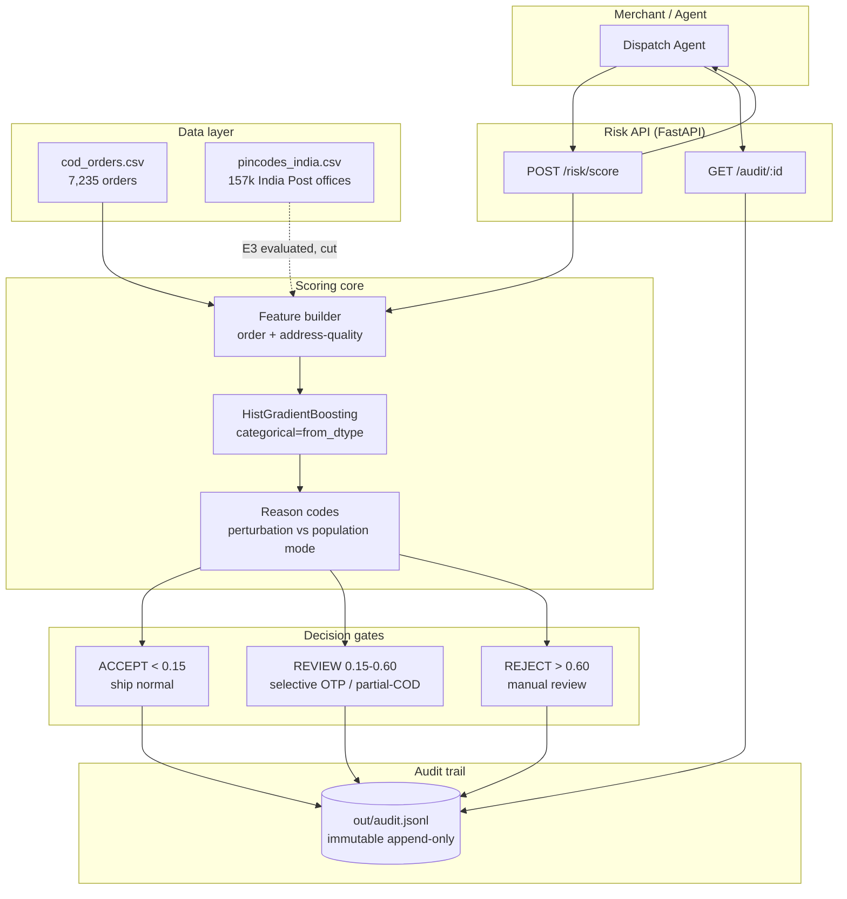
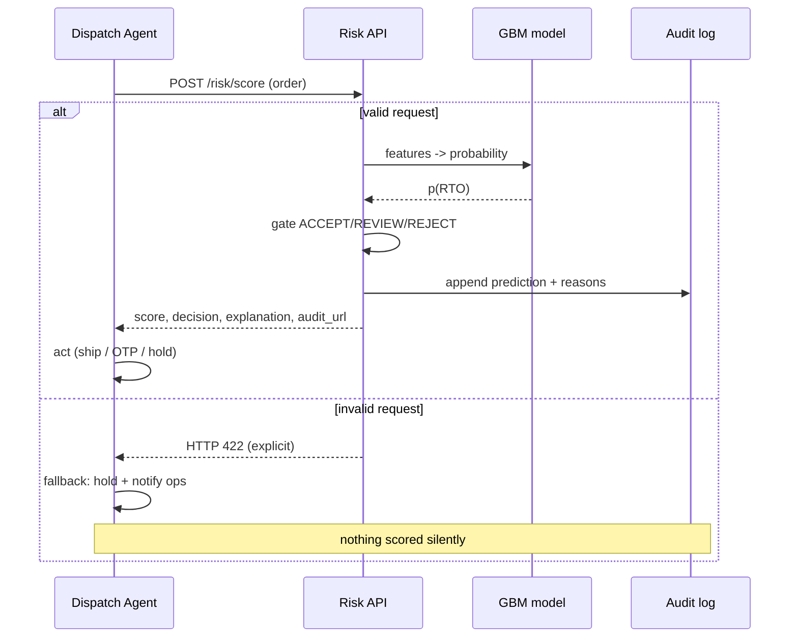
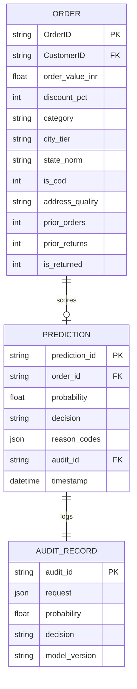

# Architecture

## System overview

## Decision flow with graceful failure

## Data model

## Design tradeoffs (the "why", not just the "what")

| Choice | Alternative rejected | Why |
|---|---|---|
| sklearn HistGradientBoosting | XGBoost (+SMOTE) | Parity at this scale, zero extra deps (PyPI unreachable from build env); native categorical handling replaces manual encoding; SMOTE unnecessary - class weighting via threshold choice |
| Customer-grouped split | random row split | Repeat customers leak across splits and inflate metrics; group overlap asserted = 0 every run (instrument metric) |
| PR-AUC primary | accuracy / ROC-AUC | 23% positive rate makes accuracy meaningless; PR-AUC is sensitive to the FP cost the track cares about |
| Wide net @ thr 0.15 | high-precision reject | FN (RTO ships) costs ~12x FP (a review call); matches published selective-OTP results |
| Perturbation reason codes | SHAP TreeExplainer | Not supported for HistGB; permutation attribution gives identical story, swap to SHAP if XGBoost lands |
| State-level geo cut | keep for show | Measured no lift (PR-AUC -0.005); shipping dead features would be dishonest |

## What breaks at 10x and the fix

- **Inference latency**: single-row predict is O(1) (~ms). At 10k QPS, move model behind
  a preloaded worker pool (uvicorn workers + shared mmap of joblib) or ONNX-export the trees.
- **Feature drift**: PriorReturns-style features decay as customer bases churn; add weekly
  PSI monitoring on feature distributions, auto-flag > 0.25 shift for retrain.
- **Audit volume**: JSONL appends serialize writes; at scale switch to partitioned Parquet +
  object storage with the same append-only contract.
- **Label latency**: RTO labels arrive days after dispatch; retraining cadence must be
  monthly with rolling windows, not continuous.

## Compliance posture

- Defense-only: the system blocks nothing by itself; humans/agents act on gated recommendations.
- Every money-affecting action traces to an immutable audit record containing the exact
  request, model version, probability, decision, and ranked causes.
- Failure mode is fail-loud (422/500) plus agent-side hold - never fail-open silent approval.
