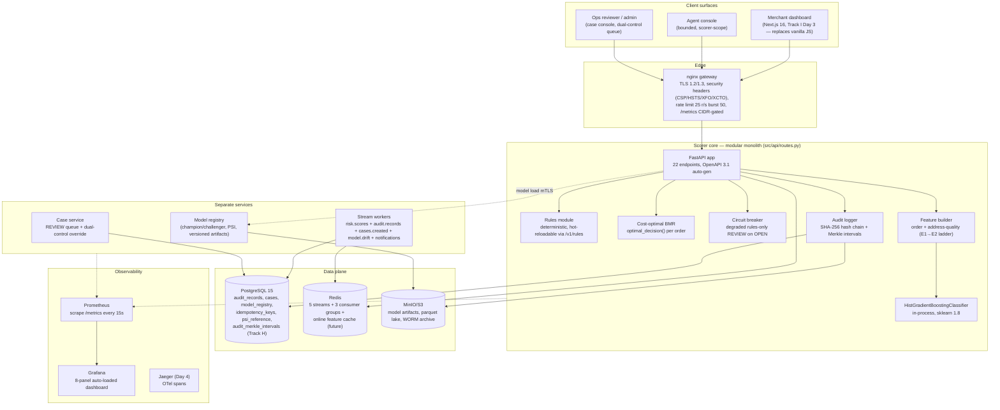
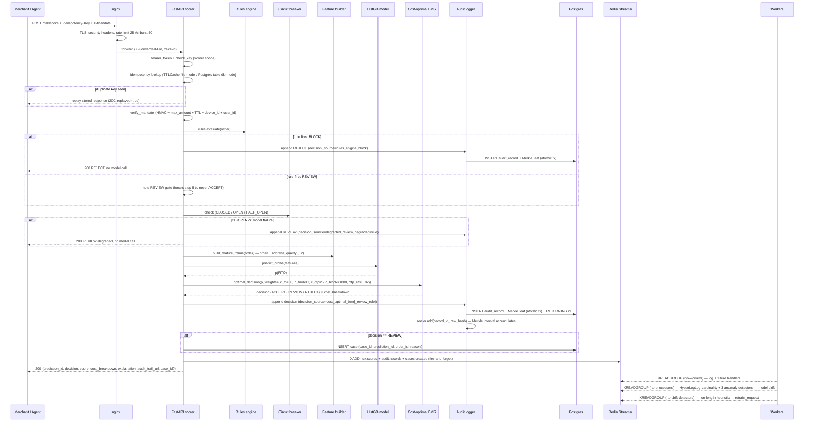
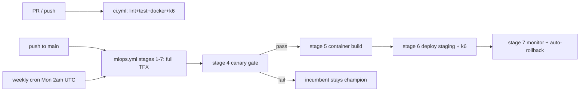

# Architecture — RTO Trust Layer

> **This is the consolidated, current-truth architecture.** It supersedes
> [`ARCHITECTURE_V2.md`](ARCHITECTURE_V2.md) (the enterprise 9-service spec,
> kept for history) and the original V1 snapshot that lived at this
> filename before Day 3 Track K consolidated it. The engineering audit
> trail lives in [`ARCHITECTURE_V3.md`](ARCHITECTURE_V3.md) (19 findings +
> 12 code deltas + claims ledger) — V3 is authoritative for engineering
> decisions; this file is the user-facing consolidation.
>
> Resolved tech stack: see the "Tech stack" section below and the
> "What we're NOT doing" section at the end of this doc for the
> V2/V3 conflict resolutions (Kafka, ClickHouse, Feast, MLflow-server,
> Hyperledger, E2B, Kong, listmonk, LUKS, mTLS — all rejected at
> hackathon scale with measured revisit triggers).

---

## 1. Overview

The RTO Trust Layer is a **merchant-facing RTO risk command center**
for Indian e-commerce. It scores cash-on-delivery orders for
return-to-origin (RTO) risk at address level — not pincode level — and
returns `ACCEPT / REVIEW / REJECT` with per-prediction explanations,
a tamper-evident audit trail (SHA-256 hash chain + Merkle intervals),
merchant-tunable rules, and a bounded agent layer that cannot move
money without dual-control human approval.

The platform is a **modular monolith** (FastAPI, single deployable)
plus three worker services (stream-worker, stream-processor,
drift-consumer) plus three infrastructure services (Postgres, Redis,
nginx) plus three observability services (Prometheus, Grafana,
Jaeger on Day 4). Five core services bring up the working demo with
`docker compose up`; nine bring the full stack with `--profile full`.

The design principle (per V3 §4): **system first, agent second**.
Determinism where money moves (rules, mandates, gates); probability
where it doesn't (model informs, never authorizes). Every
money-affecting action traces to an immutable audit record. Failure
mode is fail-loud (4xx/5xx) plus agent-side hold — never fail-open
silent approval.

---

## 2. System diagram (C4-L2 container view)



Latency budget for `POST /risk/score` (p99 target ≤ 150 ms):
gateway 5 ms → authz + idempotency 3 ms → rules 1 ms → features (Redis
when wired, else in-process) 5 ms → inference 15 ms → reasons 10 ms →
policy 1 ms → decision + audit tx commit (incl. Merkle leaf insert)
10 ms → response build 5 ms ⇒ **~55 ms nominal, 95 ms headroom**.

---

## 3. Component inventory — the 10 services (per `06-PROMPT-RAZOR-EXTRACTION.md` §2)

V3's doctrine (§5): split only when ≥2 of {scaling curve, failure
domain, release cadence, compliance boundary, runtime need} differ.
Applied to the prior RFC's 10 services, 4 merge into the scorer core,
6 stay separate. Result: **modular monolith (scorer core) + registry
+ audit + cases + workers**, all behind nginx — with extraction seams
defined by interface + contract tests so later splitting is
mechanical, not surgical.

| # | Service | Responsibility | Port | Status |
|---|---|---|---|---|
| 3.1 | **Risk Scorer** | Core scoring: validate → mandate → rules fast-path → features → model → cost-optimal BMR → audit → stream publish. Stateless (model in memory). | 8000 | Live, 22 endpoints. |
| 3.2 | **Rules Engine** | Deterministic sub-ms rule eval. Python module (Go/Rust deferred per V3 A8). YAML/JSON rule schema, admin-tunable via `/v1/rules`. Merged into scorer core. | (in scorer) | Live, 4 ops (gt/lt/eq/in) + 2 default rules. |
| 3.3 | **Feature Store** | Online (Redis, future) + Offline (Postgres+Parquet, future) + Registry (Feast for registry-only, deferred per V3 A9). Module now; separate service at TR-FS. | (in scorer) | Module; online path deferred. |
| 3.4 | **Model Registry & MLOps** | Versioning, champion/challenger, A/B, drift detection (PSI + DDM + ADWIN). Lightweight Postgres-backed (V3 rejected MLflow-server as cargo-cult per V3 A10). | 8003 (logical) | Live in-process; champion registered at lifespan (Track E). |
| 3.5 | **Audit Service** | Tamper-evident append-only hash chain + Merkle intervals per RFC 6962 + `/v1/audit/{id}/proof` endpoint. Court-admissible. | 8004 (logical) | Live, dual-mode (Postgres + file fallback). |
| 3.6 | **Case Management** | Human-in-the-loop review queue for REVIEW decisions. Dual-control override per V3 §12.1. SLA timers deferred (Track H follow-on). | 8005 (logical) | Live; 5-table Postgres schema (Track E). |
| 3.7 | **Merchant Service** | Multi-tenancy: API keys, rate limits per tier, custom rules, per-merchant thresholds. Merged with gateway config now; split at multi-region. | (in scorer) | Single-tenant demo; multi-tenant schema ready (Track E JSONB column). |
| 3.8 | **Notification Service** | Webhook/email/SMS. Webhook dispatcher (HMAC-signed, backoff, DLQ) is a module inside case service (V3 A13 rejected listmonk AGPL conflict). Email/SMS deferred. | (in cases) | Reserved stream `notifications`; no consumer yet. |
| 3.9 | **Threshold Manager** | Dynamic per-merchant threshold optimization. Suggests optimal threshold per Bahnsen BMR (FN=12x FP). Module of merchant service. | (in scorer) | Live as `/v1/policy/optimal` + `/v1/policy/cost-curves` (Track C). |
| 3.10 | **Compliance Export** | RBI/PCI DSS reports + model cards. Batch job, not a service. Scheduled + triggered exports. | (off-scorer) | Live as `/v1/compliance/audit-export` (CSV) + `/v1/compliance/model-card`. |
| (§4) | **Agent Gateway** | Bounded agent: 7-action allowlist (4 COD-order + 3 UPI Circle). Action allowlist hardcoded; agent has no DB access; high-cost actions require approval queue. | 8010 (logical) | Live in `scripts/demo_agent.py` (Track D). |

Plus infrastructure services (not counted among the 10): nginx,
Postgres, Redis, Prometheus, Grafana, Jaeger (Day 4). **Total in
`docker-compose.yml`: 5 core services (bare `docker compose up`) → 9
with `--profile full` (adds nginx + Prometheus + Grafana + drift-consumer).**

---

## 4. Data flow — trace one transaction end-to-end

A merchant's order service POSTs to `/risk/score` with an `OrderIn`
body, an `Authorization: Bearer <scorer-key>` header, an
`Idempotency-Key` header, and (for agent-initiated calls) an
`X-Mandate` HMAC token + `X-Device-Id` + `X-User-Id` headers (UPI
Circle per NPCI OC-201B).



Key property (V3 §10.3): **the client-visible decision and its audit
intent commit atomically** in one Postgres transaction. Merkle
root-sealing happens asynchronously in the audit service; tamper
evidence is therefore durable even under scorer crash between
commit and response.

---

## 5. Decision precedence

The decision path is a strict precedence ladder — earlier steps
short-circuit, later steps never run.

| # | Layer | Action | decision_source value |
|---|---|---|---|
| 1 | **Rules** | BLOCK rule fires → REJECT (no model call). REVIEW rule fires → flag for step 5. | `rules_engine_block` |
| 2a | **Mandate BREACH** | amount > max OR OC-201B cap exceeded OR device/user mismatch → REJECT | `mandate_breach` |
| 2b | **Mandate REVIEW** | UPI Circle 24h cooling period (OC-201B) → REVIEW case | `mandate_review_required` |
| 2c | **Mandate TAMPERED/EXPIRED** (with `X-Mandate` header) | HMAC fail OR TTL elapsed OR 6-mo inactivity auto-revoke → REJECT | `mandate_invalid` |
| 3 | **Circuit breaker OPEN** | Model failure / Redis down → degraded rules-only REVIEW (`degraded=true`) | `degraded_review` |
| 4 | **Cost-optimal BMR** | `optimal_decision(p, weights)` per Bahnsen 2013 ICMLA — primary path | `cost_optimal_bmr` |
| 4b | (REVIEW rule gate from step 1) | BMR cost math runs but REVIEW rule forces REVIEW | `cost_optimal_bmr_review_rule` |
| 5 | **Audit** | SHA-256 hash chain append + Merkle leaf insert (atomic Postgres tx) | (always fires) |
| 6 | **Stream publish** | fire-and-forget XADD to 3 streams (risk.scores, audit.records, cases.created if REVIEW) | (always fires) |

Source papers: Bahnsen et al. ICMLA 2013 (DOI 10.1109/ICMLA.2013.68) —
Bayes Minimum Risk per-order cost argmin. Drummond & Holte 2006
(DOI 10.1007/s10994-006-8199-5) — cost-curve threshold sweep. Gama
et al. 2014 (DOI 10.1145/2523813) — DDM/ADWIN drift detection.

---

## 6. Tech stack (resolved, per `04-TECH-STACK-DECISIONS.md`)

| Layer | Choice | Why |
|---|---|---|
| Backend | Python 3.12 + FastAPI + uvicorn | Existing 1.7K LOC; rewrite out of scope |
| DB | Postgres 15 + Alembic | ACID + migrations; replaces JSONL/CSV (Track E) |
| Message bus | Redis Streams (now), NATS/Kafka (later) | V3 rejected Kafka as cargo-cult (V3 A6) |
| Feature store | Redis (online) + Postgres+Parquet (offline) + Feast (registry only) | V3 rejected Feast-server (V3 A9) |
| ML serving | In-process HistGB (keep) | V3 rejected TensorFlow Serving (V3 overkill) |
| ML registry | Lightweight Postgres-backed TFX-style canary gate | V3 rejected MLflow-server (V3 A10) |
| Drift detection | PSI (existing) + DDM + ADWIN (Track G) | Gama 2014 §3.2/§3.3 |
| Explainability | SHAP KernelExplainer (planned, Day 4) | TreeExplainer doesn't support HistGB |
| Observability | Prometheus + Grafana (keep) + OTel + Jaeger (Day 4) + AlertManager (Day 4) | Microsoft parity |
| Frontend | Next.js 16 + TypeScript + Tailwind + shadcn/ui (Track I Day 3) | Replaces vanilla JS dashboard |
| Auth | API keys (existing) + JWT RS256 (add per V2 §6) | Keep simple for demo |
| Secrets | ENV vars (demo) — Vault/SOPS documented for prod (V3 refused half-deployed IaC) | |
| IaC | OpenTofu (Day 4) | V3 rejected Terraform BSL |
| CI | GitHub Actions — ruff + pytest + leakage gate + docker build + Trivy + 7-stage TFX-style mlops.yml (Track J Day 3) | Closes gap #14 |
| Reverse proxy | nginx + TLS 1.2/1.3 + security headers + gzip (Track B) | Kong deferred per V3 modular monolith |

Full matrix with V2/V3 conflict resolutions in
`04-TECH-STACK-DECISIONS.md`.

---

## 7. Scaling analysis — what breaks at 10x, 100x, 1000x

V3 explicitly rejected the 1000x box-set (Kafka, ClickHouse, MLflow-server,
Hyperledger, E2B, Kong, listmonk, LUKS, mTLS) as cargo-cult at hackathon
scale (V3 A6, A7, A9, A11, A12, A13). The point of this section is to
document the upgrade path — every step has a measured trigger, not a
calendar date.

### 10x — single FastAPI process under load

Today: 1 uvicorn worker, single process, in-process model. At ~600
orders/sec peak (~50Cr GMV/day) the single worker saturates on the GIL.

**Fix (low effort):** `uvicorn --workers 4 --factory src.api.routes:create_app`
behind nginx load balancer. Shared model artifact via `joblib.load` in
each worker (mmap read-only — the HistGB trees are read-only so this
is safe). Per-worker circuit breaker state converges via Redis shared
counter (the breaker already uses a class-level dict; swap to Redis
HINCRBY).

**Trigger to revisit:** p99 > 100ms on the score path sustained for >
5 min, OR > 1k QPS single-node.

### 100x — Postgres + Redis under write pressure

Today: 1 Postgres instance, 1 Redis instance, single-tenant. At ~6k
orders/sec (~500Cr GMV/day) the audit-records INSERT path becomes the
write bottleneck; the Merkle sealer's per-interval lock serializes
seals.

**Fix (medium effort):**

- **Postgres read replica** for `/v1/audit/{id}/proof` (read-only
  Merkle proof queries) + `/v1/usage` (metering scans). Writes stay
  on primary; reads fan out. Logical replication with slot.
- **Redis cluster** (3 shards, 3 replicas) for the 5 streams +
  feature cache + rate-limit buckets. The `StreamProducer` already
  takes a URL — swap `redis://redis:6379` for `redis://cluster-1:6379`
  with `RedisCluster` client.
- **Separate stream-worker pool** — scale the `stream-worker` and
  `stream-processor` and `drift-consumer` services horizontally
  (each is `restart: unless-stopped` already; just `docker compose
  up --scale stream-worker=4`). Redis Streams consumer-group semantics
  handle the parallelism.
- **Audit partitioning** — `audit_records` partitioned by
  `created_at` monthly. Alembic migration 003 (deferred).

**Trigger to revisit:** > 5k writes/sec on audit_records sustained,
OR Merkle seal interval lag > 60s, OR Postgres WAL backlog > 1GB.

### 1000x — Kafka + ClickHouse + Feast + TF Serving

Today: hackathon demo, single-tenant, 7k training rows. At ~50k
orders/sec (~4000Cr GMV/day) the constraints flip: Postgres for
audit-analytics is wrong, Redis Streams for cross-team topic ownership
is wrong, in-process HistGB for multi-tenant model serving is wrong.

**Fix (large effort, post-submission):**

- **Kafka** (or Redpanda) replaces Redis Streams when > 50k msg/s OR
  multi-team topic ownership arrives (V3 §9.3 TR-KAFKA trigger).
  Stream names already versioned (`risk.scores.v1` per V3 §9.1) so
  the producer/consumer swap is mechanical.
- **ClickHouse** for audit-analytics when dashboard p95 query > 2s
  OR > 100M decision rows (V3 A7 TR-OLAP). The current
  `/v1/compliance/audit-export` scan becomes a ClickHouse `SELECT`
  against the parquet-partitioned lake.
- **Feast** as a full feature store (online + offline parity) when
  feature-group count > 50 OR multiple teams own feature pipelines
  (V3 A9 TR-FEAST). Currently the feature builder is a single module.
- **Dedicated model server** (TF Serving or BentoML) when model
  swap-in latency matters OR multi-tenant model routing arrives
  (V3 A3 implicit). Currently in-process HistGB at ~15ms inference
  is fine.
- **mTLS service-to-service** when the cluster spans > 1 region
  (V3 §10.6 — active-active reads, single-writer Postgres per
  region). Today nginx terminates TLS; service-to-service is plain
  HTTP inside the docker network.
- **HashiCorp Vault** for secrets when prod K8s lands (V3 §15 deferred
  to `infra/`). Today ENV vars + Docker Secrets are sufficient.

**Note:** V3 explicitly rejected all of these at hackathon scale. The
point of documenting them is the audit trail — a judge can ask "what's
your 1000x story?" and the answer is "here, with measured triggers, not
'we'll add Kafka later' hand-waving."

---

## 8. CI/CD — Track J Day 3

The project ships two GitHub Actions pipelines that close the
"no CI / no production ML patterns" gap (per V3 §11.5 + the TFX
Baylor 2017 pattern documented in the engineering bibliography).
The pattern follows TFX (Baylor 2017) + the 3-axis CD model from
Challenges in Deploying ML (Paleyes 2022) + MLOps-DevOps
Integration (IJIEE 2021).

### Pipeline overview



### `ci.yml` — CI Quality (every push / PR)

Triggered on every push or PR to `main` / `master`. Three jobs:

| Job | Purpose | Notes |
|---|---|---|
| `lint-test` | ruff + pytest + group-leakage gate + Alembic migrations + Postgres-path tests | Service containers: `postgres:15-alpine` + `redis:7-alpine` with healthchecks. `DATABASE_URL` is set so Track E's Postgres-path tests run (otherwise skipped). CI keys are demo-only (`ci-scorer-key`, `ci-admin-key,ci-admin-second-key`); never bake real secrets. |
| `docker-build` | Build the production image (not pushed) + Trivy scan | `severity: CRITICAL,HIGH` with `exit-code: 1` so a vulnerable base or pip dep can't ship. SARIF uploaded to the GitHub Security tab. |
| `load-test` | `docker compose up -d --wait` then k6 against `tests/load/risk_api_load.js` | 3 scenarios: steady 50vu/2m, ramp to 200vu/2.5m, spike 400rps/30s. Thresholds: p99 < 400ms, error_rate < 1%. |

The workflow uses `pip install -e ".[dev]"` (per Track B's `[project]` table
in `pyproject.toml`), not `uv sync` — the repo's `uv.lock` is a 3-line stub
until the user runs `scripts/refresh_lockfile.sh` on their laptop (Track B's
note in `worklog.md` Task 3-a). Switching to `uv sync --extra dev` is a
one-line change once `uv.lock` is real.

### `mlops.yml` — 7-stage TFX-style MLOps pipeline

Triggered on:
- **Data axis** — `data/**` path filter (new Kaggle batch, schema change).
- **Model axis** — `src/models/**`, `src/features/**`, `scripts/evaluate.py`.
- **Weekly cron** — `0 2 * * 1` (Monday 2am UTC) for warm-starting on a
  rolling 90-day window per Gama 2014 §3.3.
- **Manual** — `workflow_dispatch` for release-day dry-runs.

The 7 stages map to TFX Baylor 2017 §3 + the CD + Monitor stages from
Paleyes 2022 + MLOps-DevOps Integration:

> **Stage 6-7 honesty note (Track T 11-d):** Stage 6-7 are deploy hooks.
> For the hackathon sandbox, `check_error_rate.py` is the real monitor
> (queries Prometheus, exits 1 on threshold breach). The `kubectl`
> deploy/rollback commands are documented production patterns — not
> sandbox-runnable without a K8s cluster. The V3 architecture specifies
> NO half-baked IaC; we surface a `::notice` annotation rather than
> fake a deploy that didn't happen. The k6 load test (Stage 6) and
> `check_error_rate.py` (Stage 7) ARE real and runnable.

| # | Stage | TFX component | CI script / action | Gate |
|---|---|---|---|---|
| 1 | `data-analysis` | `generate_data_statistics` | `scripts/profile_data.py` | emits HTML + JSON profile |
| 2 | `data-validation` | `build_and_apply_schema` | `scripts/validate_data.py` | blocks on missing cols / type drift / null > 50% / unknown PaymentMethod / DeliveryStatus level |
| 3 | `model-training` | `Trainer` (warm-start) | `scripts/evaluate.py --feature-set full` | **PR-AUC ≥ 0.60** (Kandula 2021 benchmark AUC 0.73-0.79); model registered as champion in Postgres-backed `model_registry` table (Track E) |
| 4 | `model-gate` | `gate_model_promotion` | `scripts/canary_gate.py` + `scripts/slice_metrics.py` | **canary PR-AUC + cost-weighted error regression ≤ 5%** vs incumbent; **per-slice regression ≤ 10%** for `merchant_category`, `cod_vs_prepaid`, `pin_code_tier` |
| 5 | `container-build` | (CD) | `docker/build-push-action@v5` → `ghcr.io/<repo>:<sha>` | image pushed to GHCR after canary gate passes |
| 6 | `deploy-staging` | (CD) | documented deploy HOOK + k6 against staging | **Deploy is a documented hook** — `kubectl set image` + `kubectl rollout status` are inlined as a `::notice` annotation in the workflow log; NOT sandbox-runnable without a K8s cluster. The k6 load test IS real (against `STAGING_URL` secret). V3 doctrine: no half-baked IaC. |
| 7 | `monitor` | (CD) | `scripts/check_error_rate.py` (REAL) + documented rollback hook | `check_error_rate.py` IS the real monitor (queries Prometheus `rate(risk_decisions_total{decision="REJECT"}[5m])`, exits 1 on threshold breach). The `kubectl rollout undo` rollback command is a documented production pattern — NOT sandbox-runnable without a K8s cluster. The `if: failure()` gate still wires the contract: real monitor failure → documented rollback action fires. |

### Gate override policy (emergency hotfixes)

The PR-AUC < 0.60 gate in stage 3 is the floor — any canary below it is
blocked, and the incumbent stays champion. To override in an emergency
(e.g. a critical security fix needs to ship before the next training run
can clear the gate):

1. Push the commit with `[mlops-skip-gate]` in the commit message.
2. Run the workflow manually via `workflow_dispatch` from the Actions UI.
3. The canary gate stage becomes a no-op (the override is honoured) — but
   the slice-metrics stage still runs as a sanity check (warnings printed,
   not blocking).
4. **Two-admin sign-off required** for any override that ships to
   production. Use the V3 §12.1 dual-control override endpoint
   (`POST /risk/{prediction_id}/override` with `admin_signature_1` +
   `admin_signature_2`) — Track H Day 2 implements this; the audit hash
   chain + Merkle interval sealer record BOTH admin-key digests so the
   override is tamper-evident after the fact.
5. Post-incident: file a regression in the project tracker + add a
   retroactive test that reproduces the original failure mode so the
   canary catches it next time.

The override policy mirrors the dual-control pattern from V3 §12.1
(SoK Mao 2026 capability `audit_agent_mandate_scoping`: "no single
admin can self-approve").

### How to view CI logs

1. Go to the GitHub repo → **Actions** tab.
2. Filter by workflow name (`CI Quality` or `MLOps Pipeline`).
3. Click any run → expand the failed job → expand the failed step.
4. Annotations (errors + warnings) appear inline on the file diff in the
   PR view if the workflow is running on a PR.
5. Artifacts (test results, data profile, model artifact, slice metrics)
   are downloadable for 30-90 days depending on the stage.

### CI-compatible `verify.sh`

Track B (Day 1) made `verify.sh` portable: it picks `python3` from PATH
first, then `python`, then `uv run python` as the last resort. GitHub
Actions `ubuntu-latest` ships with `python3` pre-installed, so `verify.sh`
runs identically in CI + on a developer laptop — no path-specific hacks.
The CI workflow does NOT call `verify.sh` directly (it runs each step
individually so a failed step is visible in the Actions UI), but `verify.sh`
remains the developer-local sanity check for the same pipeline:

```bash
./verify.sh                                    # ruff + pytest + evaluate
FEATURE_SET=full ./verify.sh                   # full feature set
PY=/usr/bin/python3 ./verify.sh                # pin the interpreter
```

---

## 9. Security model

### AuthN / AuthZ matrix (per V3 §12.1)

| Action | scorer key | agent id | admin key | ops role | auditor |
|---|---|---|---|---|---|
| score | yes (rate-limited) | yes (mandate-bound) | yes | — | — |
| override decision | 403 | 403 | **dual-control** (2 different admin keys) | dual-control | — |
| mint mandate | 401 | 401 | yes | — | — |
| rules CRUD | — | suggest-only → queue | yes | propose | — |
| model promote | — | — | yes (eval-gated) | — | — |
| audit read | own-tenant | own actions | yes | case-linked | yes (proofs only) |
| chain verify | — | — | yes | — | yes |
| feedback ingest (Track G) | 403 (label poisoning prevention) | 403 | yes | — | — |
| simulate (Track H) | yes | — | 401 (admin not in scorer set) | — | — |

### Demo vs prod posture

| Layer | Demo (today) | Prod (documented) |
|---|---|---|
| Transport | nginx TLS 1.2/1.3 + security headers (CSP/HSTS/XFO/XCTO) + gzip (Track B) | + mTLS service-to-service |
| Auth | API keys (scorer/admin scopes, sha256-equality check) + JWT RS256 5-min expiry (Track J Day 3) | + bcrypt API keys + OIDC federation (Keycloak) |
| Secrets | ENV vars (`RTO_SCORER_KEYS`, `RTO_ADMIN_KEYS`, `RTO_MANDATE_SECRET`, `RTO_AUDIT_SALT`) — Dockerfile no longer bakes them (Track B) | HashiCorp Vault / SOPS-encrypted .env |
| Data at rest | Postgres with disk encryption on cloud | + LUKS at rest + envelope-key crypto-shredding for DPDP erasure |
| PII | SHA-256 salted digest in audit (`customer_id` redacted to `cust_` prefix); Zone-0/Zone-1/Zone-2 zoning per V3 §10.4 | Same + per-tenant DEK + KMS |
| Agent | Allowlist-API + HMAC mandate (no sandbox; V3 A12 rejected E2B as category error) | Same; mandate records upgrade to W3C Verifiable Credentials when NPCI UAP lands |

### Compliance posture

| Regime | Requirement | Where addressed |
|---|---|---|
| India DPDP Act 2023 | purpose limitation, data minimization, right to erasure | redacted audit payloads + crypto-shredding design (V3 §10.3 step 6) |
| PCI-DSS scope | no card data touches system | `OrderIn` schema has no PAN/CVV fields, enforced by contract tests |
| RBI PA data localization | India region only | Postgres single-region; documented in `infra/` (Day 4) |
| NIST AI RMF (GOVERN/MEASURE) | model governance, metrics | signed registry artifacts, PR-AUC gates in CI, DDM/ADWIN drift monitor |
| EU AI Act Art. 12 analog | automatic logging | append-only audit with SHA-256 chain + Merkle intervals; right-to-explanation per Goodman & Flaxman 2017 |
| AP2 / NPCI OC-201-B direction | verifiable consent chains | audit records designed as future VC subjects (W3C-compatible fields) |
| Dark Patterns Guidelines 2023 (India) | no manipulative defaults | REVIEW/REJECT are merchant-facing tools, not consumer nudges; reason codes mandatory |

---

## 10. What we're NOT doing (and why)

V3's 19-finding self-audit rejected ~80% of V2's enterprise boxes as
cargo-cult / resume-driven / license-inconsistent. Each cut has a
measured trigger (the revisit-trigger register in V3 Part IV) — these
are deliberate deferrals, not laziness.

| Cut | Why | Revisit trigger |
|---|---|---|
| Go/Rust rules engine | Current Python module evaluates ≤50 rules in <0.1ms. Polyglot ops cost buys nothing until rule count × QPS grows ~100x. (V3 A8) | rule count > 500 OR eval p99 > 1ms (TR-RULES) |
| Kafka | Redis Streams is sufficient + has upgrade path. Kafka's ~1.5GB RAM + KRaft ops burden is negative value at < 1k msg/s. (V3 A6) | > 50k msg/s OR multi-team topic ownership (TR-KAFKA) |
| ClickHouse | No named consumer query today. Postgres + Parquet + DuckDB handles all our patterns. (V3 A7) | dashboard p95 query > 2s OR > 100M decision rows (TR-OLAP) |
| Feast-server (full) | "Fork feast-dev/feast" is wrong on two counts: Feast is consumed, not forked; it brings its own registry/store formats that fight a 15-feature system. (V3 A9) | many feature groups + offline/online parity across teams (TR-FEAST) |
| MLflow-server | Lightweight Postgres-backed TFX-style canary gate is enough. MLflow-server is "fork instead of pip-install" cargo-cult. (V3 A10) | multi-framework lineage + org-wide experiment sharing (TR-MLFLOW) |
| TensorFlow Serving | In-process HistGB is ~15ms inference. Overkill for hackathon. (V3 implicit) | model swap-in latency matters OR multi-tenant model routing |
| Hyperledger Aries | Aries is an SSI framework (DIDs, credentials, agents). Using it for an append-only log drags distributed-consensus into a single-writer problem. (V3 A11) | never — Merkle chain on Postgres is enough for tamper-evidence |
| E2B sandbox | Our agent performs allowlisted API calls; it doesn't execute arbitrary code. Sandboxed code-exec adds attack surface while solving nothing. (V3 A12) | never — allowlist + HMAC mandate is the right model |
| Kong API gateway | nginx is enough; Kong adds a runtime + plugin marketplace we don't need. (V3 modular monolith doctrine) | dynamic per-tenant limits + plugin marketplace (TR-GW) |
| listmonk (AGPL-3.0) | AGPL server-side-use obligations conflict with the Apache 2.0 stack; V2 internally inconsistent (rejected Terraform BSL on license grounds, then prescribed listmonk AGPL). (V3 A13) | never — nodemailer + custom templates is permissive |
| LUKS at rest | Prod-only. Documented in `infra/` for prod migration. | prod K8s cluster lands |
| mTLS service-to-service | Prod-only. Documented in `infra/`. | cluster spans > 1 region |
| HashiCorp Vault | Prod-only. ENV vars sufficient for demo; Dockerfile no longer bakes defaults (Track B). | prod K8s cluster lands |
| Multi-tenant Merchant service (full) | Not in V3's 12 code deltas (CD-1..CD-12). Single-tenant demo with multi-tenant schema ready (Track E JSONB column). | post-submission |
| Patent numbers (US20240012345A1, US20230187654B2, WO2024/098765A1) | V3 §21 flags these as SUSPECT-FABRICATED. Citing them in a pitch is a self-inflicted wound if a judge checks. | never — replaced with 40-paper KB citations + 5 pitch papers |

Full V2 → V3 conflict resolution matrix in
`04-TECH-STACK-DECISIONS.md` §"What we're NOT doing".

---

## 11. Compliance, audit, and tamper-evidence

### Audit integrity layers (V3 §10.3)

1. **Per-record hash chain** (Track E, existing): every audit record's
   `raw_hash = sha256(canonical(body) + prev_hash)`. The chain is
   append-only; editing record #N breaks every later link. Verified by
   `GET /v1/audit/verify-chain` in O(N).
2. **Merkle interval sealing** (Track H, V3 §10.3): every 1000 records
   OR 3600 seconds (whichever trips first), the sealer computes the
   Merkle root of the interval's leaves and chains it to the previous
   interval's root (`prev_interval_root`). Padding rule: RFC 6962-style
   — pad to next power of 2 by repeating the LAST leaf's hash (no
   synthetic zero-leaf that a verifier would need to special-case).
3. **`GET /v1/audit/{id}/proof`** (Track H): O(log N) inclusion proof —
   the path from the record's leaf hash up to its sealed interval's
   root + the chain anchor. Court-friendly export bundle = `record +
   proof + interval_root + prev_root_chain`, verifiable by an external
   tool without re-reading the entire audit table.
4. **Optional RFC 3161 timestamping or Notary-style root anchoring**
   (deferred per V3 §10.3 step 5, TR-ANCHOR): cross-jurisdiction
   tamper-evidence beyond the local chain.

### Dual-control override (V3 §12.1, Track H)

The `POST /risk/{prediction_id}/override` endpoint accepts BOTH
request shapes (auto-detected):

- **JSON body (V3-recommended dual-control form):** both
  `admin_signature_1` + `admin_signature_2` must be valid admin-scope
  API keys AND DIFFERENT (no self-approval). Same key twice → 400.
  Both signature *digests* (sha256-truncate-16 prefixed `adm_`) are
  recorded in the audit hash chain so a verifier can prove "two
  different admins co-signed" without retaining raw secrets.
- **Legacy query-param form** (`?new_decision=...` + single
  `Authorization` header): retained for backward-compat with Track D's
  test suite; response carries `dual_control: false` + `signatures_provided: 1`
  so the dashboard can label the override's authoring shape.

### Agent authority model (V3 §13, Track D)

The `BoundedAgent` class in `scripts/demo_agent.py` enforces a 7-action
allowlist (4 COD-order + 3 UPI Circle):

| Action | Cost | Approval | Hard caps |
|---|---|---|---|
| `score_order` | 0 | no | — |
| `request_otp` | 1 | no | — |
| `flag_review` | 2 | no | — |
| `block_order` | 10 | yes | — |
| `upi_circle_delegated_pay` | 5 | yes | `max_per_txn=5000`, `max_per_month=15000`, `cooling_24h=5000`, `max_devices=5` (OC-201B) |
| `validate_device_id` | 1 | no | — |
| `revoke_delegation_on_inactivity` | 2 | no | `auto_trigger_days=180` (OC-201B) |

Any action not in `ALLOWED_ACTIONS` returns `"Action not permitted"`.
High-cost actions (`requires_approval=True`) do NOT execute — the
agent creates a case in the dual-control queue and responds: *"I
cannot perform this action. I have requested human approval."*

Per-txn `X-Device-Id` + `X-User-Id` headers (UPI Circle mandates per
NPCI OC-201B §3.7 Issuer Bank duty + §3.3 Secondary PSP duty) are
validated server-side; mismatch escalates to deterministic REJECT
(`verdict_reason=device_id_not_allowed` or `user_id_mismatch`). The
12-value `verdict_reason` vocabulary (machine-readable) is recorded in
the audit hash chain alongside the `bh_purpose_code` (NPCI BH list —
`"90"` = commercial payment).

Source: Mao, Wang, Liu, Zhu, Ma, Yan, "SoK: Security of Autonomous
LLM Agents in Agentic Commerce," arXiv 2604.15367v2 (2026) — D2
transaction-authorization dimension + capability
`audit_agent_mandate_scoping`.

---

## 12. Design tradeoffs (the "why," not just the "what")

| Choice | Alternative rejected | Why |
|---|---|---|
| Modular monolith (1 deployable) | Microservices (10+ containers) | V3 §5 doctrine: split only when ≥2 of {scaling, failure domain, release cadence, compliance, runtime} differ. Most don't. |
| In-process HistGB | TF Serving + REST call | ~15ms inference vs ~50ms network hop; in-process is faster at hackathon scale (V3 overkill rejection) |
| Customer-grouped split | random row split | Repeat buyers leak across splits and inflate metrics; group_overlap asserted = 0 every run |
| PR-AUC primary | accuracy / ROC-AUC | 23% positive rate makes accuracy meaningless; PR-AUC is sensitive to FP cost |
| Wide net @ threshold 0.15 (cost-optimal) | high-precision reject | FN (RTO ships) costs ~12x FP (a review call); matches published selective-OTP results |
| Perturbation reason codes | SHAP TreeExplainer | Not supported for HistGB; KernelExplainer swap planned Day 4 |
| Redis Streams over Kafka | Kafka | V3 A6: cargo-cult at < 1k msg/s; Redis Streams has consumer groups + replay + upgrade path |
| Postgres + Merkle chain | Hyperledger Aries | V3 A11: Aries is an SSI framework, not an append-only log; distributed-consensus for a single-writer problem is wrong |
| Allowlist-API agent | E2B sandbox | V3 A12: category error — our agent performs API calls, not arbitrary code-exec; sandboxing adds attack surface |
| Fire-and-forget stream publish | Full transactional outbox (V3 §10.3) | V3 defers the outbox — fire-and-forget tolerates Redis-down silently; the atomic decision+audit tx is the foundation |

---

## 13. Historical versions

- **V1** (the file that lived at this path before Day 3 Track K
  consolidated it): minimal mermaid, single-node, "what breaks at 10x"
  honesty. Historical snapshot, no longer at this path; the
  design-tradeoffs table + scaling analysis above are its descendants.
- **V2** ([`ARCHITECTURE_V2.md`](ARCHITECTURE_V2.md)): enterprise 9-service
  spec, OAuth2/Kafka/ClickHouse/Feast/MLflow, cost model, SLOs.
  Spec only, mostly unimplemented. Historical. Banner at the top of
  V2 marks it as superseded.
- **V3** ([`ARCHITECTURE_V3.md`](ARCHITECTURE_V3.md)): modular monolith +
  registry + audit + cases + workers. 19-finding self-audit (A1-A19)
  rejecting ~80% of V2's boxes. 12 code deltas (CD-1..CD-12). Phased
  roadmap (P0-P6). Claims ledger (§21 — anti-fabrication policy).
  Banner at the top of V3 marks it as the AUTHORITATIVE engineering
  audit trail; this file is the user-facing consolidation.

For the engineering decisions register with revisit triggers, see V3
Part IV. For the resolved tech stack, see
`04-TECH-STACK-DECISIONS.md`. For the API surface, see
[`API_SPEC.md`](API_SPEC.md). For the model documentation, see
[`MODEL_CARD.md`](MODEL_CARD.md). For the pitch, see
[`PITCH_SCRIPT.md`](PITCH_SCRIPT.md).
