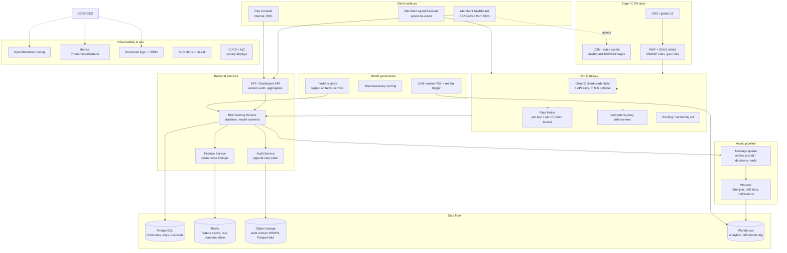
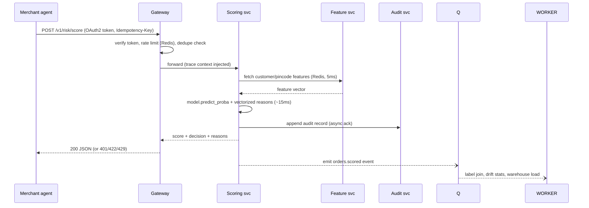
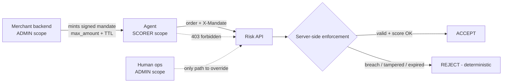

> HISTORICAL — superseded by V3 (`docs/ARCHITECTURE_V3.md`) and the
> consolidated user-facing version (`docs/ARCHITECTURE.md`). Kept for
> context. V2's enterprise 9-service spec was audit-corrected by V3's
> 19 findings (A1-A19) which rejected ~80% of V2's enterprise boxes as
> cargo-cult / resume-driven / license-inconsistent. The current truth
> is in `ARCHITECTURE.md`; V3 is the engineering audit trail; this V2
> is the pre-audit enterprise RFC.

---

# Architecture v2 — Enterprise System Design (cloud-neutral)

> v1 proved the model slice. v2 specifies the system a payment company would actually run.
> Vendor-neutral boxes; map to GCP/AWS/Azure per procurement reality.

## 1. Full-stack system diagram

## 2. Request lifecycle (score call, p99 budget 150 ms)

## 3. Security architecture (maps 1:1 to probe findings)

| Finding (probe) | v1 state | v2 control | Layer |
|---|---|---|---|
| AUTHN-MISSING | none | OAuth2 client-credentials for agents; scoped API keys (scorer vs admin); mTLS option for high-value merchants | Gateway |
| AUDIT-AUTHZ-PII | open | Audit reads admin-scope only; `customer_id` stored as salted digest; full PII never enters audit payload | Audit svc |
| INPUT-UNBOUNDED | scored Rs 1e15 | Pydantic business ranges + schema contracts per field | Scoring svc |
| RATELIMIT-MISSING | unlimited | Per-key token bucket at gateway (Redis-backed counters, cross-instance) | Gateway |
| IDEMPOTENCY-MISSING | duplicate rows | Mandatory Idempotency-Key on POST; Redis SETNX with 24h TTL | Gateway + Redis |
| pickle RCE risk | raw joblib.load | Signed artifacts (ed25519) verified at load; registry is sole writer | MLOps |
| error leakage | exception text | Incident-ID scrubbing, details to SIEM only | Scoring svc |

Threat model highlights (STRIDE): spoofing→mTLS/OAuth; tampering→signed artifacts + WORM audit; repudiation→audit trail w/ digests; info disclosure→PII redaction + TLS everywhere; DoS→WAF/rate-limit/autoscale; elevation→least-privilege IAM per service.

## 4. Reliability targets (SLOs)

| SLO | Target | Notes |
|---|---|---|
| Scoring availability | 99.95% monthly | multi-AZ, stateless services |
| p99 latency (score) | <150 ms | measured: ~35-60 ms local single-node |
| Audit durability | RPO=0 | sync append + async WORM replication |
| Decision correctness | leakage=0 every build | asserted in CI |
| Drift response | retrain within 7d of PSI>0.25 | weekly batch + ADWIN-style online detector; drift taxonomy per Gama et al., ACM Comput. Surv. 46(4) 2014 |

Degradation policy: feature-store timeout → fall back to order-only features (E1 model), flag degraded=true in response; queue down → decisions still logged locally and replayed (at-least-once, idempotent consumer).

## 5. Cost model (unit economics, order-of-magnitude)

Assume 50 scored orders/s peak (≈130M/mo), cloud-neutral mid-tier pricing:

| Component | Monthly est. |
|---|---|
| Scoring service (12 × 2vCPU containers autoscaled avg 40%) | ~$700 |
| Gateway + WAF + CDN | ~$450 |
| PostgreSQL (HA) + Redis | ~$600 |
| Queue + workers | ~$250 |
| Warehouse + lake storage | ~$800 |
| Observability | ~$400 |
| **Total** | **~$3.2k/mo ≈ $0.000025 per scoring** |

vs. prevented loss: at E4 operating point (recall 79%) and industry RTO economics, each 10k COD orders screened prevents ≈ ₹4-6 lakh net loss — cost is noise; the constraint is precision/recall, not infra.

## 6. Rollout plan

1. **Shadow mode**: new model scores live traffic, no decisions taken; compare distributions.
2. **Canary**: 5% of merchants on REVIEW-gate only (never auto-REJECT).
3. **Ramp** 25→100% with kill-switch to v-model via registry pin.
4. Rollback = repoint registry alias; no deploy needed.

## 7. Compliance matrix

| Regime | Requirement | Where addressed |
|---|---|---|
| India DPDP Act 2023 | purpose limitation, data minimization | redacted audit payloads, digest identifiers |
| PCI-DSS scope | no card data touches system | schema has no PAN/CVV fields, enforced by contract tests |
| NIST AI RMF (GOVERN/MEASURE) | model governance, metrics | signed registry, PR-AUC gates in CI, drift monitor |
| EU AI Act Art.12 analog | automatic logging | append-only audit with digests; 'right to explanation' per Goodman & Flaxman, AI Magazine 38(3) 2017 |
| Agentic payments risk regime | bounded agent authority | mandates + admin-only overrides; threat models per SoK arXiv:2604.15367 and Amariles et al., Eur. J. Risk Reg. 2026 (DOI 10.1017/err.2026.10103) |
| Dark Patterns Guidelines 2023 (India) | no manipulative defaults | REVIEW/REJECT are merchant-facing tools, not consumer nudges; decision explanations mandatory |
| AP2 / NPCI OC-201-B direction | verifiable consent chains | audit records designed as future VC subjects (W3C VC-compatible fields) |

## 9. Agent-as-untrusted-client doctrine

The agentic surface is a thin client on top of a boring, proven core. Agents are treated
as the least-trusted principal class in the system: no ambient authority, no credentials
in prompt context, no ability to mint discounts, widen limits, or approve decisions.
Everything money-affecting is enforced server-side against signed, bounded mandates -
the same posture legacy payment rails use for human operators, extended to agents.

Abuse catalog -> control mapping (each row is enforced by code + test):

| Observed failure mode | Real-world pattern | Control in this repo |
|---|---|---|
| Prompt-injected agent leaks credentials | stolen gateway keys resold | scoped keys (scorer vs admin), never in agent context; rotation via env |
| Hallucinated discounts/coupons | agent promises free money | prices/mandates computed server-side only; agents cannot mint (`POST /v1/mandates` is admin-scope) |
| Agent self-approves high-risk order | autonomy runaway | `POST /risk/:id/override` returns 403 to scorer scope; dual control = admin only |
| Spend beyond authorization | mandate runaway (human-not-present) | HMAC-signed mandates with max_amount + expiry; breach escalates to deterministic REJECT |
| Forged authorization artifacts | replayed/tampered tokens | constant-time signature check; tampered -> REJECT (test_mandates.py) |
| Model extraction via query chatter | Tramèr et al., USENIX'16 | per-key rate limits; explanation capped at top-5 reasons; confidence rounded |
| Silent failure masking | errors swallowed by agent | fail-loud contract: 4xx/5xx always explicit; audit records every verdict incl. breaches |

Mandate design aligns with AP2's Intent-vs-Payment mandate distinction (Google et al.,
2025) and the guardrail posture argued for in Amariles et al. 2026: short-lived, scope-bound, cryptographically verifiable, issued by the accountable
principal (merchant), carried by the untrusted one (agent). When NPCI UAP lands, the
same mandate records upgrade to W3C Verifiable Credentials without changing enforcement.

## 10. What is implemented vs specified today

Implemented in-repo (runnable): scoring core, reason codes, gated decisions, scoped-key authn/authz, rate limiting, idempotency, input bounds, PII redaction, O(1) audit index, incident scrubbing, security probe suite, dashboard MVP, cost/threshold analysis.
Specified here (not runnable solo): gateway/WAF, Redis-backed counters, queue/workers, warehouse, registry signing, shadow/canary tooling, multi-AZ. Each maps to a concrete component above so an infra team can implement without redesign.
