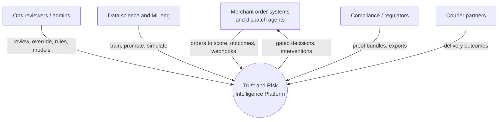
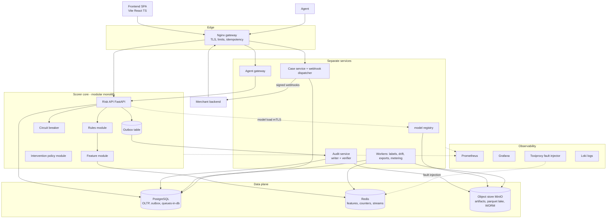
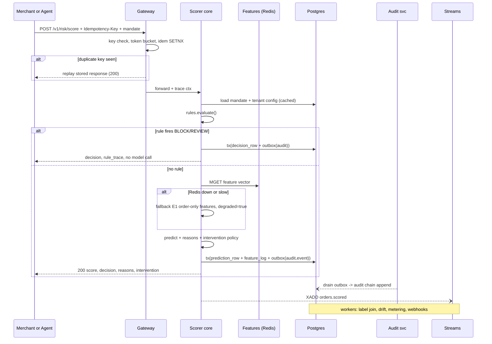

# Architecture v3 — Trust & Risk Intelligence Platform

> **Status:** DRAFT-FOR-REVIEW (living document, edit in place)
> **Supersedes:** `ARCHITECTURE_V2.md` (kept for history), and the external "RFC 2.0 + Missing Assets Brief" produced in a prior chat session.
> **Relationship to code:** The repo (`bfee771`, ship-hardening v0.3) already implements ~60% of the prior RFC's "to build" list. v3 reconciles plan ↔ repo instead of proposing rewrites. Code changes are deliberately minimal; the work here is architectural.

---

## How to use this document

- Every component and every connection has a **register entry** with: purpose, upside, downside, alternatives, decision, and a **revisit trigger** (the measured condition under which we change our mind). Nothing is sacred.
- Sections are independently editable. When we change a decision, do not delete the old row — flip its status to `REVISED` and add the new row. Decisions are append-only, like the audit log.
- Δ marks net-new vs ARCHITECTURE_V2 / the prior RFC.

---

# PART I — AUDIT OF THE INHERITED PLAN

## 1. Verdict on the prior RFC + Missing Assets Brief

| # | Finding | Severity | Resolution in v3 |
|---|---|---|---|
| A1 | **Repo amnesia.** The RFC proposes building mandates, scoped keys, circuit breaker, rules engine, audit chain, cost-optimal thresholds, case service — all of which exist in `src/` today (routes.py, mandates.py, breaker.py, engine.py, logger.py, cost_optimizer.py, cases/service.py). Building them twice burns the schedule. | HIGH | §5 decomposition starts from what ships; each module gets an "extend vs rewrite" verdict. |
| A2 | **Decorative infra.** Compose `--profile full` starts Postgres + Redis, but the API never connects to either (no DATABASE_URL/REDIS_URL env). Demo risk: judges ask "what uses Redis?" and the honest answer is "nothing yet." | HIGH | Phase P2 wires real consumers before advertising the boxes (§18). |
| A3 | **Model trains inside the API lifespan** (`routes.py` loads CSV, group-splits, fits if missing at boot). Startup latency, non-reproducible artifacts, model differs per replica. | MEDIUM-HIGH | Code delta CD-1: API loads a pinned, registry-resolved artifact; training stays offline in `scripts/evaluate.py`. |
| A4 | **Global sequential hash chain is a concurrency bottleneck.** `AuditLogger.log()` serializes every write behind one lock and one `last_hash`; throughput ceiling ≈ single-digit k writes/s and O(n) full-chain verification. At ₹50Cr-GMV scale (~600 orders/s peak) this is the first wall. | HIGH | §10.3: shard-per-hour chains + Merkle checkpointing + outbox; verification becomes O(log n) per proof, chain stays append-only. |
| A5 | **Fire-and-forget audit writes** (FastAPI BackgroundTasks) violate the stated RPO=0: process death between response and write loses the record silently. | HIGH | §10.3 outbox pattern: audit row commits in the same transaction as the decision; relay publishes async. |
| A6 | **Kafka prescribed without workload justification.** For a 1-laptop demo and even early production (~1k msg/s), Kafka (≈1.5–2GB RAM, KRaft/ZK ops burden, slow cold start) is negative value. | MEDIUM | §9.3 matrix: Redis Streams now (already deployed, consumer groups, replay), NATS JetStream at mid scale, Kafka/Redpanda when >50k msg/s or multi-team topic ownership. |
| A7 | **ClickHouse with no named consumer query.** Analytics workload today fits Postgres + Parquet + DuckDB. Adding an OLAP engine before an OLAP problem is resume-driven design. | MEDIUM | Deferred behind revisit trigger TR-OLAP (§7.8): p95 dashboard query >2s or >100M decision rows. |
| A8 | **Go/Rust rules engine premature.** Current engine evaluates ≤50 in-memory rules in <0.1ms Python. Polyglot ops cost (two runtimes, two CI pipelines, two deploys) buys nothing measurable until rule count × QPS grows ~100x. | MEDIUM | Keep Python module; extract behind interface; Rust sidecar listed with trigger TR-RULES (§7.1). |
| A9 | **Feast misprescribed.** "Fork feast-dev/feast" is wrong on two counts: (a) Feast is consumed as a library/server, never forked; (b) it brings its own registry/store formats that fight a 15-feature system. Value appears only with many feature groups + offline/online parity needs across teams. | MEDIUM | Custom thin FeatureService now (we already own the code shape); Feast adoption = trigger TR-FEAST (§7.4). |
| A10 | **"Clone MLflow/Evidently/Prometheus/Grafana sources" is cargo-cult.** These are dependencies, not forks. Prometheus/Grafana are images; mlflow/evidently are pip packages. | LOW | §7 matrices corrected: consume binaries/packages, pin versions, vendor nothing. |
| A11 | **Hyperledger Aries cited for a hash chain.** Aries is an SSI framework (DIDs, credentials, agents). Using it to "steal an append-only log" drags a distributed-consensus-shaped dependency into a single-writer problem. | LOW | Replace with RFC 6962-style Merkle tree + signed checkpoints (§10.3); optionally anchor checkpoints via RFC 3161 timestamping later. |
| A12 | **E2B sandbox for the bounded agent is a category error.** Our agent performs allowlisted *API calls*; it does not execute arbitrary code. Sandboxed code-exec adds attack surface (container escapes) while solving nothing. | MEDIUM | Agent constrained by capability tokens + server-side action budget (§13), not by sandboxing. |
| A13 | **Listmonk is AGPL-3.0** while the same brief rejected Terraform for BSL license hygiene — internally inconsistent. AGPL server-side-use obligations are a real procurement conversation Razorpay legal would have. | LOW | Notification = plain webhook dispatcher we own (~200 LOC) + provider adapters; email/SMS deferred. License matrix added (§7.11). |
| A14 | **Patent numbers in the brief look fabricated** (e.g., "US20240012345A1", "WO2024/098765A1" — suspiciously round numbers, no verifiable titles). Citing them in a pitch is a self-inflicted wound if a judge checks. | HIGH (reputation) | §21: all external claims downgraded to UNVERIFIED until checked against Google Patents/Espacenet. Pitch cites only the experiments we ran. |
| A15 | **RFC's auth model (JWT/OAuth CC everywhere) collides with the shipped mandate model** (scoped keys + HMAC-signed mandates), which is *stronger* for the agent threat model and matches AP2 intent-mandate semantics. Rewriting auth to JWT would be a downgrade dressed as modernization. | HIGH | Keep scoped keys + mandates as the core; OAuth2 CC added only for dashboard SSO federation (§12). |
| A16 | **No labeling/feedback loop specified anywhere.** The whole MLOps story (drift, champion/challenger) is meaningless without a pipeline that joins realized RTO outcomes back to predictions. This was the biggest *missing subsystem*, not a missing repo clone. | HIGH | §11: outcome ingestion, late-label ontology, feature logging to kill training-serving skew. |
| A17 | **Idempotency underspecified.** Key scope, TTL, concurrent-duplicate race, and response-replay storage were hand-waved. | MEDIUM | §14 EC-DIST rows + connection register C-01..C-03 semantics. |
| A18 | **16-service compose for a hackathon demo** ≈ 8GB+ RAM, minutes of startup, 16 failure surfaces during a live pitch. Complexity must be staged, not dumped. | HIGH (demo risk) | §19 phased roadmap: modular monolith → extraction seams → microservices, with per-phase demo-visible artifacts. |
| A19 | Prior plan had **no DR/multi-region story**, **no metering/billing dimension**, **no webhook delivery guarantees**, **no schema evolution policy** — all table-stakes for "platform" credibility. | MEDIUM | §§10.6, 15.4, 16.2, 11.5. |

## 2. What the prior plan got right (keep)

1. System-first, agent-second ordering — correct and preserved.
2. Rules-before-ML evaluation order — correct (deterministic fast path + explainability).
3. Champion/challenger + PSI drift + threshold-as-config — correct shape.
4. Case management as a first-class subsystem — correct (REVIEW without a queue UI is dead weight).
5. k6 over Locust for CI gating — agreed (threshold-based pass/fail, single binary).
6. OpenTofu preference over Terraform BSL — agreed, consistent with MPL-2.0 hygiene.
7. Cost-model math (three-way expected-cost comparison) — the sharpest idea in the whole brief; v3 extends it into a full intervention-policy engine (§11.6).
8. Honest-metrics culture (E3 cut documented) — this is the moat; v3 hardens it with calibration + policy simulation.

---

# PART II — WHO USES THIS AND HOW (USAGE DIMENSIONS)

## 3. Persona × journey × permission map

Every persona below must map to ≥1 test asserting their permission boundary. If a persona has no test, it doesn't exist.

| Persona | Journey | Surface | Auth principal | Permission class |
|---|---|---|---|---|
| Merchant integration engineer | Onboard, get keys, hit `/v1/risk/score` from order service | REST + OpenAPI + generated SDK | scorer-scope API key | score-only, rate-limited by tier |
| Merchant risk analyst | Tune thresholds, read own audit trail, export CSV | Merchant dashboard | dashboard session (OIDC) | own-tenant reads, config writes within tenant caps |
| Ops reviewer (human-in-loop) | Work REVIEW queue, approve/reject cases | Case console | staff session + role claim | case actions; overrides require dual control |
| Risk admin | CRUD rules, promote/challenge models, mint mandates | Admin console | admin-scope key / OIDC admin group | global config; every write audited |
| Autonomous dispatch agent | Score orders, request OTP, flag review | Server-to-server | agent identity (per-agent key) + mandate | zero ambient authority (§13) |
| Supervised agent copilot | Draft rule suggestions, summarize cases | Agent console | agent identity + human approver | suggestions land in approval queue only |
| Data scientist | Backfills, training runs, skew audits, simulations | Notebooks + internal CLI | service identity (CI/DS scope) | read lake, write registry candidates |
| ML engineer | Ship models via shadow→canary→promote | Registry CLI/CI | CI service identity | gated by eval-floor checks |
| SRE | Dashboards, alerts, game days, kill switches | Grafana/on-call | SSO | break-glass role, all actions logged |
| Compliance auditor | Verify chain integrity, pull exports, read model cards | Read-only audit portal | auditor role, time-boxed | no PII unless break-glass w/ ticket |
| Regulator (RBI/DPA officer) | Request decision evidence for order X | Export bundle | via compliance team | signed PDF/JSON bundle + Merkle proof |
| End customer | Experiences OTP/partial-COD gate (indirect) | none | n/a | explanation letter on REJECT (DPDP-friendly) |
| Courier partner (future) | Post delivery outcome webhooks | Outcome API | partner key | outcome fields only |
| Razorpay internal risk (white-label future) | Consume scoring as embedded service | Internal API | service mesh identity | tenant-scoped |

Δ Net-new personas vs prior plan: courier partner (outcome webhooks close the label loop), supervised-agent copilot (separates suggestion from authority), regulator (export bundle with cryptographic proof).

---

# PART III — PRINCIPLES AND DECOMPOSITION DOCTRINE

## 4. Principles (v3 additions bolded)

1. System first, agent second (unchanged).
2. Fail loud, fail safe; degraded ≠ fail-open (unchanged).
3. Audit everything money-affecting (unchanged).
4. Zero ambient authority for agents (unchanged).
5. **Explainability is a contract, not a feature**: every decision carries machine-checkable reasons; reason codes are versioned and tested for stability.
6. **Determinism where money moves, probability where it doesn't**: rules/mandates/gates deterministic; model informs, never authorizes.
7. **Every dependency pays rent**: a box stays in the diagram only while a named requirement or failure mode justifies it. Rent is collected via the revisit triggers in Part IV registers.
8. **Measure the plan, not just the model**: each phase has a demo-visible artifact and a falsifiable exit gate.
9. **Complexity budget is spent on failure modes, not boxes**: we add components only when they retire a concrete failure scenario (each component cites its scenarios).
10. **Two-speed data**: hot path (<150ms budget, sync) and truth path (labels, audits, analytics, eventually consistent). Never let the truth path block the hot path; never let the hot path lie to the truth path.

## 5. Service decomposition doctrine (answers "microservices or not?")

Split only when ≥2 of these hold:
(a) different scaling curve, (b) different failure domain, (c) different release cadence/owner, (d) different compliance boundary, (e) different runtime/tech need.

Applied to the prior RFC's 10 services:

| Prior RFC service | Doctrine result | Why |
|---|---|---|
| Risk Scorer | **KEEP separate** | distinct scaling curve (QPS), strictest latency SLO |
| Rules Engine | **MERGE into scorer process as module** (interface-extracted) | sub-ms, shares deploy cadence; extract per TR-RULES |
| Feature Store svc | **Module now; separate service at TR-FS** | online lookup is a library call to Redis; network hop costs more than it isolates |
| Model Registry svc | **KEEP separate (thin)** | write path (CI promotes) must be independent of read path (scorer loads); compliance boundary |
| Audit svc | **KEEP separate** | different failure domain (must survive scorer crash — hence outbox) + compliance boundary |
| Case Mgmt | **KEEP separate** | human workflow cadence ≠ machine QPS; owns its state machine |
| Merchant svc | **MERGE with gateway config module now** | pure CRUD; split at multi-region |
| Notification svc | **Module inside case mgmt** (webhook dispatcher) | no独立 scaling need; DLQ discipline lives with cases |
| Threshold Manager | **Module of merchant svc** (it is merchant-scoped config) | was never a service |
| Compliance Export | **Batch job, not a service** | scheduled + triggered exports; runs off the lake |

Resulting topology for Phase P1–P3: **modular monolith (scorer-core) + registry + audit + cases + workers**, all behind nginx. Extraction seams defined by interface + contract tests so later splitting is mechanical, not surgical. This is *more* complex than the naive monolith (contract tests, outbox, seams) and *more* logical than 16 containers (every boundary justified).

---

# PART IV — TARGET ARCHITECTURE

## 6. System context (C4-L1)

## 7. Container view (C4-L2) with latency budgets

Latency budget for `POST /v1/risk/score` (p99 ≤ 150ms):
gateway 5ms → authz+idempotency 3ms → rules 1ms → features (Redis) 5ms → inference 15ms → reasons 10ms → policy 1ms → decision+tx commit (incl. outbox insert) 10ms → response build 5ms ⇒ **~55ms nominal, 95ms headroom**.

## 8. Score-request sequence with failure branches

Key property: **the client-visible decision and its audit intent commit atomically** (one Postgres transaction). Chain-hashing happens asynchronously in Audit svc; tamper-evidence is therefore durable even under crash.

## 9. Event topology (streams, consumers, DLQs)

### 9.1 Topics (Redis Streams in P2; names stable for later Kafka)

| Stream | Producer | Consumers | Payload contract (versioned) |
|---|---|---|---|
| `orders.scored.v1` | scorer | labeler, metering, drift, webhook-out | prediction_id, tenant, feature_vector_hash, decision, proba, model_version, degraded, ts |
| `outcomes.v1` | outcome-api / courier adapter | labeler | order_id, disposition(delivered/rto/refused/returned), occurred_at, source |
| `cases.v1` | case svc | webhook-out, metrics | case lifecycle transitions |
| `audit.checkpoint.v1` | audit svc | verifier, compliance-exporter | interval, merkle_root, prev_root |
| `alerts.v1` | drift/rules/monitor | notifier, on-call | severity, subject, evidence_ref |
| `dlq.<stream>` | consumer frameworks | triage job | original + error metadata |

### 9.2 Delivery semantics
At-least-once everywhere; consumers idempotent by `(stream, msg_id)` dedupe table. Poison messages → DLQ after 3 attempts with exponential backoff + jitter. Replay = reset consumer group to offset/timestamp via admin CLI.

### 9.3 Bus selection matrix

| Option | Upside | Downside | Verdict |
|---|---|---|---|
| Redis Streams | already in stack; consumer groups; XADD/XREADGROUP simple; ~µs-ms | limited retention story; no schema registry native | **P2 choice** |
| NATS JetStream | lightweight, real persistence, mirroring, KV | one more runtime to operate | adopt at TR-BUS (multi-host prod) |
| Redpanda | Kafka API, single binary, lower ops than Kafka | newer ecosystem | candidate for prod-scale |
| Kafka | de-facto standard; ecosystem (Connect, SR) | heavy for demo; partition ops; ZK/KRaft learning curve | only at TR-KAFKA (>50k msg/s or multi-team topics) |

## 10. Data architecture

### 10.1 Store roles

| Store | Owns | Not owned here |
|---|---|---|
| PostgreSQL | tenants, keys(hash), mandates, decisions, predictions, feature_logs, cases, outbox, dedupe, metering aggregates, stream checkpoints | analytics scans (lake), blobs |
| Redis | online features (per-entity hashes + TTL), rate buckets, idempotency SETNX, streams, hot config cache w/ pubsub invalidation | durable anything |
| Object store (MinIO/S3) | model artifacts (signed), parquet lake partitions (decisions/features/outcomes/audits), WORM audit archives (object-lock), proof bundles | OLTP |
| DuckDB-over-parquet | adhoc analytics, drift batch, exports | serving path |

### 10.2 Core schema (delta-focused; full DDL in `/db/migrations`)

New/changed tables vs current JSONL world:
- `tenants(id, name, tier, rate_rpm, accept_t, reject_t, custom_rules_enabled, created_at)`
- `api_keys(key_hash, tenant_id, scope[score|admin|agent], agent_id nullable, rotated_from, expires_at)`
- `mandates(mandate_id, tenant_id, max_amount_inr, currency, ttl_end, hmac_sig, status, issued_by_scope)`
- `predictions(prediction_id PK, tenant_id, order_id, proba, decision, intervention, model_version, degraded, latency_ms, created_at)` — index `(tenant_id, created_at)`
- `feature_logs(prediction_id FK, feature_vector jsonb, feature_set_version, entity_digests)` — closes training-serving skew
- `outcomes(outcome_id, order_id, tenant_id, disposition, source[courier|merchant|manual], occurred_at, ingested_at)` — unique(order_id, source)
- `labels(prediction_id, outcome_id, label_delay_h, joined_at)` — label-join product
- `outbox(id, aggregate_type, aggregate_id, payload jsonb, created_at, published_at null)` — relay drains
- `audit_intervals(interval_id, shard, first_seq, last_seq, merkle_root, prev_root, sealed_at, anchored_at)`
- `metering(tenant_id, day, scored_count, blocked_count, ...)`
- `webhook_endpoints(tenant_id, url, secret, status)` + `webhook_deliveries(endpoint_id, payload_ref, attempt, next_retry_at, status)`

Migration tooling: Alembic (currently absent — code delta CD-6), expand→migrate→contract pattern, every migration tested against prod-shape snapshot.

### 10.3 Audit integrity v3 (fixes A4/A5)

1. Decision txn inserts `outbox(audit_intent)` atomically with the decision row.
2. Audit service drains intents, assigns `(shard=hour_bucket, seq)`, computes `leaf = sha256(canonical(record))`, builds per-interval Merkle tree, persists leaves.
3. Interval seal: `merkle_root` chained to `prev_root` → `audit_intervals` row → exported parquet to WORM bucket (object-lock, compliance mode).
4. Proof: `GET /v1/audit/{id}/proof` returns leaf + inclusion path + interval root + prev_root chain → O(log n) verification, court-friendly.
5. Optional later: RFC 3161 timestamp or Notary-style anchoring of roots (trigger TR-ANCHOR).
6. Retention vs DPDP erasure conflict → **crypto-shredding**: PII-bearing fields encrypted with per-tenant/per-customer DEK (envelope, KMS or local master key in dev); erasure destroys DEK; record structure + hashes remain verifiable, plaintext unrecoverable. Resolves the append-only-vs-deletion paradox honestly.

### 10.4 PII zoning
Zone-0 (free text address, phone): only in encrypted columns + lake raw zone (restricted ACL).
Zone-1 (digests: customer digest, pincode, city tier): analytics-safe.
Zone-2 (aggregates): public-demo-safe.
Contract tests assert no Zone-0 string ever reaches logs/audit/events (extend existing redaction tests with property-based fuzzing).

### 10.5 Feature freshness SLAs

| Feature class | SLA | Staleness behavior |
|---|---|---|
| Order-static (amount, category) | request-time | n/a |
| Entity aggregates (prior_orders, prior_returns, rolling return rate) | ≤60s post-event | if stale >SLA → degraded=true, model falls back E1 |
| Config (thresholds, rules) | ≤5s propagate (pubsub invalidate) | serve stale + alert |
| Offline (CLV, cohort) | daily | excluded from online path |

### 10.6 Multi-region / DR (spec now, implement P6+)
Active-active read paths (features cache per region), single-writer Postgres per region for decisions with async logical replication; audit roots anchored globally (region-local intervals, global root chain). RPO: decisions 0 (sync local commit), cross-region ≤60s; recovery-time objective (yes, the other RTO) ≤ 15 min via registry-pinned redeploy. Game-day drill scripted before claiming any of this.

## 11. MLOps loop (the subsystem the prior plan forgot)

### 11.1 Label lifecycle
Outcome sources: courier webhooks (P4), merchant reconciliation uploads, manual ops adjudication of REVIEW cases. Late-label reality: RTO ground truth lands 3–21 days post-dispatch ⇒ all production metrics are **delayed-label metrics**; dashboards show both `same-day proxy (score distribution shift)` and `settled truth (D+14 window)` with explicit coverage %.

### 11.2 Training-serving skew kill
`feature_logs` (exact vector served) vs recomputed features on outcome join → nightly skew report; skew >1% on any feature blocks promotion gates. This converts the classic silent killer into a CI-visible number.

### 11.3 Registry & promotion ladder
candidate → shadow (scored, not decided; divergence alarm if shadow would flip >2% of decisions) → canary (hash-bucketed 5% tenants/orders, sticky by order_id hash) → champion. Challenger floors: min traffic share to reach power; auto-demote on SLO breach. Rollback = alias repoint (no deploy). Artifacts ed25519-signed at CI, signature verified at load (existing plan retained; add cosign for images).

### 11.4 Drift & health battery (beyond PSI)
PSI per feature (existing) + **calibration monitoring** (reliability curves, Brier score by segment — a model can drift in ranking-neutral ways that destroy threshold economics) + score KS vs reference + intervention acceptance-rate watch (ops behavior drift) + label-delay-aware PR-AUC on settled windows.

### 11.5 Evaluation harness as product
`POST /v1/simulate` (admin): given proposed thresholds/rules/model-version, replay against historical `predictions + labels` lake slice, return cost curve, confusion at operating points, affected-order sample. **This is the demo moment that separates us from every "we trained XGBoost" team: policy changes are simulated, then applied, with before/after economics printed.**

### 11.6 Intervention policy engine (extends cost_optimizer)
Current three-way cost argmin generalizes to intervention set: `{ship, otp_verify, partial_cod(p%), address_check, hold}` with per-intervention cost vectors (₹OTP≈5, friction conversion loss, partial-COD margin retention ≈ fraud-reduction×p×margin) and effectiveness priors (selective OTP 78–84% reduction per industry data — cite Pragma-class sources, marked VERIFIED/UNVERIFIED per §21). Output = argmin expected cost, exposed as `intervention` field; contextual bandit upgrade (Thompson sampling with guardrails + explore budget cap) is TR-BANDIT, after logging infrastructure proves counterfactual estimates unbiased.

## 12. Security & trust architecture

### 12.1 Principal matrix (who can do what — enforced + tested)

| Action | scorer key | agent id | admin key | ops role | auditor |
|---|---|---|---|---|---|
| score | ✅(rate-limited) | ✅ mandate-bound | ✅ | – | – |
| override decision | ❌403 | ❌403 | dual-control | dual-control | – |
| mint mandate | ❌ | ❌ | ✅ | – | – |
| rules CRUD | – | suggest-only→queue | ✅ | propose | – |
| model promote | – | – | ✅ (eval-gated) | – | – |
| audit read | own-tenant | own actions | ✅ | case-linked | ✅ proofs only |
| chain verify | – | – | ✅ | – | ✅ |

Existing abuse-drill tests stay; new: agent-vs-agent isolation (tenant A agent cannot see tenant B traces), key rotation windows (old key valid ≤300s overlap), mandate replay across tenants rejected.

### 12.2 Threat model additions (STRIDE deltas beyond V2)
- **Elevation via rule injection:** admin-supplied rule values must be typed/validated (current `value: float|str|bool|list` is too loose — CD-4 tightens to per-op types) to prevent e.g. `in` with a giant array DoS or type-confusion comparisons.
- **Timing oracle on mandate HMAC** — constant-time compare already; add fuzz test.
- **Model theft:** capped top-k reasons (done) + per-key explanation quota + watermarking scores (low-bit jitter keyed per tenant) — makes model-distillation datasets noisier; document residual risk honestly.
- **Webhook SSRF:** outbound dispatcher restricted by allowlist + no redirects + DNS pinning; private CIDRs denied.
- **Supply chain:** pip-audit + Trivy scan in CI, SBOM via syft, image signing cosign, base image pinning by digest.
- **Insider (ops) misuse:** all admin mutations require reason string + are audit-streamed to SIEM; break-glass access time-boxed with auto-expiry.

## 13. Agent layer (deep spec)

Identity: each agent = `agent_id` + own key (scope=agent), registered by merchant admin. Capabilities = intersection(agent grants, mandate bounds, tenant config). 

Request contract: every agent call carries `X-Agent-Id` + `X-Mandate`; platform enforces:
1. mandate sig (constant-time) 2. TTL 3. amount ≤ max_amount 4. per-agent action budget (token bucket per action class) 5. global agent kill-switch (`agents.disabled=true` propagates ≤5s via config pubsub).

Action classes (server-enforced): `score`, `explain`, `case.create(reason)`, `intervention.request` (never executes money movement; returns recommended gate), `rule.suggest` (lands in approval queue). **No refund/no discount/no address-edit capabilities exist at any scope** — absence is enforced by route-level scope checks with tests proving 403s.

Agent observability: every agent decision trace tagged `actor_class=agent`; console shows constraint viewer (read-only dump of the exact effective capability set), approval queue, and a live "what the agent cannot do" panel — the trust pitch, made inspectable.

Prompt-injection posture: agents are assumed compromised; therefore nothing in model output or free-text fields is ever interpreted as instruction by our services (no LLM in the decision path at all — LLM usage confined to summarization with structured-output schemas + human approval).

## 14. Edge-case catalog (by layer; each row = required test)

### Request/data layer
| ID | Case | Required behavior |
|---|---|---|
| EC-R1 | amount exactly equals mandate max | allowed (≤), boundary test |
| EC-R2 | unicode/emoji address, combining chars | length computed post-NFKC; no 500 |
| EC-R3 | valid-format pincode with zero serviceability | scores normally; serviceability flag surfaced when courier data lands |
| EC-R4 | discount makes effective value negative after clamp | clamp at contract level, flagged field |
| EC-R5 | duplicate order_id different payload same Idempotency-Key | 409 + stored-response mismatch event |
| EC-R6 | category unseen in training | model handles via categorical dtype unknown-handling; reason code shows "unseen_category" |
| EC-R7 | NaN/inf smuggled via float fields | Pydantic rejects non-finite (allow_inf_nan=False — CD-2) |
| EC-R8 | clock-skewed client timestamps ignored | server-time authoritative everywhere |

### Distributed-systems layer
| ID | Case | Behavior |
|---|---|---|
| EC-D1 | crash between decision-commit and HTTP response | client retries with same key → replay from decisions table |
| EC-D2 | outbox relay lag >30s | alert; audit read-your-write fallback reads outbox pending intents |
| EC-D3 | duplicate stream delivery | consumer dedupe table absorbs |
| EC-D4 | out-of-order outcomes (delivered after rto webhook) | last-write-wins per (order,source) + correction event emitted |
| EC-D5 | Redis eviction under memory pressure | feature miss → degraded path (E1), metric `feature_miss_total` |
| EC-D6 | Postgres failover during tx | client sees 5xx; idempotent retry safe |
| EC-D7 | poison message loops | 3-strike → DLQ + alert |

### Model layer
| ID | Case | Behavior |
|---|---|---|
| EC-M1 | adversarial padding (address_quality gamed to 'complete') | quality derived from multiple weak signals later; monitor feature-importance drift for gaming signatures |
| EC-M2 | score distribution sudden shift mid-day | KS alarm + auto-shadow deepen |
| EC-M3 | calibration decay (ranking fine, probs off) | Brier-by-segment alarm; thresholds recalibrated via isotonic on settled labels |
| EC-M4 | challenger flips decision on high-value order | canary divergence alarm lists prediction_ids |

### Tenancy layer
| ID | Case | Behavior |
|---|---|---|
| EC-T1 | noisy neighbor (one tenant hammers) | per-tenant token buckets + fairness queue; 429 with Retry-After |
| EC-T2 | rule scope collision (global vs tenant) | precedence: tenant > global, ties broken by priority then created_at; unit-tested |
| EC-T3 | cross-tenant cache leakage | Redis keys namespaced `f:{tenant}:{entity}`; contract test walks random pairs |

### Time layer
| ID | Case | Behavior |
|---|---|---|
| EC-TM1 | midnight-boundary daily aggregates | UTC day windows, documented; IST business-day views computed at read |
| EC-TM2 | leap-second/NTP step | monotonic clocks for latency, wall only for display |
| EC-TM3 | DST — N/A India | noted to silence reviewer questions |

### Compliance layer
| ID | Case | Behavior |
|---|---|---|
| EC-C1 | erasure request vs append-only audit | crypto-shred DEK; proof still verifies; response documents mechanism |
| EC-C2 | subpoena export for order set | bundle = records + Merkle proofs + chain anchors, signed by exporter key |

---

# PART V — STACK DECISION MATRICES (question-the-default pass)

## 15. Language/runtime per component

| Component | Options | Decision | Trigger to revisit |
|---|---|---|---|
| Scorer/API | Python/FastAPI vs Go vs Rust vs TS(Bun) | **Python/FastAPI** (team velocity, sklearn-native, existing 2.4k LOC) | sustained >3k RPS/node or p99 inference overhead >10ms → Rust infer sidecar via ONNX |
| Rules | Python module vs CEL-python vs jsonlogic vs Rust sidecar | **Python module, expression-typed DSL subset now; CEL evaluator candidate P4** | rule count >500 or eval p99 >1ms (TR-RULES) |
| Workers | Python + arq/celery vs Temporal | **Postgres-skip-lock workers (simple, transactional)** | workflow DAGs with human steps multiply → Temporal (it excels at long-lived, resumable flows like case SLA timers) |
| Frontend | Next.js vs Vite SPA | **Vite SPA + TanStack Query + Zustand + Recharts** (no SEO needs; fastest to polish) | public marketing site needed → Next |
| Gateway | nginx vs Kong vs APISIX vs Envoy | **nginx now** (zero extra runtime; config-as-file) | dynamic per-tenant limits + plugin marketplace → Kong/APISIX (TR-GW) |
| Registry svc | custom FastAPI vs MLflow server | **custom thin registry now** (we need promote/alias/sign only); MLflow tracking optional for DS ergonomics as pip dep, not platform dependency | multi-framework lineage + org-wide experiment sharing → adopt MLflow server (TR-MLFLOW) |
| Drift | custom PSI vs evidently (pip) | **pip evidently reports archived to lake; custom PSI for inline metric** | report variety demands grow (TR-EVIDENTLY) |
| Object store | MinIO vs SeaweedFS vs cloud S3 | **MinIO in compose; S3-compatible API keeps swap trivial** | managed-cloud migration |
| Secrets | env vars vs SOPS vs Vault dev | **SOPS-encrypted .env in dev; Vault dev-mode container optional profile** | prod K8s → sealed-secrets/Vault |
| AuthN federation | OIDC provider (Keycloak vs Authentik vs hosted) | **defer; local roles now; Keycloak profile for SSO demo (TR-SSO)** | multi-persona consoles land |

Each "later" row above is a deliberate deferral **with a measured trigger**, which is the difference between pragmatism and laziness.

## 16. Cross-cutting policies

### 16.1 Retry/timeout matrix (hot path)
| Call | Timeout | Retry | Notes |
|---|---|---|---|
| gateway→core | 200ms total | none (fail loud 503 + degraded banner) | protects p99 |
| core→Redis features | 20ms | 1 (same req) | then E1 fallback |
| core→PG decision tx | 80ms | 0 inline; outbox retry async | tx kept minimal |
| registry load (boot only) | n/a | backoff x5 | pinned artifact |
| webhook out | 3s | exp backoff 1m..24h, jitter | DLQ after 24h |

### 16.2 Versioning & compatibility
API: URL-versioned `/v1`, additive-only within major; deprecation header + sunset date; OpenAPI exported per commit; generated TS+Python SDKs published as artifacts (judges can `pip install` a client — cheap credibility).
Events: `*.vN` suffix; producers include `schema_version`; consumers tolerate additive fields; breaking change = new stream + dual-publish window.

### 16.3 Rate limiting tiers (initial)
FREE 60 rpm / STARTUP 300 / GROWTH 1200 / ENTERPRISE 6000, burst=2x, plus per-action agent budgets (score 10/s, explain 1/s, case.create 5/min). Enforced Redis token buckets keyed `(principal, class)`.

### 16.4 Metering & billing hooks (Δ)
Every scored order emits metering event → daily rollup per tenant → `/v1/usage` + invoice-ready parquet. Even if monetization is out of hackathon scope, the *event* must exist from day one or history is lost.

## 17. Observability & SLOs

Golden signals per service + model-specific: score latency hist, decision mix, degraded-rate, feature-miss rate, outbox lag, stream lag, chain-seal lag, drift PSI, calibration Brier, shadow-divergence %. Alerting on **SLO burn rates** (fast+slow windows) instead of raw thresholds. Exemplars link Grafana panel → Jaeger-lite trace (Tempo optional; start with trace-id in logs + Loki, Tempo at TR-TEMPO).

Runbooks: one page per alert (symptom, blast radius, first 3 commands, escalation). Chaos drills (toxiproxy profiles): redis-latency-500ms, pg-partition, stream-backpressure, registry-unreachable-at-boot — each wired as a make target so a judge can watch the circuit breaker trip **live on stage** (demo gold, near-zero code cost).

## 18. Testing strategy

Pyramid: unit (pure modules) → contract (seam interfaces between monolith modules = future microservice contracts) → integration (compose profile `test`: pg+redis+toxiproxy) → property-based (hypothesis on rules engine + mandate verifier + redaction: "no zone-0 substring ever appears") → E2E happy paths → k6 load gates in CI (p95<100ms @200rps target on laptop-class runner) → chaos drills (manual, scripted). Mutation spot-checks on security-critical modules (mandates.py, security.py) quarterly.

Coverage floors: overall ≥85%; `src/api/security.py`, `src/api/mandates.py`, `src/audit/*` = 100% branch. Leakage assertion stays a CI gate (existing).

---

# PART VI — EXECUTION

## 19. Phased roadmap (DoD-gated, demo-artifact per phase)

| Phase | Theme | Contents | Exit gate (falsifiable) | Demo artifact |
|---|---|---|---|---|
| P0 | Stabilize (days) | CD-1..CD-7 code deltas; alembic baseline; contract-test scaffold | `verify.sh` green incl. new property tests; boot <3s with pinned model | clean `git log` + green CI badge |
| P1 | Truthful data plane | Real Postgres for decisions/outbox/tenants; Redis features with TTL+pubsub invalidation; degraded-path tests | kill redis → degraded=true E1 responses continue (chaos drill passes) | toxiproxy demo: breaker trips, recovers, on screen |
| P2 | Event spine + audit v3 | Outbox relay; Redis Streams + consumer groups; Merkle interval sealing + `/proof` endpoint; WORM archive | tamper drill: edit one parquet leaf → proof fails loudly | "we tampered, here's the broken proof" moment |
| P3 | Feedback loop | Outcome ingest (manual upload + mock courier), label-join worker, skew report, calibration dashboards | skew report <1% on all features for 3 consecutive runs; D+7 settled PR-AUC chart live | drift+calibration grafana story |
| P4 | Policy as product | `/v1/simulate` backtester; intervention policy engine (otp/partial-cod); rules v2 typed DSL; webhook dispatcher signed+retry | simulate(threshold sweep) reproduces cost_table numbers ±2% | what-if slider → economics curve updates live |
| P5 | Surfaces | 4-console SPA (merchant/case/admin/agent) on Vite; SSE live feed; SDK publish | each persona journey from §3 clickable E2E | Stripe-grade dark dashboard walkthrough |
| P6 | Scale story | Extraction seam #1 executed for real (rules module → sidecar OR documented no-go with measurements); multi-region design doc; load test 1k rps | k6 1k rps p95<150ms on runner; seam decision memo written | architecture-evolution narrative slide |

Sequencing logic: truth before speed, feedback before intelligence, surfaces last because demos die from flaky UIs, not missing ones.

## 20. Minimal code-delta list (CD-*) — the only planned code changes

| ID | Change | Files | Effort |
|---|---|---|---|
| CD-1 | Load pinned model from registry path at boot; remove train-at-startup | routes.py, ml/registry.py | S |
| CD-2 | Contract tightening: `allow_inf_nan=False`, NFKC normalization, per-op rule value types | routes.py, rules/engine.py | S |
| CD-3 | Atomic decision+audit-intent tx (sqlite→pg abstraction behind existing AuditLogger iface) | audit/logger.py, api/routes.py | M |
| CD-4 | Outbox table + relay loop (pg LISTEN/NOTIFY or poll) | new db/outbox.py | M |
| CD-5 | Merkle interval sealer + `/v1/audit/{id}/proof` | audit/logger.py → audit/merkle.py | M |
| CD-6 | Alembic migrations + compose wiring for pg-backed stores (make profile-full boxes real — fixes A2) | db/, docker-compose.yml | M |
| CD-7 | Tenant-namespaced Redis features + pubsub invalidation + degraded fallback | new features/online.py | M |
| CD-8 | Feature-log write alongside prediction | routes.py | S |
| CD-9 | Simulate endpoint wrapping cost_optimizer over lake slice | business/, api/routes.py | M |
| CD-10 | Webhook dispatcher (HMAC sign, backoff, DLQ) | cases/service.py ext | M |
| CD-11 | Chaos profiles + make targets (toxiproxy) | compose, Makefile | S |
| CD-12 | Hypothesis property tests (redaction, mandates, rules) | tests/ | S |

Everything else in this document is spec, not code. (Respects "minimal edits to code".)

## 21. Claims ledger (anti-fabrication policy)

Any external fact used in pitch/docs must carry status:

| Claim | Status | Action |
|---|---|---|
| Selective OTP cuts COD fraud 78–84% @4–7% conversion cost | UNVERIFIED-industry | find primary source (logistics whitepaper) or label "industry-reported" |
| FN≈12×FP cost ratio | ASSUMPTION-model | keep as parameterized assumption, sensitivity-charted in cost table |
| Patents cited in prior brief | SUSPECT-FABRICATED | do not cite; search Espacenet only if we claim novelty anywhere |
| "RTO Shield is pincode-level black-box" | PUBLIC-MARKETING-derived | phrase as "public materials describe…", never assert internals |
| E1/E2/E3 PR-AUC numbers | MEASURED (repo) | citable, reproducible via verify.sh |

Rule: **measured > cited > assumed > omitted.**

## 22. Open questions (need your calls)

1. Track lock: 02 vs 05 — v3 supports both, but pitch framing differs (§23). Decide by P3.
2. Real data: who manually pulls Amazon Sale Report CSV (no Kaggle API)? Unblocks PR-AUC credibility jump.
3. Geocoding budget: register Mapbox free key (100k/mo) or stay pincode-only this cycle? (Feature-slot exists either way.)
4. Team size for phases: solo-with-agents assumes P0–P4 realistic; P5 UI depth flexes.
5. Deadline date — drives whether P6 is memo-only (recommended).
6. White-label/internal-risk framing: do we expose multi-tenant onboarding UX or keep single-tenant demo with multi-tenant code?

## 23. Positioning (updated pitch spine)

"We didn't build a chatbot that refunds orders. We built the boring, provable machinery underneath agentic commerce: deterministic gates, bounded agents with cryptographic mandates, a feedback loop that learns from realized outcomes, tamper-evident decisions with Merkle proofs, and a policy simulator that shows the money before we touch the knobs. Everything claimed here is measured in-repo or explicitly labeled unverified — including what we cut."
