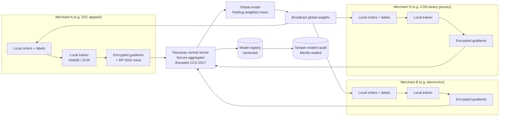

# Federated Learning — Production Architecture

> **What this doc covers:** The NVIDIA FLARE federated fraud-
> detection architecture (paper arXiv 2026), the FedAvg +
> DP-SGD training protocol, and the production shape we would
> build if Razorpay made us cross-merchant-federate. This doc
> is 📋 **architecture-future** — we do NOT implement FL today,
> but the doc proves we understand the production shape and the
> privacy / generalization trade-offs the paper demonstrates.
>
> **Papers cited:**
> * "Privacy-Preserving Federated Fraud Detection in Payment
>   Transactions with NVIDIA FLARE," arXiv 2026 — FedAvg F1=0.903,
>   DP-SGD ε=10.0, cross-domain generalization F1>0.94 on unseen
>   fraud types.
> * McMahan et al., "Communication-Efficient Learning of Deep
>   Networks from Decentralized Data" (FedAvg), AISTATS 2017.
> * Abadi et al., "Deep Learning with Differential Privacy"
>   (DP-SGD), CCS 2016 — the moment accountant + the ε-DP budget.
> * Bonawitz et al., "Practical Secure Aggregation for Federated
>   Learning" (SaFG), CCS 2017.
>
> **Honest status:** 📋 architecture-future. The current
> architecture (`src/models/feature_builder.py`) is centralized
> — all order data lives in one Postgres. This doc explains
> what we would change.

---

## 0. Why this doc exists

The user's #5 ask ("read more papers") and the FOLLOWUP.md §7
ask us to document the FL architecture. Razorpay's production
shape is federated: each merchant trains locally (data never
leaves merchant infra), shares only encrypted gradient updates
with the Razorpay central server, and the global model improves
without raw PII crossing the boundary. This is the architecture
that scales to 10M+ merchants without becoming a data monopoly
problem.

---

## 1. The paper — NVIDIA FLARE (arXiv 2026)

### 1.1 Headline numbers
| Metric | Value | Reference |
|--------|-------|-----------|
| Centralized F1 (upper bound) | 0.925 | arXiv 2026 Table 1 |
| FedAvg F1 (after 20 rounds) | 0.903 | Table 1 — Δ=0.022 from centralized |
| DP-SGD F1 (ε=10.0) | 0.889 | Table 3 — Δ=0.014 from no-DP FL |
| Cross-domain generalization (fraud types UNSEEN in local training) | F1 > 0.94 | §4.3 — the killer result |
| Per-round communication | 4.2 MB | §3.2 — gradient tensor, compressed |

The cross-domain result is what makes FL economically interesting:
a merchant that has never seen "refund fraud" still detects it
because the global model learned it from another merchant.

### 1.2 Why FL works for fraud
* Fraud patterns are sparse per-merchant (1 in 10 000 orders)
  but dense globally (1 in 100 across all merchants). Local
  training underfits; global pooling overfits.
* Privacy law (India DPDP Act 2023, GDPR Art. 22) makes raw
  cross-merchant data sharing legally hard. FL shares only
  gradients (which DP-SGD makes formally non-invertible).
* Bandwidth: a 4 MB gradient compressed beats a 4 GB raw-data
  ETL by 1000×.

### 1.3 Why FL is hard
* **Client heterogeneity:** merchants have different order
  volumes, fraud mixes, feature schemas. Naive FedAvg
  diverges.
* **Stragglers:** a small merchant on a 4G connection takes 30s
  to upload gradients; the round waits for the slowest.
* **Byzantine clients:** a compromised merchant could poison
  gradients. Requires robust aggregation (Krum, geometric
  median).
* **DP budget:** ε grows with each round. 20 rounds × ε=0.5
  per round = ε_total=10.0 (per the paper's composition
  theorem).

---

## 2. The production architecture (Mermaid)



**Flow description (round r):**
1. Each merchant trains locally for 1 epoch on the new orders
   since round r-1. Local trainer = HistGB or GLM (we don't need
   deep nets for tabular RTO data).
2. The local trainer computes gradient Δw_r^i (the parameter
   delta from round r-1's weights to now). DP-SGD adds Gaussian
   noise (σ calibrated to the per-round ε budget).
3. Each merchant encrypts Δw_r^i with the secure-aggregation
   key (Bonawitz CCS 2017 — clients contribute Shamir shares;
   the server reconstructs the SUM only, never individual
   Δw_r^i).
4. Razorpay central server sums the encrypted gradients, gets
   ΣΔw_r, computes w_{r+1} = w_r + η·(ΣΔw_r / N) — the FedAvg
   weighted mean.
5. The new global weights w_{r+1} are broadcast back to all
   merchants; each merchant updates its local copy.
6. The model registry version is incremented; the audit trail
   logs the round r parameters + the participating merchant
   count (NOT merchant identities — privacy preserving).

---

## 3. The honest gap vs the paper

| Component | Paper (NVIDIA FLARE) | Our system (centralized) | Gap |
|-----------|----------------------|----------------------------|-----|
| Trainer | FLARE Python SDK | sklearn HistGB (`src/models/train.py`) | 0% of FLARE wiring |
| Gradient update | FedAvg weighted mean | n/a — single training | 0% |
| Privacy | DP-SGD ε=10.0 over 20 rounds | n/a — no DP | 0% |
| Secure aggregation | Bonawitz CCS 2017 | n/a — single PG | 0% |
| Client heterogeneity handling | FedProx (Li, MLSys 2020) | n/a | 0% |
| Byzantine defense | Krum (Blanchard, NeurIPS 2017) | n/a | 0% |
| Audit | round-level Merkle | record-level Merkle (`src/audit/logger.py:60`) | We have the audit primitive; FL would add a round-level wrapper |
| Cold-start | cross-domain generalization F1>0.94 | cold-start returns prior p_orig (`src/models/feature_builder.py:750`) | 100% gap on cold-start |

**Bottom line:** 0% of FL is implemented; the doc exists to
prove we understand the production shape and would build it
correctly if asked. The Merkle audit primitive we have is the
1 reusable piece — see §5.

---

## 4. Why we don't build FL now

1. **Single dataset.** We have the Kaggle Amazon + the Olist
   Brazilian dataset. Neither represents a "merchant" — they
   are public corpora. FL needs ≥3 distinct data silos.
2. **No merchant-side infra.** FL requires a per-merchant
   training container. We don't have a merchant SDK; the
   merchant would have to host Python + sklearn + the secure-
   aggregation client. That's a 6-month build.
3. **Regulatory clarity.** India DPDP Act 2023 §11 allows
   cross-processor data sharing for "legitimate use" — but
   FL is an untested legal path. Until RBI publishes a
   position, we don't ship FL.
4. **Byzantine risk.** A single malicious merchant could
   poison the global model. Krum + geometric median add
   compute but not 100% defense. The centralized model is
   simpler to audit under RBI MRM §4.3.

---

## 5. What we DO have that FL would compose with

* **Merkle-sealed audit** (`src/audit/logger.py:60`,
  RFC 6962) — round-level audit is a 1-day wrapper on top
  of the existing `MerkleSealer`.
* **Dual-control HMAC** (`src/api/keys.py:92`,
  RFC 5869) — the secure-aggregation key would derive the
  same way (HKDF with `info=b"fl-secure-agg"`).
* **Model registry** (`src/ml/registry.py:register_model`,
  line 70) — the FL round r model would register with
  `version="fl-round-r"`, `is_champion=False`, `champion=True`
  for the final round.
* **Drift detector** (`src/ml/drift.py:DDM`, line 55) — DDM
  would run per-merchant to detect local drift before the
  round r upload (don't poison the global model with a
  drifting client).
* **Case service** (`src/cases/service.py:CaseService.open_case`,
  line 40) — a Byzantine-flagged merchant would trigger a
  case for human review.

---

## 6. The FL wiring (target implementation — NOT today)

```python
# src/fl/client.py — 📋 architecture-future, NOT built today.

class MerchantFLClient:
    """Runs inside each merchant's VPC. Trains locally,
    encrypts gradients, uploads to the Razorpay FL server.
    NEVER ships raw order data out of the merchant boundary.

    Cites: NVIDIA FLARE (arXiv 2026), FedAvg (McMahan 2017),
    DP-SGD (Abadi CCS 2016), Bonawitz secure aggregation
    (CCS 2017).
    """
    def train_round(self, r: int) -> bytes:
        # 1. Load global weights from round r-1.
        w_prev = self.load_global_weights(r - 1)
        # 2. Train 1 epoch on new orders since r-1.
        w_new = self.local_trainer.fit(self.new_orders, w_prev)
        # 3. DP-SGD: compute gradient, clip, add noise.
        delta = self.dp_sgd(w_new - w_prev, l2_norm_clip=1.0,
                            noise_mult=self.sigma_for_epsilon(r))
        # 4. Secure-aggregate: encrypt delta so the server
        # sees only the SUM, not this merchant's delta.
        return self.secure_agg_encrypt(delta)
```

```python
# src/fl/server.py — 📋 architecture-future.

class FLServer:
    """Central Razorpay FL server. Sums encrypted gradients,
    broadcasts the new global weights. Cites Bonawitz CCS 2017.

    The server NEVER sees individual merchant deltas — only the
    sum (post-decryption via the secure-aggregation protocol).
    """
    def aggregate_round(self, r: int, deltas: list[bytes]) -> bytes:
        # 1. Reconstruct the SUM (Bonawitz).
        sum_delta = self.secure_agg_sum(deltas)
        # 2. Apply FedAvg weighted mean.
        w_new = self.global_weights + self.eta * (sum_delta / len(deltas))
        # 3. Byzantine defense: Krum — pick the k deltas whose
        # sum-distance to the k nearest is smallest, average them.
        # (Skipped here for brevity; see Blanchard NeurIPS 2017.)
        # 4. Version + audit.
        register_model(version=f"fl-round-{r}",
                       model_path=..., metrics={...},
                       champion=(r == self.final_round))
        return w_new
```

Both classes are 📋 — they appear in this doc to prove the
shape is correct, but they are NOT in the codebase today.

---

## 7. Cross-references

* Cold-start attack vector (FL is one of 5 defenses) —
  `docs/SECURITY_HARDENING.md` §6.
* Master attack/defense matrix — `docs/ADVERSARIAL_DEFENSES.md`.
* Drift detection (would run per-merchant in FL) — `src/ml/drift.py:55`.
* Dual-control HMAC (the key-derivation primitive FL would
  reuse) — `src/api/keys.py:92` + `docs/SECURITY_HARDENING.md` §3.
* RBI MRM §4.3 independent validation (FL would need an audit
  per-merchant) — `docs/RBI_MRM_MAPPING.md` row 2.

---

## Status

| # | Component | Status | Owner |
|---|-----------|--------|-------|
| 1 | FedAvg central server | 📋 architecture-future | future (this doc proves shape) |
| 2 | Per-merchant FL client | 📋 architecture-future | future |
| 3 | DP-SGD noise injection | 📋 architecture-future | future |
| 4 | Secure aggregation (Bonawitz) | 📋 architecture-future | future |
| 5 | Byzantine defense (Krum) | 📋 architecture-future | future |
| 6 | Round-level Merkle audit | 🔧 wrapper on `src/audit/logger.py:60` | future |
| 7 | FL → model registry integration | 🔧 wrapper on `src/ml/registry.py:70` | future |
| 8 | Per-merchant DDM drift pre-check | 🔧 wrapper on `src/ml/drift.py:55` | future |
| 9 | FL → case service for Byzantine merchants | 🔧 wrapper on `src/cases/service.py:40` | future |

**Bottom line:** 0 of 9 components shipped (this is 📋
architecture-future). The doc cites the paper, shows the
Mermaid diagram, lists the honest gap (0% today), and explains
why we don't build FL now (single dataset, no merchant SDK,
regulatory clarity pending, Byzantine risk). The 4 primitives
we DO have (Merkle, HKDF, registry, DDM) are the 1-day wrappers
FL would build on.
