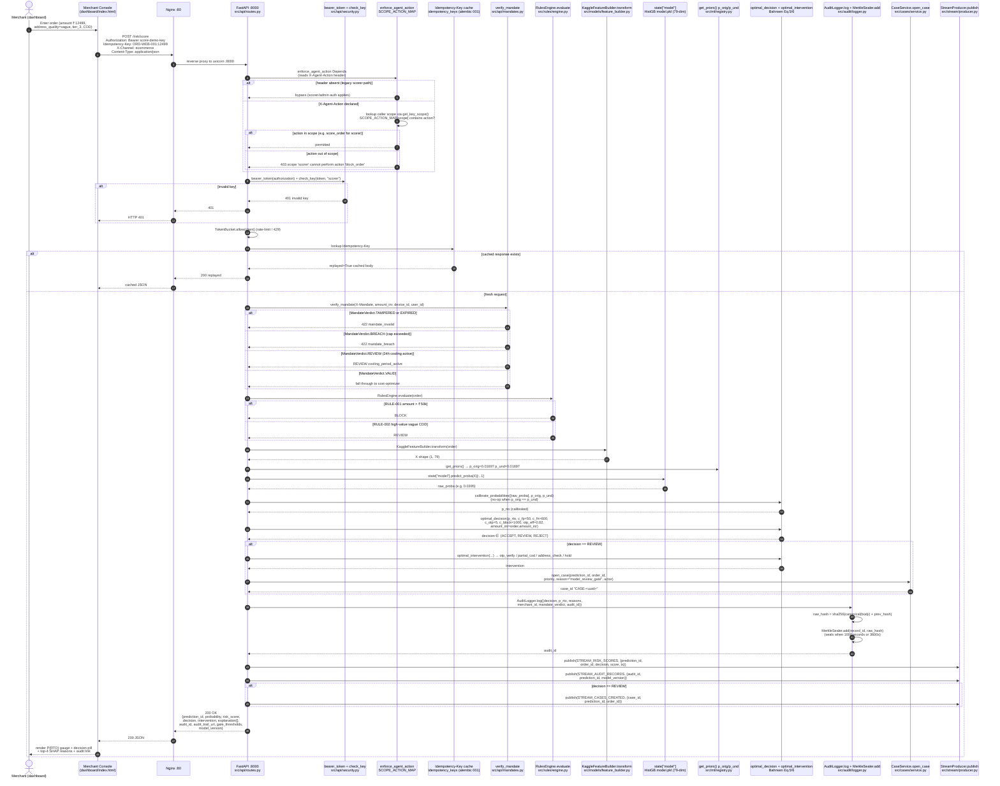
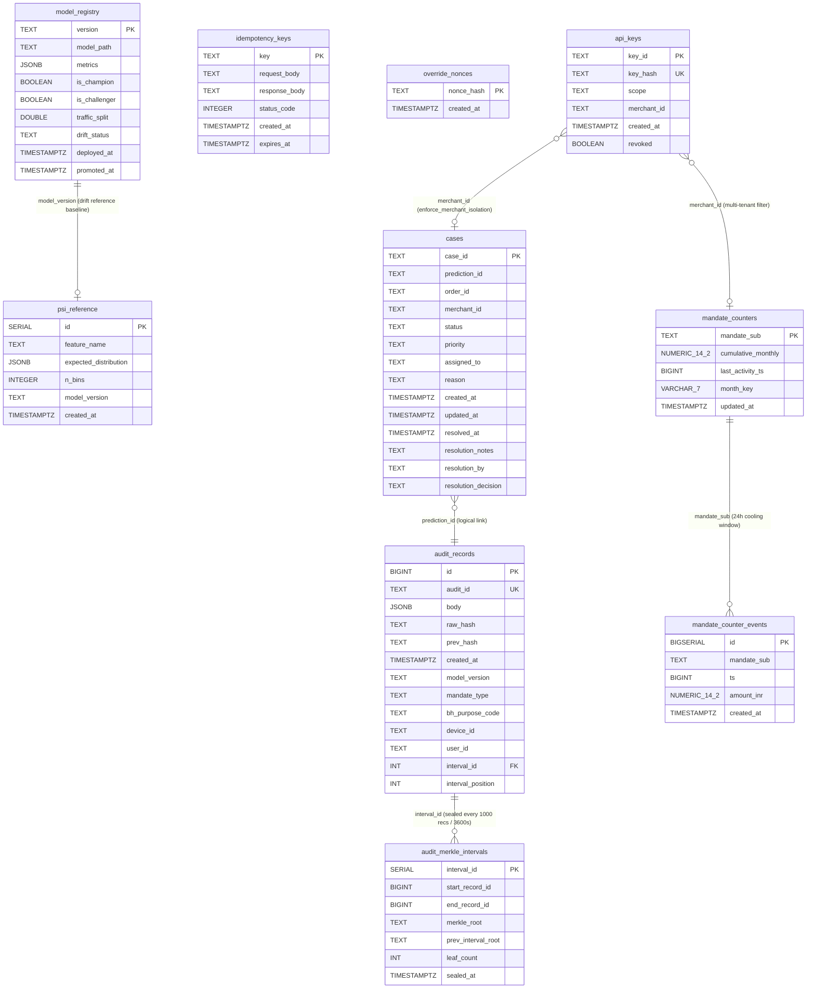
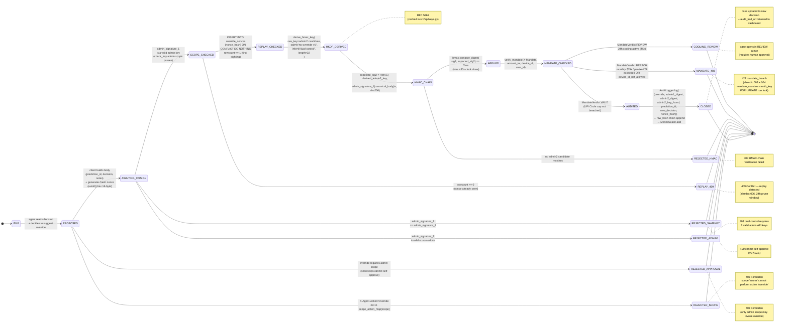
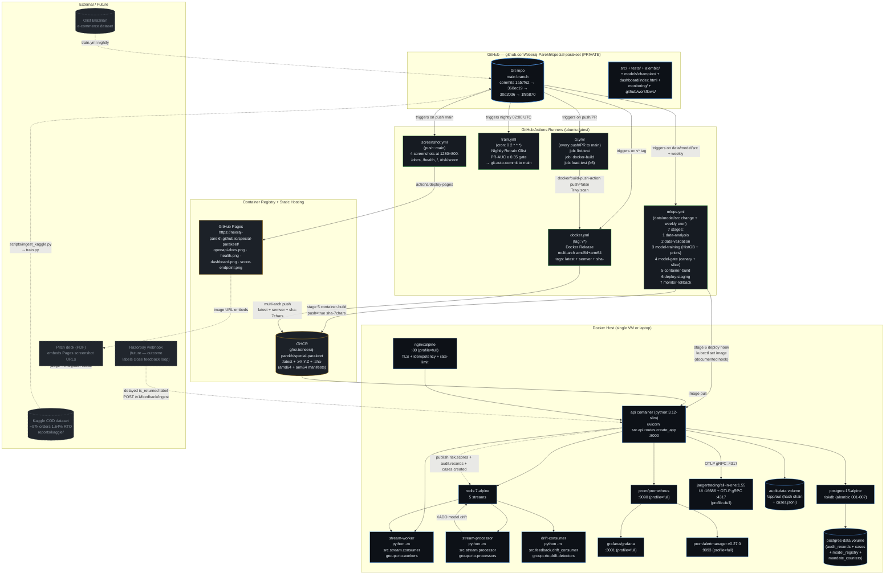
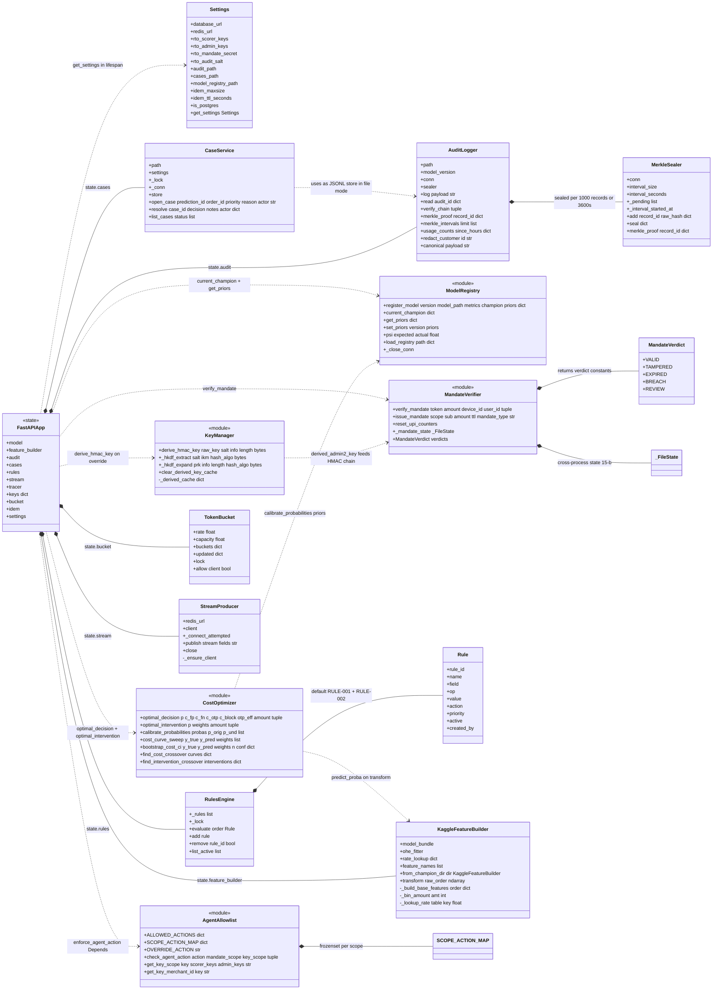

# RTO Trust Layer - UML Diagrams

> 8 diagram types covering architecture, sequence, data flow, ER schema,
> agent state, user journey, deployment topology, and class structure.
> All Mermaid syntax - renders natively on GitHub.
> Sources: actual source code read on 2026-08-28 (src/api/routes.py,
> src/api/agent_allowlist.py, src/api/mandates.py, src/api/keys.py,
> src/audit/logger.py, src/cases/service.py, src/ml/registry.py,
> src/rules/engine.py, src/business/cost_optimizer.py, src/stream/*.py,
> src/ingest/*.py, alembic/versions/001-007, docker-compose.yml,
> .github/workflows/*).

## Index

| # | Diagram | Mermaid Type | File |
|---|---------|------|------|
| 01 | 1. System Architecture | Component (flowchart TB, 5 subgraph layers) | [`figures/01-system-architecture.mmd`](figures/01-system-architecture.mmd) |
| 02 | 2. Score Request Sequence | Sequence Diagram (sequenceDiagram, actor + 17 participants + alt/else blocks) | [`figures/02-score-request-sequence.mmd`](figures/02-score-request-sequence.mmd) |
| 03 | 3. Data Flow | Data Flow Diagram (flowchart LR, cylinder data stores + processes) | [`figures/03-data-flow.mmd`](figures/03-data-flow.mmd) |
| 04 | 4. ER Schema | Entity-Relationship (erDiagram, 10 entities + attributes + 4 relationships) | [`figures/04-er-schema.mmd`](figures/04-er-schema.mmd) |
| 05 | 5. Agent Override State | State Machine (stateDiagram-v2, 9 success states + 8 failure terminals + notes) | [`figures/05-agent-override-state.mmd`](figures/05-agent-override-state.mmd) |
| 06 | 6. Merchant User Journey | User-Journey Flowchart (flowchart TD, decision diamonds + 3 terminal classes) | [`figures/06-merchant-user-journey.mmd`](figures/06-merchant-user-journey.mmd) |
| 07 | 7. Deployment Topology | Deployment (flowchart TB, 5 subgraphs: GitHub / Runner / Registry / Host / External) | [`figures/07-deployment-topology.mmd`](figures/07-deployment-topology.mmd) |
| 08 | 8. Class Diagram (bonus) | Class Diagram (classDiagram, 14 classes + composition/dependency edges) | [`figures/08-class-diagram.mmd`](figures/08-class-diagram.mmd) |

---

## 1. System Architecture

**Type:** Component (flowchart TB, 5 subgraph layers)

C4-style component view: 5 layers (Edge / Application / Domain / Data / Infra) showing how the FastAPI modular monolith orchestrates AgentAllowlist, MandateCounter, AuditLogger (MerkleSealer), CaseService, RulesEngine, CostOptimizer, ModelRegistry, KeyManager (HKDF), StreamProducer, OTel + CircuitBreaker against PostgreSQL + Redis.

Source: [`figures/01-system-architecture.mmd`](figures/01-system-architecture.mmd).

```mermaid
%% RTO Trust Layer — Component Diagram (C4-L2 style)
%% Grounded in: src/api/routes.py (FastAPI app, 28 endpoints),
%%   src/api/agent_allowlist.py (SCOPE_ACTION_MAP), src/api/mandates.py
%%   (MandateVerdict + UPI Circle caps), src/api/keys.py (HKDF derive),
%%   src/audit/logger.py (MerkleSealer), src/cases/service.py (CaseService),
%%   src/ml/registry.py (current_champion/register_model), src/rules/engine.py
%%   (RulesEngine), src/business/cost_optimizer.py (optimal_decision),
%%   docker-compose.yml (api/postgres/redis/stream-worker/stream-processor/
%%   drift-consumer/prometheus/grafana/jaeger/alertmanager), alembic 001-007.
flowchart TB
  classDef edge fill:#21262d,color:#e6edf3,stroke:#30363d
  classDef app fill:#0d1117,color:#e6edf3,stroke:#58a6ff,stroke-width:2px
  classDef domain fill:#161b22,color:#e6edf3,stroke:#3fb950
  classDef data fill:#1c2128,color:#e6edf3,stroke:#d29922
  classDef infra fill:#21262d,color:#e6edf3,stroke:#f85149
  classDef external fill:#0d1117,color:#8b949e,stroke:#6e7681,stroke-dasharray:3 3

  %% -------- Edge layer --------
  subgraph EDGE["Edge Layer — browsers / agents / external traffic"]
    direction LR
    MERCH["Merchant Console<br/>dashboard/index.html<br/>(vanilla JS SPA)"]
    AGENT["Bounded Dispatch Agent<br/>scripts/demo_agent.py<br/>X-Agent-Action header"]
    SIM["Ingest Simulators<br/>scripts/run_simulators.py"]
  end

  %% -------- Application layer --------
  subgraph APP["Application Layer — FastAPI modular monolith (src/api/routes.py)"]
    direction TB
    ROUTES["FastAPI App (28 routes)<br/>/risk/score · /v1/cases<br/>/v1/explain/shap · /v1/audit/{id}/proof<br/>/risk/{id}/override · /v1/feedback/ingest"]
    SEC["AuthMiddleware<br/>src/api/security.py<br/>bearer_token + check_key + TokenBucket (429)"]
    ALLOWLIST["AgentAllowlist<br/>src/api/agent_allowlist.py<br/>SCOPE_ACTION_MAP scorer/ops/admin<br/>7 actions + override pseudo-action"]
    KEYS["KeyManager<br/>src/api/keys.py<br/>HKDF-Extract+Expand (RFC 5869)<br/>salt=rto-override-v1 info=dual-control"]
    MANDATES["MandateCounter<br/>src/api/mandates.py<br/>UPI Circle caps: ₹5k/txn ₹15k/mo<br/>₹5k 24h cooling 5 devices 6-mo"]
    AUDIT["AuditLogger<br/>src/audit/logger.py<br/>SHA-256 hash chain + MerkleSealer<br/>(every 1000 records / 3600s)"]
    CASES["CaseService<br/>src/cases/service.py<br/>OPENED→UNDER_REVIEW→<br/>APPROVED/REJECTED/ESCALATED"]
    RULES["RulesEngine<br/>src/rules/engine.py<br/>RULE-001 (₹50k BLOCK)<br/>RULE-002 (vague addr REVIEW)"]
    COSTOPT["CostOptimizer<br/>src/business/cost_optimizer.py<br/>Bahnsen BMR Eq.5/6<br/>optimal_decision ACCEPT/REVIEW/REJECT"]
    REGISTRY["ModelRegistry<br/>src/ml/registry.py<br/>champion/challenger<br/>priors blob (E14)"]
    OTEL["OTel + CircuitBreaker<br/>src/api/otel.py + breaker.py<br/>5 risk.score sub-spans + circuit state"]
    STREAM["StreamProducer<br/>src/stream/producer.py<br/>5 streams fire-and-forget"]
  end

  %% -------- Domain layer (model + features) --------
  subgraph DOMAIN["Domain Layer — ML + Features"]
    direction LR
    MODEL["Champion HistGB<br/>models/champion/model.pkl<br/>+ feature_list.json (79-dim OHE)"]
    FB["KaggleFeatureBuilder<br/>src/models/feature_builder.py<br/>from_champion_dir() → transform(raw)"]
    PRIORS["priors.json<br/>p_orig=0.01697 p_und=0.01697<br/>calibration_method=bahnsen_eq6"]
    SHAP["SHAPExplainer<br/>src/models/explain.py<br/>reason_codes_batch + serialize"]
  end

  %% -------- Data plane --------
  subgraph DATA["Data Plane"]
    direction LR
    PG[("PostgreSQL 15<br/>alembic 001-007<br/>10 tables<br/>audit_records · cases ·<br/>model_registry · api_keys ·<br/>mandate_counters · override_nonces")]
    RD[("Redis 7<br/>5 streams:<br/>risk.scores · audit.records ·<br/>cases.created · model.drift ·<br/>notifications")]
  end

  %% -------- Infra layer (workers + observability) --------
  subgraph INFRA["Infra Layer — workers + observability"]
    direction TB
    SW["stream-worker<br/>src/stream/consumer.py<br/>XREADGROUP rto-workers"]
    SP["stream-processor<br/>src/stream/processor.py<br/>HyperLogLog + sliding-window<br/>3σ spike-factor (15-a)"]
    DC["drift-consumer<br/>src/feedback/drift_consumer.py<br/>DDM + ADWIN (Gama 2014)"]
    LS["LabelFeedbackService<br/>src/feedback/label_service.py<br/>late-label feedback loop"]
    PROM["Prometheus<br/>monitoring/prometheus.yml"]
    GRAF["Grafana<br/>monitoring/grafana/<br/>rto-dashboard.json"]
    JAEGER["Jaeger :16686<br/>OTLP gRPC :4317"]
    AM["Alertmanager v0.27"]
  end

  %% -------- External sources --------
  subgraph EXT["External Sources"]
    direction LR
    KAGGLE[("Kaggle COD dataset<br/>reports/kaggle/")]
    SIMATM["ATM sim<br/>src/ingest/atm.py"]
    SIMCC["Callcenter sim<br/>src/ingest/callcenter.py"]
    SIMMOB["Mobile sim<br/>src/ingest/mobile.py"]
    SIMEC["Ecommerce<br/>(= /risk/score itself)"]
  end

  %% -------- Edge → App --------
  MERCH -->|POST /risk/score + Bearer scorer-key| ROUTES
  AGENT -->|POST + X-Agent-Action| ROUTES
  SIM --> ROUTES

  %% -------- App internal wiring --------
  ROUTES --> SEC
  ROUTES --> ALLOWLIST
  ROUTES --> KEYS
  ROUTES --> MANDATES
  ROUTES --> AUDIT
  ROUTES --> CASES
  ROUTES --> RULES
  ROUTES --> COSTOPT
  ROUTES --> REGISTRY
  ROUTES --> OTEL
  ROUTES --> STREAM

  %% -------- App → Domain --------
  COSTOPT --> MODEL
  COSTOPT --> PRIORS
  ROUTES --> FB
  ROUTES --> SHAP
  FB --> MODEL

  %% -------- App → Data --------
  AUDIT --> PG
  CASES --> PG
  REGISTRY --> PG
  MANDATES --> PG
  KEYS --> PG
  STREAM --> RD

  %% -------- App → Infra --------
  STREAM -->|XADD risk.scores / audit.records / cases.created| RD
  RD --> SW
  RD --> SP
  SP -->|XADD model.drift| RD
  RD --> DC
  DC --> LS
  LS -->|/v1/feedback/ingest| ROUTES
  ROUTES --> PROM
  PROM --> GRAF
  PROM --> AM
  OTEL --> JAEGER

  %% -------- External → App/Domain --------
  KAGGLE -->|train.py + scripts/ingest_kaggle.py| MODEL
  KAGGLE --> PRIORS
  SIMATM -->|X-Channel: atm + OrderIn| ROUTES
  SIMCC -->|X-Channel: call_center + OrderIn| ROUTES
  SIMMOB -->|X-Channel: mobile + OrderIn| ROUTES
  SIMEC -->|X-Channel: ecommerce + OrderIn| ROUTES

  class EDGE,EXT edge
  class ROUTES,SEC,ALLOWLIST,KEYS,MANDATES,AUDIT,CASES,RULES,COSTOPT,REGISTRY,OTEL,STREAM app
  class MODEL,FB,PRIORS,SHAP domain
  class PG,RD data
  class SW,SP,DC,LS,PROM,GRAF,JAEGER,AM infra
  class MERCH,AGENT,SIM,SIMATM,SIMCC,SIMMOB,SIMEC,KAGGLE external
```

---

## 2. Score Request Sequence

**Type:** Sequence Diagram (sequenceDiagram, actor + 17 participants + alt/else blocks)

End-to-end sequence for a single score request: Merchant Console -> Nginx -> FastAPI -> enforce_agent_action -> bearer_token/check_key -> Idempotency-Key cache -> verify_mandate (UPI Circle 24h cooling / Rs.15k cap) -> RulesEngine.evaluate -> KaggleFeatureBuilder.transform -> predict_proba -> calibrate_probabilities (Bahnsen Eq.6) -> optimal_decision (ACCEPT/REVIEW/REJECT) -> CaseService.open_case -> AuditLogger.log + MerkleSealer.add -> StreamProducer.publish to risk.scores / audit.records / cases.created.

Source: [`figures/02-score-request-sequence.mmd`](figures/02-score-request-sequence.mmd).

---

## 3. Data Flow

**Type:** Data Flow Diagram (flowchart LR, cylinder data stores + processes)

Two-speed data view: hot path (Kaggle-trained champion model -> /risk/score -> audit_records + Redis Streams) and truth path (4 ingest simulators -> stream-worker -> stream-processor (HLL + 3-sigma spike-factor) -> drift-consumer (DDM+ADWIN) -> LabelFeedbackService -> retrain_real + canary_gate -> mlops.yml PR-AUC gate -> register_model -> champion swap on next lifespan).

Source: [`figures/03-data-flow.mmd`](figures/03-data-flow.mmd).

```mermaid
%% RTO Trust Layer — Data Flow Diagram (DFD L0 → L1)
%% Grounded in: src/ingest/{atm,callcenter,ecommerce,mobile}.py,
%%   scripts/ingest_kaggle.py, src/models/train.py, src/ml/registry.py,
%%   src/stream/producer.py + consumer.py + processor.py,
%%   src/feedback/label_service.py + drift_consumer.py,
%%   src/business/cost_optimizer.py, src/api/routes.py /risk/score,
%%   src/audit/logger.py, alembic 001-007.
flowchart LR
  classDef source fill:#161b22,color:#e6edf3,stroke:#58a6ff
  classDef store fill:#1c2128,color:#e6edf3,stroke:#d29922
  classDef process fill:#0d1117,color:#e6edf3,stroke:#3fb950
  classDef external fill:#21262d,color:#8b949e,stroke:#6e7681,stroke-dasharray:3 3
  classDef loop fill:#0d1117,color:#e6edf3,stroke:#f85149

  %% ===== External sources =====
  KAGGLE[("Kaggle COD dataset<br/>data/raw/cod_orders.csv<br/>~97k rows 1.64% RTO")]
  ATM["ATM switch log CSV<br/>src/ingest/atm.py<br/>(batch daily 02:00 IST)"]
  CC["CRM webhook<br/>src/ingest/callcenter.py<br/>~720 flags/day"]
  MOB["Kafka mobile.orders<br/>src/ingest/mobile.py<br/>~2/sec peak"]
  EC["Merchant web checkout<br/>src/ingest/ecommerce.py<br/>(identity normalize)"]
  RAZORPAY[("Razorpay webhook<br/>(future — outcome labels")]

  %% ===== Ingest / training stores =====
  RAW[("Raw feature frame<br/>src/models/train.py<br/>build_feature_frame + group_split")]
  MODEL[("Champion artifact<br/>models/champion/<br/>model.pkl + priors.json<br/>+ rate_lookup.json<br/>+ ohe_fitter.joblib")]
  REG[("ModelRegistry<br/>out/model_registry.json<br/>or alembic 001 model_registry<br/>(is_champion partial-unique)")]
  PRIORS[("priors blob<br/>p_orig=0.01697 p_und=0.01697<br/>calibration_method=bahnsen_eq6")]

  %% ===== Hot path stores =====
  PG[("PostgreSQL 15<br/>alembic 001-007<br/>audit_records · cases ·<br/>mandate_counters · api_keys<br/>override_nonces · idempotency_keys")]
  RD[("Redis 7 Streams<br/>5 streams:<br/>risk.scores · audit.records ·<br/>cases.created · model.drift ·<br/>notifications")]

  %% ===== Processes =====
  TRAIN["train.py<br/>fit_model(HistGB,<br/>max_iter=300 lr=0.08 depth=6)<br/>+ compute_priors + save_model"]
  REGISTER["register_model(version,<br/>model_path, metrics, priors)<br/>src/ml/registry.py"]
  SCORE["POST /risk/score<br/>src/api/routes.py:960<br/>feature_builder.transform<br/>→ predict_proba<br/>→ calibrate_probabilities<br/>→ optimal_decision"]
  AUDIT["AuditLogger.log<br/>src/audit/logger.py<br/>hash chain + Merkle interval"]
  CASES["CaseService.open_case<br/>src/cases/service.py"]

  %% ===== Stream consumers =====
  SW["stream-worker<br/>src/stream/consumer.py<br/>XREADGROUP rto-workers group"]
  SP["stream-processor<br/>src/stream/processor.py<br/>HyperLogLog + sliding-window<br/>3-sigma spike-factor (15-a)"]
  DC["drift-consumer<br/>src/feedback/drift_consumer.py<br/>DDM Level + ADWIN"]

  %% ===== Feedback loop =====
  LABELS["LabelFeedbackService<br/>src/feedback/label_service.py<br/>late-label prequential eval"]
  DRAIN["Drain (3+ same-reason<br/>-- retrain_request notification)"]
  RETRAIN["retrain_real.py<br/>scripts/retrain_real.py<br/>+ canary_gate.py"]
  PROMOTE["Promotion (MLOps)<br/>mlops.yml workflow<br/>relative PR-AUC gate 3x baseline"]
  SHAP["SHAPExplainer<br/>src/models/explain.py<br/>/v1/explain/shap"]

  %% ===== Hot path external consumer =====
  DASH["Merchant Console<br/>dashboard/index.html"]
  COMPL["Compliance Auditor<br/>/v1/audit/{id}/proof<br/>+ /v1/compliance/audit-export"]

  %% ===== Training flow =====
  KAGGLE --> RAW
  RAW --> TRAIN
  TRAIN --> MODEL
  TRAIN --> PRIORS
  MODEL --> REGISTER
  PRIORS --> REGISTER
  REGISTER --> REG

  %% ===== Hot path (inference) =====
  MODEL -.->|lifespan loads at boot| SCORE
  PRIORS -.->|"get_priors() at request time"| SCORE
  REG -.->|"current_champion() lookup"| SCORE
  EC -->|POST /risk/score| SCORE
  SCORE --> AUDIT
  SCORE --> CASES
  AUDIT --> PG
  CASES --> PG
  SCORE -.->|publish risk.scores + audit.records + cases.created| RD
  DASH -->|POST /risk/score| SCORE
  SCORE -->|200 decision + p_rto + reasons + audit_id| DASH
  SHAP -.->|/v1/explain/shap| DASH
  AUDIT --> COMPL

  %% ===== Cold path (feedback loop) =====
  ATM -->|POST /risk/score X-Channel: atm| SCORE
  CC -->|POST /risk/score X-Channel: call_center| SCORE
  MOB -->|POST /risk/score X-Channel: mobile| SCORE

  RD --> SW
  RD --> SP
  SP -->|XADD model.drift| RD
  RD --> DC
  DC --> LABELS
  LABELS --> DRAIN
  RAZORPAY -.->|delayed is_returned label T+30d| LABELS
  DRAIN -->|3+ consecutive anomalies<br/>-- retrain PR| RETRAIN
  LABELS -->|DDM 99% drift confirmed<br/>-- /v1/feedback/ingest| RETRAIN
  RETRAIN --> PROMOTE
  PROMOTE -.->|"register_model(new version, champion=True)"| REG
  REG -.->|champion swap on next /risk/score lifespan| SCORE

  %% styling
  class KAGGLE,RAZORPAY external
  class ATM,CC,MOB,EC source
  class RAW,MODEL,REG,PRIORS,PG,RD store
  class TRAIN,REGISTER,SCORE,AUDIT,CASES,SW,SP,DC,LABELS,DRAIN,RETRAIN,PROMOTE,SHAP process
  class DASH,COMPL source
```

---

## 4. ER Schema

**Type:** Entity-Relationship (erDiagram, 10 entities + attributes + 4 relationships)

10-table PostgreSQL schema: audit_records <-> audit_merkle_intervals (tamper-evidence layer), cases (case lifecycle), model_registry (champion/challenger partial-unique), idempotency_keys (TTL), psi_reference (drift baseline), mandate_counters + mandate_counter_events (UPI Circle cumulative state + 24h window), override_nonces (replay defense, alembic 006), api_keys (multi-tenant scope binding, alembic 007).

Source: [`figures/04-er-schema.mmd`](figures/04-er-schema.mmd).

---

## 5. Agent Override State

**Type:** State Machine (stateDiagram-v2, 9 success states + 8 failure terminals + notes)

State machine for POST /risk/{prediction_id}/override: IDLE -> PROPOSED -> AWAITING_COSIGN -> SCOPE_CHECKED (SCOPE_ACTION_MAP) -> REPLAY_CHECKED (nonce ON CONFLICT, alembic 006) -> HKDF_DERIVED (RFC 5869, salt=rto-override-v1) -> HMAC_CHAIN (+/-30s skew) -> APPLIED -> MANDATE_CHECKED (UPI Circle Rs.5k/txn Rs.15k/mo, FOR UPDATE) -> AUDITED (hash chain + Merkle interval) -> CLOSED. Failure terminals: 403 scope / 403 admin1 / 400 same-key / 409 replay / 403 HMAC / 422 mandate_breach / cooling REVIEW.

Source: [`figures/05-agent-override-state.mmd`](figures/05-agent-override-state.mmd).

---

## 6. Merchant User Journey

**Type:** User-Journey Flowchart (flowchart TD, decision diamonds + 3 terminal classes)

Merchant's UI journey in dashboard/index.html: enter keys + order form -> POST /risk/score -> render P(RTO) gauge + decision pill + SHAP top-4 reasons + audit link. REVIEW branches to otp_verify / partial_cod / address_check / hold -> CaseService.open_case. Optionally tune rules via POST /v1/rules or trigger agent override -> dual-control co-sign (admin1 raw key + admin2 HKDF-derived HMAC) -> MandateCounter increments -> CaseService.resolve -> audit trail visible via /audit/{audit_id} + /v1/audit/{audit_id}/proof (Merkle inclusion proof).

Source: [`figures/06-merchant-user-journey.mmd`](figures/06-merchant-user-journey.mmd).

```mermaid
%% RTO Trust Layer — Merchant User Journey / Flowchart
%% Grounded in: dashboard/index.html (form fields, /risk/score call,
%%   /v1/policy/cost-curves fetch, /audit/{id} lookup),
%%   src/api/routes.py (POST /risk/score, POST /risk/{id}/override,
%%   GET /v1/explain/shap, GET /audit/{audit_id}, POST /v1/cases/{id}/resolve,
%%   POST /v1/rules, DELETE /v1/rules/{id}),
%%   src/rules/engine.py (RulesEngine.add/remove),
%%   src/business/cost_optimizer.py (optimal_decision → ACCEPT/REVIEW/REJECT),
%%   src/cases/service.py (open_case, resolve),
%%   src/models/explain.py (explain_with_shap, reason_codes_batch).
flowchart TD
  START([Merchant opens dashboard/index.html]) --> KEYS

  KEYS["Enter Scorer API key + Admin API key<br/>(two text inputs at top)"] --> FILL_FORM

  FILL_FORM["Fill order form:<br/>order_id · amount_inr · category ·<br/>payment_method · address_quality<br/>· city_tier · prior_orders · prior_returns"] --> CLICK

  CLICK["Click 'Score order' button"] --> CALL_SCORE

  CALL_SCORE["Browser POST /risk/score<br/>headers: Authorization + Idempotency-Key<br/>body: OrderIn (Pydantic)"] --> SCORE_RESPONSE{HTTP response?}

  SCORE_RESPONSE -- 401 --> SHOW_ERR["Show error:<br/>'HTTP 401: invalid key'"]
  SHOW_ERR --> KEYS

  SCORE_RESPONSE -- 429 --> RATE_ERR["Show rate-limit message"]
  RATE_ERR --> WAIT[("Wait + retry")]
  WAIT --> CLICK

  SCORE_RESPONSE -- 200 --> RENDER

  RENDER["Render result panel:<br/>P(RTO) gauge + decision pill<br/>(ACCEPT green / REVIEW amber / REJECT red)<br/>+ top-4 SHAP reasons (delta_prob arrows)<br/>+ audit_trail_url link"] --> DECISION{decision?}

  DECISION -- ACCEPT --> SHIP["Action: ship normal<br/>(cost = c_ship_fp only)"]
  SHIP --> DONE([Order placed in audit trail])

  DECISION -- REJECT --> BLOCK["Action: manual review<br/>(cost = c_block ₹1000)"]
  BLOCK --> DONE

  DECISION -- REVIEW --> INTERVENTION{Intervention shown}
  INTERVENTION --> |otp_verify| OTP["Send selective OTP<br/>(c_otp=₹5, eff=0.82)"]
  INTERVENTION --> |partial_cod| P_COD["Collect partial amount upfront"]
  INTERVENTION --> |address_check| ADDR["Call-center address verification"]
  INTERVENTION --> |hold| HOLD["Hold for manual review queue<br/>(opens case in cases table)"]

  OTP --> CASE_OPEN
  P_COD --> CASE_OPEN
  ADDR --> CASE_OPEN
  HOLD --> CASE_OPEN

  CASE_OPEN["CaseService.open_case()<br/>case_id = CASE-<uuid10><br/>status=OPENED reason=model_review_gate"] --> RULE_TUNE{Merchant wants to tune rules?}

  RULE_TUNE -- Yes --> ADJUST_RULES["Adjust rule thresholds<br/>POST /v1/rules<br/>DELETE /v1/rules/{rule_id}"]
  ADJUST_RULES --> CLICK

  RULE_TUNE -- No --> AGENT_OVERRIDE{Agent suggested<br/>dual-control override?}

  AGENT_OVERRIDE -- No --> RESOLVE_CASE
  AGENT_OVERRIDE -- Yes --> COSIGN["Ops reviewer co-signs<br/>client generates nonce +<br/>admin_signature_1 (raw key)<br/>admin_signature_2 (HMAC chain)"]

  COSIGN --> OVERRIDE["POST /risk/{prediction_id}/override<br/>(server-side checks:<br/>scope allowlist + nonce uniqueness<br/>+ HKDF-derived HMAC chain +<br/>mandate counter FOR UPDATE lock)"]

  OVERRIDE --> OVERRIDE_RESULT{Override outcome?}
  OVERRIDE_RESULT -- 200 --> MANDATE_INC["MandateCounter increments<br/>(monthly ₹15k cap updated<br/>+ 24h event row INSERTed)"]
  MANDATE_INC --> RESOLVE_CASE
  OVERRIDE_RESULT -- 403 scope --> SHOW_ERR
  OVERRIDE_RESULT -- 409 replay --> SHOW_ERR
  OVERRIDE_RESULT -- 422 mandate_breach --> SHOW_ERR

  RESOLVE_CASE["Merchant approves intervention in dashboard<br/>POST /v1/cases/{case_id}/resolve<br/>body: {decision: APPROVED, notes}"] --> CASE_CLOSE
  CASE_CLOSE["CaseService.resolve()<br/>cases.status → APPROVED<br/>resolved_at = NOW()"] --> DONE

  DONE --> AUDIT_LOOKUP{Merchant clicks audit link?}
  AUDIT_LOOKUP -- Yes --> FETCH_AUDIT["GET /audit/{audit_id}<br/>(admin key) → raw audit body<br/>(hash chain verified)"]
  FETCH_AUDIT --> VERIFY["Optionally GET /v1/audit/{audit_id}/proof<br/>→ Merkle inclusion proof<br/>(leaf + path to interval root)"]
  VERIFY --> DONE
  AUDIT_LOOKUP -- No --> END([End of journey])

  classDef start fill:#0d1117,color:#e6edf3,stroke:#3fb950,stroke-width:2px
  classDef err fill:#47201f,color:#e6edf3,stroke:#f85149
  classDef ok fill:#123b23,color:#e6edf3,stroke:#3fb950
  classDef review fill:#3d2e00,color:#e6edf3,stroke:#d29922
  classDef neutral fill:#161b22,color:#e6edf3,stroke:#30363d
  class START,DONE,END start
  class SHOW_ERR,RATE_ERR err
  class SHIP ok
  class BLOCK,CASE_OPEN,CASE_CLOSE review
  class KEYS,FILL_FORM,CLICK,CALL_SCORE,RENDER,OTP,P_COD,ADDR,HOLD,RESOLVE_CASE,COSIGN,OVERRIDE,MANDATE_INC,ADJUST_RULES,FETCH_AUDIT,VERIFY,WAIT neutral
  class INTERVENTION,SCORE_RESPONSE,DECISION,RULE_TUNE,AGENT_OVERRIDE,OVERRIDE_RESULT,AUDIT_LOOKUP neutral
```

---

## 7. Deployment Topology

**Type:** Deployment (flowchart TB, 5 subgraphs: GitHub / Runner / Registry / Host / External)

GitHub (Neeraj-Parekh/special-parakeet, PRIVATE) -> 5 GitHub Actions runners (ci.yml, mlops.yml 7-stage TFX pipeline, train.yml nightly Olist, docker.yml v* tag -> GHCR, screenshot.yml -> Pages) -> GHCR container registry + GitHub Pages. Docker host runs api container (:8000) + postgres:15 + redis:7 + stream-worker + stream-processor + drift-consumer + (profile=full) nginx + prometheus + grafana + jaeger:1.55 + alertmanager:0.27. External: Kaggle COD dataset, Olist dataset, Razorpay webhook (future), pitch deck embedding Pages screenshot URLs.

Source: [`figures/07-deployment-topology.mmd`](figures/07-deployment-topology.mmd).

---

## 8. Class Diagram (bonus)

**Type:** Class Diagram (classDiagram, 14 classes + composition/dependency edges)

Static structure of the key Python modules: Settings (pydantic-settings, dual-mode is_postgres switch), AuditLogger + MerkleSealer (composition), CaseService, ModelRegistry (module-level functions), MandateVerifier + MandateVerdict + _FileState (15-b cross-process state), RulesEngine + Rule, CostOptimizer (Bahnsen Eq.5/6), AgentAllowlist + SCOPE_ACTION_MAP + OVERRIDE_ACTION, KeyManager (HKDF derive + cache), TokenBucket, StreamProducer (fire-and-forget XADD), KaggleFeatureBuilder (from_champion_dir + transform), and the FastAPI state dict that wires them together in routes.py lifespan.

Source: [`figures/08-class-diagram.mmd`](figures/08-class-diagram.mmd).

---
